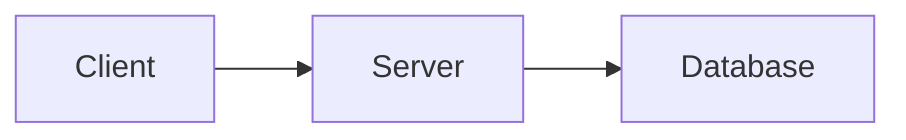

# 開發指南

[English](./DEVELOPMENT.md) | **繁體中文**

本文件說明專案的開發環境設定、開發規範與常見問題解決方案。

---

## 目錄

- [環境需求](#環境需求)
- [快速開始](#快速開始)
- [開發工作流](#開發工作流)
- [開發規範](#開發規範)
- [常見任務](#常見任務)
- [疑難排解](#疑難排解)
- [效能優化](#效能優化)

---

## 環境需求

### 必要環境

| 工具 | 版本 | 說明 |
|------|------|------|
| Node.js | >= 18.17.0 | JavaScript 執行環境 |
| npm | >= 9.0.0 | 套件管理工具 |
| Git | >= 2.0.0 | 版本控制 |

### 推薦工具

| 工具 | 用途 |
|------|------|
| VS Code | 程式碼編輯器 |
| Chrome DevTools | 除錯與效能分析 |
| React DevTools | React 元件除錯 |

---

### VS Code 推薦擴充

```json
{
  "recommendations": [
    "dbaeumer.vscode-eslint",             // ESLint
    "esbenp.prettier-vscode",             // Prettier
    "bradlc.vscode-tailwindcss",          // Tailwind CSS IntelliSense
    "unifiedjs.vscode-mdx",               // MDX 語法支援
    "ms-vscode.vscode-typescript-next"    // TypeScript
  ]
}
```

---

## 快速開始

### 1. Clone 專案

```bash
git clone <repository-url>
cd blog
```

---

### 2. 安裝依賴

```bash
npm install
```

**注意事項：**
- 確保使用 Node.js 18.17.0 以上版本
- 如果遇到安裝問題，嘗試刪除 `node_modules` 和 `package-lock.json` 後重新安裝

---

### 3. 啟動開發伺服器

```bash
npm run dev
```

**開發伺服器特性：**
- 🔥 Hot Module Replacement (HMR)
- ⚡ Fast Refresh
- 🔍 詳細的錯誤訊息
- 📊 即時編譯狀態

---

### 4. 驗證環境

開啟瀏覽器訪問 `http://localhost:3000`，確認：
- ✅ 頁面正常顯示
- ✅ 導航列功能正常
- ✅ 語言切換正常
- ✅ 主題切換正常
- ✅ 文章列表顯示正常

---

## 開發工作流

### 日常開發流程

```bash
# 1. 更新程式碼
git pull origin main

# 2. 安裝新依賴 (如果有)
npm install

# 3. 啟動開發伺服器
npm run dev

# 4. 開發功能...

# 5. 檢查程式碼品質
npm run lint

# 6. 建置測試
npm run build

# 7. 提交變更
git add .
git commit -m "feature: add new feature"
git push
```

---

### 可用指令

| 指令 | 說明 |
|------|------|
| `npm run dev` | 啟動開發伺服器 (port 3000) |
| `npm run build` | 建置生產版本 |
| `npm start` | 啟動生產伺服器 |
| `npm run lint` | 執行 ESLint 檢查 |

---

### Git 工作流

**分支策略：**
```
main                  # 主分支，永遠可部署
    ├─ feature/xxx    # 新功能開發
    ├─ fix/xxx        # Bug 修復
    └─ docs/xxx       # 文檔更新
```

**開發流程：**
```bash
# 1. 建立新分支
git checkout -b feature/new-feature

# 2. 開發與提交
git add .
git commit -m "feature: add new feature"

# 3. 推送分支
git push origin feature/new-feature

# 4. 合併回 main (本地或透過 PR)
git checkout main
git merge feature/new-feature

# 5. 刪除分支
git branch -d feature/new-feature
```

---

## 開發規範

### Commit Message 規範

**格式：** `<type>: <description>`

**Type 類型：**
- `feature` — 新功能
- `fix` — Bug 修復
- `docs` — 文檔更新
- `refactor` — 程式碼重構
- `style` — 程式碼格式調整
- `chore` — 雜項 (依賴更新、設定調整等)

**範例：**
```bash
✅ feature: add search functionality
✅ fix: resolve mobile menu issue
✅ docs: update README
✅ refactor: simplify post parsing logic
✅ chore: update dependencies

❌ Update code
❌ Fix bug
❌ WIP
```

---

### 程式碼風格

**TypeScript 規範：**
```typescript
// ✅ 使用 const/let，避免 var
const name = "Charmy";
let count = 0;

// ✅ 明確的型別定義
interface User {
    name: string;
    age: number;
}

// ✅ 使用箭頭函式
const greet = (name: string) => `Hello, ${name}`;

// ✅ 解構賦值
const { title, date } = metadata;

// ✅ 可選鏈
const userName = user?.profile?.name;

// ❌ 避免 any
const data: any = {};     // 不好
const data: User = {};    // 好
```

---

**React 規範：**
```typescript
// ✅ 使用函式元件
export function MyComponent() {
  return <div>Hello</div>;
}

// ✅ 使用 TypeScript 定義 props
interface Props {
  title: string;
  count?: number;
}

export function MyComponent({ title, count = 0 }: Props) {
  return <div>{title}: {count}</div>;
}

// ✅ 預設使用 Server Component
export function ServerComponent() {
  // 可以直接使用 async/await
  return <div>Server Component</div>;
}

// ✅ 需要互動時使用 Client Component
"use client";

export function ClientComponent() {
  const [count, setCount] = useState(0);
  return <button onClick={() => setCount(count + 1)}>{count}</button>;
}
```

---

**CSS 規範：**
```tsx
// ✅ 優先使用 Tailwind
<div className="flex items-center gap-4 p-4">

// ✅ 使用 CSS 變數
<div style={{ color: "var(--foreground)" }}>

// ✅ 響應式設計
<div className="text-sm md:text-base lg:text-lg">

// ❌ 避免內聯樣式 (除非動態值)
<div style={{ color: "black" }}>     // 不好
<div className="text-foreground">    // 好
```

---

### 檔案組織規範

**元件檔案：**
```typescript
// theme-toggle.tsx

"use client";

import { useState } from "react";

// 1. 型別定義
interface ThemeToggleProps {
  defaultTheme?: "light" | "dark";
}

// 2. 元件實作
export function ThemeToggle({ defaultTheme = "dark" }: ThemeToggleProps) {
  const [theme, setTheme] = useState(defaultTheme);

  // 3. 事件處理
  const toggleTheme = () => {
    setTheme(theme === "light" ? "dark" : "light");
  };

  // 4. 渲染
  return (
    <button onClick={toggleTheme}>
      {theme === "light" ? "🌙" : "☀️"}
    </button>
  );
}
```

---

**工具函式檔案：**
```typescript
// posts.ts

// 1. 型別定義
export interface PostMetadata {
  slug: string;
  title: string;
  date: string;
}

// 2. 常數定義
const POSTS_DIR = "src/posts";

// 3. 輔助函式 (不 export)
function parseMetadata(content: string): PostMetadata {
  // ...
}

// 4. 公開函式
export function getAllPosts(locale: string): PostMetadata[] {
  // ...
}

export function getPostBySlug(slug: string): PostMetadata {
  // ...
}
```

---

### 命名規範

**檔案命名：**
```
✅ theme-toggle.tsx
✅ main-nav.tsx
✅ search-modal.tsx

❌ ThemeToggle.tsx
❌ mainNav.tsx
❌ SearchModal.tsx
```

**元件命名：**
```typescript
✅ export function ThemeToggle() { }
✅ export function MainNav() { }

❌ export function themeToggle() { }
❌ export function main_nav() { }
```

**變數命名：**
```typescript
✅ const userName = "Charmy";
✅ const postList = [];
✅ const isLoading = false;

❌ const user_name = "Charmy";
❌ const PostList = [];
❌ const loading = false;  // 布林值應該用 is/has 開頭
```

**常數命名：**
```typescript
✅ const THEME_STORAGE_KEY = "blog-theme";
✅ const MAX_POSTS_PER_PAGE = 10;

❌ const themeStorageKey = "blog-theme";
❌ const maxPostsPerPage = 10;
```

---

## 常見任務

### 新增文章

**1. 建立 MDX 檔案**

在 `src/posts/[locale]/` 建立新檔案：

```bash
# 繁體中文文章
src/posts/zh-TW/my-new-article.mdx

# 英文文章
src/posts/en/my-new-article.mdx
```

**2. 撰寫文章內容**

```mdx
export const metadata = {
  title: "我的新文章",
  date: "2024-01-15",
  excerpt: "這是文章摘要",
  tags: ["React", "Next.js"],
};

# 文章標題

這是文章內容...

## 子標題

更多內容...

```typescript
const example = "程式碼範例";
```

## 架構圖

使用 Mermaid 語法嵌入圖表：


```

**3. 驗證文章**

- 啟動開發伺服器
- 訪問 `/articles`
- 確認文章出現在列表中
- 點擊文章確認內容正確顯示

---

### 新增翻譯

**1. 在翻譯檔案中加入新鍵**

```json
// messages/zh-TW.json
{
  "NewFeature": {
    "title": "新功能標題",
    "description": "新功能描述"
  }
}

// messages/en.json
{
  "NewFeature": {
    "title": "New Feature Title",
    "description": "New feature description"
  }
}
```

**2. 在元件中使用**

```typescript
// Server Component
import { getTranslations } from 'next-intl/server';

export default async function Page() {
  const t = await getTranslations('NewFeature');

  return (
    <div>
      <h1>{t('title')}</h1>
      <p>{t('description')}</p>
    </div>
  );
}

// Client Component
"use client";

import { useTranslations } from 'next-intl';

export function ClientComponent() {
  const t = useTranslations('NewFeature');

  return (
    <div>
      <h1>{t('title')}</h1>
      <p>{t('description')}</p>
    </div>
  );
}
```

---

### 新增頁面

**1. 建立頁面檔案**

```bash
# 在 (site) 群組下建立新頁面
src/app/[locale]/(site)/new-page/page.tsx
```

**2. 實作頁面元件**

```typescript
import { getTranslations } from 'next-intl/server';

export default async function NewPage() {
  const t = await getTranslations('NewPage');

  return (
    <div className="container mx-auto px-4 py-8">
      <h1 className="text-4xl font-bold">{t('title')}</h1>
      <p className="mt-4 text-secondary">{t('description')}</p>
    </div>
  );
}

// Metadata
export async function generateMetadata({ params: { locale } }) {
  const t = await getTranslations({ locale, namespace: 'NewPage' });

  return {
    title: t('title'),
    description: t('description'),
  };
}
```

**3. 加入導航 (如需要)**

```typescript
// src/config/site.ts
export const siteConfig = {
  navItems: [
    { href: "/", labelKey: "home" },
    { href: "/about", labelKey: "about" },
    { href: "/articles", labelKey: "articles" },
    { href: "/new-page", labelKey: "newPage" },    // 新增
  ],
} as const;
```

---

### 新增元件

**1. 建立元件檔案**

```bash
# 在適當的目錄下建立
src/components/my-component.tsx
```

**2. 實作元件**

```typescript
// 如果需要互動，加上 "use client"
"use client";

import { useState } from "react";

interface MyComponentProps {
  title: string;
  onAction?: () => void;
}

export function MyComponent({ title, onAction }: MyComponentProps) {
  const [isActive, setIsActive] = useState(false);

  return (
    <div className="p-4">
      <h2>{title}</h2>
      <button onClick={() => setIsActive(!isActive)}>
        {isActive ? "Active" : "Inactive"}
      </button>
    </div>
  );
}
```

**3. 在頁面中使用**

```typescript
import { MyComponent } from "@/components/my-component";

export default function Page() {
  return (
    <div>
      <MyComponent title="Hello" />
    </div>
  );
}
```

---

### 修改樣式

**1. 全域樣式**

編輯 `src/app/globals.css`：

```css
/* 新增 CSS 變數 */
:root {
  --my-color: #ff0000;
}

[data-theme="light"] {
  --my-color: #00ff00;
}

/* 新增全域樣式 */
.my-custom-class {
  color: var(--my-color);
}
```

**2. Tailwind 設定**

編輯 `src/app/globals.css` 的 `@theme` 區塊：

```css
@theme {
  /* 新增自訂斷點 */
  --breakpoint-3xl: 120rem;

  /* 新增自訂容器 */
  --container-3xl: 100rem;
}
```

**3. 元件樣式**

優先使用 Tailwind，需要時使用 CSS 變數：

```tsx
<div className="p-4 bg-card-bg hover:bg-card-hover">
  <h2 className="text-2xl font-bold text-foreground">Title</h2>
  <p className="text-secondary">Description</p>
</div>
```

---

## 效能優化

### 開發時優化

**1. 使用 Fast Refresh**
- 修改元件時自動更新
- 保持元件狀態
- 避免整頁重新載入

**2. 減少不必要的重新渲染**
```typescript
// ✅ 使用 React.memo (如需要)
export const MyComponent = React.memo(function MyComponent({ data }) {
  return <div>{data}</div>;
});

// ✅ 使用 useCallback (如需要)
const handleClick = useCallback(() => {
  console.log('clicked');
}, []);
```

**3. 優化 import**
```typescript
// ❌ 匯入整個套件
import _ from 'lodash';

// ✅ 只匯入需要的函式
import { debounce } from 'lodash';

// ✅ 使用動態 import
const Component = dynamic(() => import('./Component'));
```

---

### 生產環境優化

**1. 圖片優化**
```typescript
// ✅ 使用 Next.js Image 元件
import Image from 'next/image';

<Image
  src="/image.jpg"
  alt="Description"
  width={800}
  height={600}
  priority  // 首屏圖片
/>
```

**2. 字體優化**
```typescript
// 使用系統字體，無需載入外部字體
font-family: var(--font-sans);
```

**3. 程式碼分割**
```typescript
// 動態載入非首屏元件
import dynamic from 'next/dynamic';

const HeavyComponent = dynamic(() => import('./HeavyComponent'), {
  loading: () => <p>Loading...</p>,
});
```

---

### 監控效能

**1. 使用 Chrome DevTools**
- Lighthouse — 整體效能評分
- Performance — 執行時效能分析
- Network — 網路請求分析

**2. Next.js 內建分析**
```bash
# 分析 bundle size
npm run build
# 查看 .next/analyze/ 目錄
```

**3. 關鍵指標**
- FCP (First Contentful Paint) — 首次內容繪製
- LCP (Largest Contentful Paint) — 最大內容繪製
- CLS (Cumulative Layout Shift) — 累積版面配置位移
- FID (First Input Delay) — 首次輸入延遲

---

## 總結

### 開發檢查清單

**開始開發前：**
- ✅ 確認 Node.js 版本
- ✅ 安裝依賴
- ✅ 啟動開發伺服器
- ✅ 驗證環境正常

**開發過程中：**
- ✅ 遵循命名規範
- ✅ 遵循程式碼風格
- ✅ 撰寫清晰的 commit message
- ✅ 定期執行 lint

**提交前：**
- ✅ 執行 `npm run lint`
- ✅ 執行 `npm run build`
- ✅ 測試核心功能
- ✅ 檢查 console 無錯誤

---

### 文檔幫助

**文檔資源：**
- [Next.js 文檔](https://nextjs.org/docs)
- [React 文檔](https://react.dev)
- [TypeScript 文檔](https://www.typescriptlang.org/docs)
- [Tailwind CSS 文檔](https://tailwindcss.com/docs)

**專案文檔：**
- [README](../README.md)
- [架構說明](./STRUCTURE.md)
- [依賴清單](./DEPENDENCIES.md)
