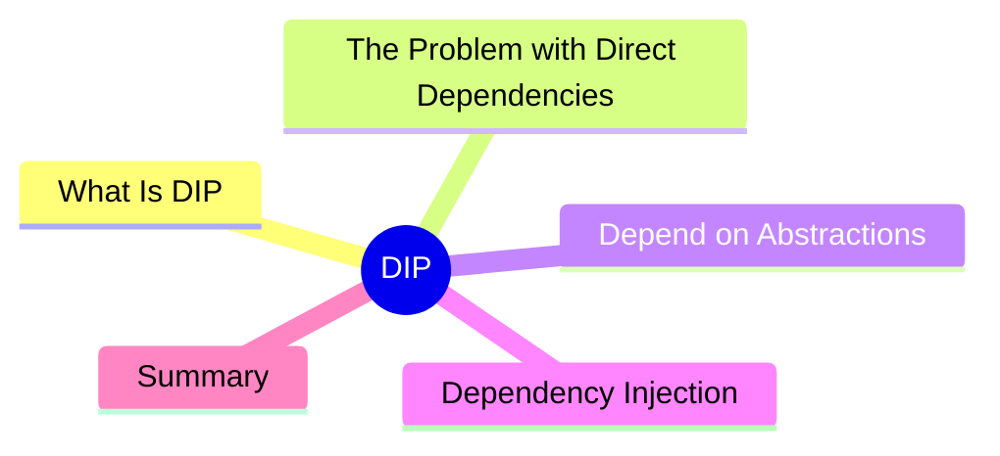

export const metadata = {
  title: 'SOLID Principles: Dependency Inversion Principle (DIP)',
  date: '2026-04-16',
  excerpt: 'A practical guide to the Dependency Inversion Principle — why high-level modules should not depend on low-level implementations, and how abstractions and dependency injection fix the relationship.',
  tags: ['Software Design', 'Best Practice', 'OOP'],
};

# SOLID Principles: Dependency Inversion Principle (DIP)

The Dependency Inversion Principle (DIP) is the D in SOLID:

> 1. High-level modules should not depend on low-level modules. Both should depend on abstractions.
> 2. Abstractions should not depend on details. Details should depend on abstractions.

The word "inversion" doesn't mean flip the dependency. It means **abstractions control the direction** — high-level modules define what they need, and low-level implementations conform to those needs.



- [What Is the Dependency Inversion Principle](#what-is-the-dependency-inversion-principle)
- [The Problem with Direct Dependencies](#the-problem-with-direct-dependencies)
- [Depend on Abstractions](#depend-on-abstractions)
- [Dependency Injection](#dependency-injection)
- [Summary](#summary)

---

## What Is the Dependency Inversion Principle

Consider an order service that needs a database connection, an email sender, and a logger. If the service creates those dependencies directly, it's what DIP calls a high-level module depending on low-level modules.

**High-level module**: OrderService — owns the business logic
**Low-level modules**: database, email, logger — handle implementation details

DIP says: neither should depend directly on the other. Both should depend on abstractions.

---

## The Problem with Direct Dependencies

```typescript
class MySQLUserRepository {
  save(user: User): void {
    mysql.query(`INSERT INTO users ...`);
  }
}

class SMTPNotifier {
  send(to: string, message: string): void {
    smtp.sendMail({ to, text: message });
  }
}

// high-level module directly depending on low-level implementations
class OrderService {
  private repo = new MySQLUserRepository();  // tightly coupled
  private notifier = new SMTPNotifier();      // tightly coupled

  placeOrder(userId: string, items: Item[]): void {
    const order = buildOrder(userId, items);
    this.repo.save(order);
    this.notifier.send(userId, 'Order placed successfully');
  }
}
```

Problems:

- Switching from MySQL to PostgreSQL means changing `OrderService`
- Testing `OrderService` requires a real MySQL connection and SMTP server
- `OrderService` → concrete class: high-level depends on low-level

---

## Depend on Abstractions

Replace the concrete dependencies with interfaces that the high-level module defines:

```typescript
// high-level module defines what it needs
interface UserRepository {
  save(user: User): void;
}

interface Notifier {
  send(to: string, message: string): void;
}

// low-level modules implement the abstractions
class MySQLUserRepository implements UserRepository {
  save(user: User): void {
    mysql.query(`INSERT INTO users ...`);
  }
}

class SMTPNotifier implements Notifier {
  send(to: string, message: string): void {
    smtp.sendMail({ to, text: message });
  }
}

// high-level module depends on abstractions, not implementations
class OrderService {
  constructor(
    private repo: UserRepository,  // interface, not concrete class
    private notifier: Notifier,     // interface, not concrete class
  ) {}

  placeOrder(userId: string, items: Item[]): void {
    const order = buildOrder(userId, items);
    this.repo.save(order);
    this.notifier.send(userId, 'Order placed successfully');
  }
}
```

Now `OrderService` and `MySQLUserRepository` both depend on `UserRepository` — they no longer depend directly on each other.

---

## Dependency Injection

DIP is usually implemented through dependency injection (DI) — dependencies are passed in from outside rather than created internally:

```typescript
// wire up the concrete implementations
const repo = new MySQLUserRepository();
const notifier = new SMTPNotifier();

// inject dependencies into OrderService
const orderService = new OrderService(repo, notifier);
```

In tests, inject mocks instead:

```typescript
const mockRepo: UserRepository = {
  save: jest.fn(),
};

const mockNotifier: Notifier = {
  send: jest.fn(),
};

// no real database or SMTP needed — fully controlled
const orderService = new OrderService(mockRepo, mockNotifier);
```

Tests are isolated, deterministic, and fast. Swapping implementations in production is equally clean.

---

## Summary

DIP in practice:

- **High-level modules define the abstractions** they depend on; low-level implementations conform to them
- Abstractions act as a firewall between high-level logic and low-level details
- Both layers can evolve and be tested independently

DIP is the foundation for dependency injection containers, service locators, and other advanced inversion-of-control patterns. All five SOLID principles are now complete — independent, but each one reinforcing the others.
