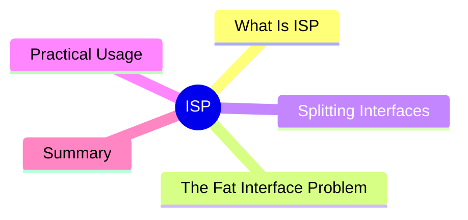

export const metadata = {
  title: 'SOLID Principles: Interface Segregation Principle (ISP)',
  date: '2026-04-14',
  excerpt: 'A practical guide to the Interface Segregation Principle — what fat interfaces look like, why they cause problems, and how splitting them leads to cleaner, more flexible code.',
  tags: ['Software Design', 'Best Practice', 'OOP'],
};

# SOLID Principles: Interface Segregation Principle (ISP)

The Interface Segregation Principle (ISP) is the I in SOLID:

> No client should be forced to depend on methods it does not use.

In plain terms: **keep interfaces small and focused. Don't dump unrelated methods into a single interface.**



- [What Is the Interface Segregation Principle](#what-is-the-interface-segregation-principle)
- [The Fat Interface Problem](#the-fat-interface-problem)
- [Splitting Interfaces](#splitting-interfaces)
- [Practical Usage](#practical-usage)
- [Summary](#summary)

---

## What Is the Interface Segregation Principle

A fat interface declares more methods than any single implementor needs. That forces implementors to provide stubs for functionality they don't actually support.

The classic example:

```typescript
interface Printer {
  print(document: string): void;
  scan(): string;
  fax(document: string, to: string): void;
  copy(document: string): void;
}
```

This interface models an all-in-one machine. Most real devices only support a subset of these operations.

---

## The Fat Interface Problem

```typescript
// a basic printer that only prints and copies
class SimplePrinter implements Printer {
  print(document: string): void {
    console.log(`Printing: ${document}`);
  }

  copy(document: string): void {
    console.log(`Copying: ${document}`);
  }

  // forced to implement this even though the machine has no scanner
  scan(): string {
    throw new Error('This device does not support scanning');
  }

  // forced to implement this even though the machine has no fax
  fax(document: string, to: string): void {
    throw new Error('This device does not support faxing');
  }
}
```

`SimplePrinter` is forced to implement two methods it can't support. That's a direct ISP violation: the class depends on an interface it doesn't fully use.

This also leads to an LSP violation: code calling `printer.scan()` will unexpectedly throw.

---

## Splitting Interfaces

Break the fat interface into smaller, focused ones:

```typescript
interface Printable {
  print(document: string): void;
}

interface Scannable {
  scan(): string;
}

interface Faxable {
  fax(document: string, to: string): void;
}

interface Copyable {
  copy(document: string): void;
}

// simple printer: only implements what it actually supports
class SimplePrinter implements Printable, Copyable {
  print(document: string): void {
    console.log(`Printing: ${document}`);
  }

  copy(document: string): void {
    console.log(`Copying: ${document}`);
  }
}

// all-in-one: implements everything
class AllInOnePrinter implements Printable, Scannable, Faxable, Copyable {
  print(document: string): void { /* ... */ }
  scan(): string { return '...scanned content'; }
  fax(document: string, to: string): void { /* ... */ }
  copy(document: string): void { /* ... */ }
}
```

Code that needs scanning accepts `Scannable` — it doesn't need to know or care whether the device can also print or fax.

---

## Practical Usage

ISP applies just as much to TypeScript type design as to class hierarchies:

```typescript
interface Readable {
  read(id: string): Promise<User>;
}

interface Writable {
  create(data: UserInput): Promise<User>;
  update(id: string, data: Partial<UserInput>): Promise<User>;
}

interface Deletable {
  delete(id: string): Promise<void>;
}

// this service only needs read access
class ReadOnlyUserService implements Readable {
  async read(id: string): Promise<User> {
    return db.findUser(id);
  }
}

// this service needs full access
class FullUserService implements Readable, Writable, Deletable {
  async read(id: string): Promise<User> { /* ... */ }
  async create(data: UserInput): Promise<User> { /* ... */ }
  async update(id: string, data: Partial<UserInput>): Promise<User> { /* ... */ }
  async delete(id: string): Promise<void> { /* ... */ }
}
```

---

## Summary

ISP in practice: **keep interfaces lean, specific, and focused on one capability**.

Benefits:

- Implementors only implement what they actually support
- No throwing from empty stubs (avoids LSP violations)
- Different consumers depend only on the capabilities they use, completely isolated from the rest

ISP and LSP go hand in hand — well-segregated interfaces mean subclasses are never forced to implement behavior they can't deliver.
