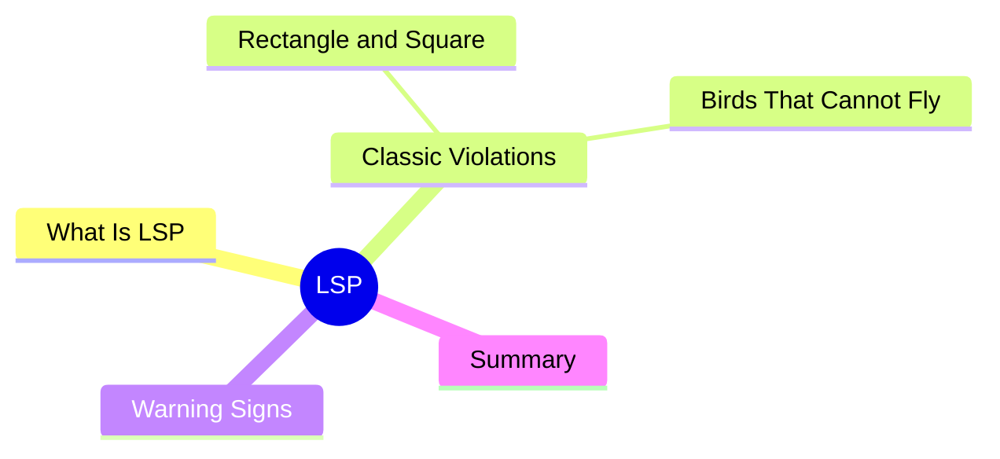

export const metadata = {
  title: 'SOLID Principles: Liskov Substitution Principle (LSP)',
  date: '2026-04-25',
  excerpt: 'A practical guide to the Liskov Substitution Principle — covering the classic Rectangle/Square problem, the Bird/Penguin example, and how to recognize LSP violations before they cause real trouble.',
  tags: ['Software Design', 'Best Practice', 'OOP'],
};

# SOLID Principles: Liskov Substitution Principle (LSP)

The Liskov Substitution Principle (LSP) is the L in SOLID, introduced by Barbara Liskov in 1987.

The core idea: **wherever your code accepts a base class, swapping in any subclass should work correctly — not just compile, but actually behave as expected**.

That distinction — "compiles" vs. "behaves correctly" — matters more than it might seem.



- [What Is the Liskov Substitution Principle](#what-is-the-liskov-substitution-principle)
- [Violation 1: Rectangle and Square](#violation-1-rectangle-and-square)
- [Violation 2: Birds That Can't Fly](#violation-2-birds-that-cant-fly)
- [Warning Signs](#warning-signs)
- [Summary](#summary)

---

## What Is the Liskov Substitution Principle

The formal definition:

> If S is a subtype of T, then objects of type T may be replaced with objects of type S without altering any desirable properties of the program.

In practical terms: **a parent class establishes a behavioral contract, and every subclass must honor it — not weaken it, not work around it**.

LSP is about semantic compatibility, not just syntactic compatibility. When you override a method, you can't require more from the caller than the parent did, and you can't promise less.

---

## Violation 1: Rectangle and Square

The textbook LSP example.

Mathematically, a square is a special kind of rectangle (all sides equal), so inheriting seems natural:

```typescript
class Rectangle {
  constructor(protected width: number, protected height: number) {}

  setWidth(w: number) { this.width = w; }
  setHeight(h: number) { this.height = h; }
  getArea(): number { return this.width * this.height; }
}

class Square extends Rectangle {
  // A square's sides must always be equal
  setWidth(w: number) {
    this.width = w;
    this.height = w;
  }

  setHeight(h: number) {
    this.width = h;
    this.height = h;
  }
}
```

Here's where it falls apart:

```typescript
function testArea(rect: Rectangle) {
  rect.setWidth(4);
  rect.setHeight(5);
  console.log(rect.getArea()); // expected: 20
}

testArea(new Rectangle(0, 0)); // 20 ✓
testArea(new Square(0));       // 25 ✗
```

`testArea` sets width to 4, then height to 5, and expects an area of 20. With a `Square`, `setHeight(5)` also sets `width` to 5, silently overwriting the previous call. The result is 5 × 5 = 25.

The code was written against the `Rectangle` contract: width and height are independent. `Square` broke that contract. The caller's assumption — "setting height doesn't change width" — no longer holds.

Mathematically a square is a rectangle. But inheritance isn't about classification; it's about **behavioral compatibility**. Those are two different things.

### The Fix

Use a shared interface and let each class implement it independently:

```typescript
interface Shape {
  getArea(): number;
}

class Rectangle implements Shape {
  constructor(private width: number, private height: number) {}

  setWidth(w: number) { this.width = w; }
  setHeight(h: number) { this.height = h; }
  getArea(): number { return this.width * this.height; }
}

class Square implements Shape {
  constructor(private side: number) {}

  setSide(s: number) { this.side = s; }
  getArea(): number { return this.side * this.side; }
}
```

Both implement `Shape`, each with their own API. No inherited contract to violate.

---

## Violation 2: Birds That Can't Fly

```typescript
class Bird {
  fly() {
    console.log("Flying...");
  }
}

class Penguin extends Bird {
  fly() {
    throw new Error("Penguins can't fly");
  }
}
```

Code that works fine with a `Bird` breaks immediately with a `Penguin`:

```typescript
function makeBirdFly(bird: Bird) {
  bird.fly();
}

makeBirdFly(new Bird());    // "Flying..."
makeBirdFly(new Penguin()); // Error: Penguins can't fly ✗
```

Biologically, a penguin is a bird. But in this design, `Penguin` violates the `fly()` contract and can't genuinely substitute for `Bird`.

### The Fix

Pull flying out into its own interface:

```typescript
class Bird {
  // behaviors shared by all birds
}

interface Flyable {
  fly(): void;
}

class Sparrow extends Bird implements Flyable {
  fly() {
    console.log("Flying...");
  }
}

class Penguin extends Bird {
  swim() {
    console.log("Swimming...");
  }
}
```

`Penguin` no longer inherits `fly()` and doesn't need to fake it. Code that requires flight accepts `Flyable`, not `Bird` — so `Penguin` can never accidentally end up there.

---

## Warning Signs

A few patterns that usually point to an LSP violation:

**1. A subclass method throws "not supported"**

```typescript
class ReadOnlyList extends MutableList {
  add(item: unknown) {
    throw new Error("This list is read-only"); // breaks the add() contract
  }
}
```

The parent promises `add()` works. The subclass quietly breaks that promise.

**2. Scattered `instanceof` checks**

```typescript
function processShape(shape: Shape) {
  if (shape instanceof Square) {
    // handle square specifically
  } else if (shape instanceof Rectangle) {
    // handle rectangle specifically
  }
}
```

If you need to know the actual type to handle it correctly, the subclasses aren't truly substitutable. The abstraction isn't holding up.

**3. Overriding a method to do nothing**

```typescript
class SilentLogger extends Logger {
  log(message: string) {
    // intentionally empty
  }
}
```

The parent contract says `log()` records something. The subclass silently drops it.

---

## Summary

The core of LSP: **inheritance isn't "I am this kind of thing" — it's "I can fully play this role"**.

Before finalizing an inheritance hierarchy, ask:

- Does every method in the subclass honor the behavioral contract of the parent?
- If the subclass replaces the parent everywhere in the codebase, does existing code still work correctly?
- Does any method in the subclass throw exceptions the parent's contract never mentioned?

If the answer to any of those is no, the inheritance relationship is probably wrong. Reach for interfaces or composition instead.

LSP and the Interface Segregation Principle (ISP) work closely together — lean interfaces mean subclasses are never forced to implement behavior they can't actually support.
