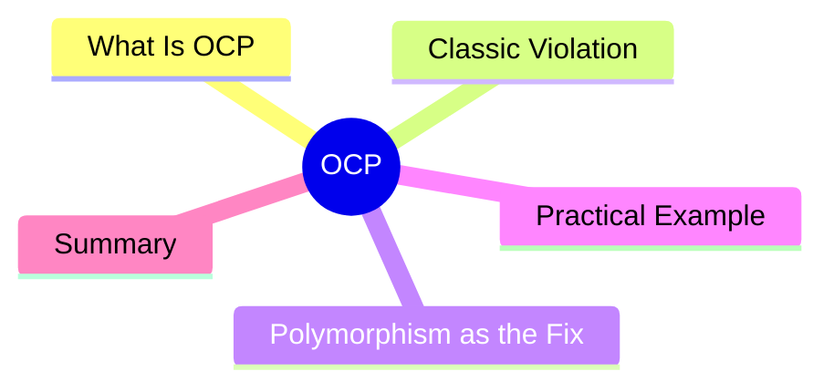

export const metadata = {
  title: 'SOLID Principles: Open/Closed Principle (OCP)',
  date: '2026-04-10',
  excerpt: 'A practical guide to the Open/Closed Principle — what it actually means to be open for extension and closed for modification, with the classic shape area example and a real-world payment system.',
  tags: ['Software Design', 'Best Practice', 'OOP'],
};

# SOLID Principles: Open/Closed Principle (OCP)

The Open/Closed Principle (OCP) is the O in SOLID:

> Software entities should be open for extension, but closed for modification.

**Open for extension** means you can add new behavior.
**Closed for modification** means you do that without touching existing code.

In practice: when a new requirement comes in, the answer should be "add new code," not "edit the code that's already working."



- [What Is the Open/Closed Principle](#what-is-the-openclosed-principle)
- [Classic Violation: Shape Area](#classic-violation-shape-area)
- [Polymorphism as the Fix](#polymorphism-as-the-fix)
- [Practical Example: Payment Methods](#practical-example-payment-methods)
- [Summary](#summary)

---

## What Is the Open/Closed Principle

The goal of OCP is: when requirements change, you don't have to touch code that's already tested and deployed.

Two benefits:

1. Less risk — code you don't touch can't break
2. New features can be developed and tested in isolation

---

## Classic Violation: Shape Area

```typescript
type Shape = { type: 'circle'; radius: number }
           | { type: 'rectangle'; width: number; height: number }
           | { type: 'triangle'; base: number; height: number };

function calculateArea(shape: Shape): number {
  if (shape.type === 'circle') {
    return Math.PI * shape.radius ** 2;
  } else if (shape.type === 'rectangle') {
    return shape.width * shape.height;
  } else if (shape.type === 'triangle') {
    return (shape.base * shape.height) / 2;
  }
  throw new Error('Unknown shape');
}
```

Every time you add a new shape, you must modify `calculateArea`. This function is closed for extension — you have to break it open every time.

As the number of shapes grows, so does the if-else chain, and so does the blast radius of every change.

---

## Polymorphism as the Fix

Move the area calculation responsibility into the shapes themselves:

```typescript
interface Shape {
  area(): number;
}

class Circle implements Shape {
  constructor(private radius: number) {}

  area(): number {
    return Math.PI * this.radius ** 2;
  }
}

class Rectangle implements Shape {
  constructor(private width: number, private height: number) {}

  area(): number {
    return this.width * this.height;
  }
}

class Triangle implements Shape {
  constructor(private base: number, private height: number) {}

  area(): number {
    return (this.base * this.height) / 2;
  }
}

// this function never needs to change again
function calculateArea(shape: Shape): number {
  return shape.area();
}
```

Adding a new shape? Add a new class that implements `Shape`. `calculateArea` doesn't change. Neither does anything else.

Open for extension. Closed for modification.

---

## Practical Example: Payment Methods

The same pattern shows up everywhere in real codebases:

```typescript
interface PaymentMethod {
  pay(amount: number): void;
}

class CreditCard implements PaymentMethod {
  pay(amount: number): void {
    console.log(`Charging credit card $${amount}`);
  }
}

class PayPal implements PaymentMethod {
  pay(amount: number): void {
    console.log(`Sending PayPal payment $${amount}`);
  }
}

class ApplePay implements PaymentMethod {
  pay(amount: number): void {
    console.log(`Processing Apple Pay $${amount}`);
  }
}

class Checkout {
  constructor(private paymentMethod: PaymentMethod) {}

  complete(amount: number): void {
    this.paymentMethod.pay(amount);
  }
}

// adding a fourth payment method: just add a new class
// Checkout and everything else stays untouched
const checkout = new Checkout(new ApplePay());
checkout.complete(1200);
```

The `Checkout` class doesn't know or care what payment method it's working with. You can add five more options without looking at `Checkout` at all.

---

## Summary

OCP in practice comes down to a few tools:

- **Interfaces / abstract classes** — define the closed behavioral contract; concrete implementations are open
- **Strategy pattern** — encapsulate swappable algorithms or behaviors as separate classes
- **Polymorphism** — new behavior via new classes, not modified conditionals

The practical test: if adding a new feature requires editing code that already exists and is already tested, ask whether there's a design that would let you do it through addition instead.
