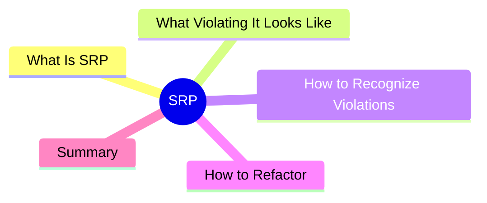

export const metadata = {
  title: 'SOLID Principles: Single Responsibility Principle (SRP)',
  date: '2026-04-08',
  excerpt: 'A practical guide to the Single Responsibility Principle — what "one reason to change" actually means, how to recognize when a class is doing too much, and how to refactor it.',
  tags: ['Software Design', 'Best Practice', 'OOP'],
};

# SOLID Principles: Single Responsibility Principle (SRP)

The Single Responsibility Principle (SRP) is the S in SOLID, and arguably the most misunderstood.

The common misread is "a class should only have one method." The actual principle: **a module should have only one reason to change**.

"Reason to change" means the source of requirements. Is it the business logic that's changing, the notification mechanism, the data storage? If a class needs to be modified for changes coming from different places, it's carrying too much.



- [What Is the Single Responsibility Principle](#what-is-the-single-responsibility-principle)
- [What Violating SRP Looks Like](#what-violating-srp-looks-like)
- [How to Recognize Violations](#how-to-recognize-violations)
- [How to Refactor](#how-to-refactor)
- [Summary](#summary)

---

## What Is the Single Responsibility Principle

Robert C. Martin's definition:

> A class should have only one reason to change.

"Reason to change" is the key phrase. Different business requirements represent different sources of change:

- Finance asks to update the billing format → one reason to change
- Engineering wants to swap the database → another reason
- Marketing wants to change the notification copy → yet another

If the same class needs to change for any of the above, it's violating SRP.

---

## What Violating SRP Looks Like

```typescript
class UserService {
  createUser(name: string, email: string) {
    if (!email.includes('@')) throw new Error('Invalid email');
    const user = { id: Date.now(), name, email };

    // directly touching the database
    db.query(`INSERT INTO users VALUES (${user.id}, '${name}', '${email}')`);

    // directly sending email
    const smtp = new SMTPClient('smtp.example.com', 587);
    smtp.send({
      to: email,
      subject: 'Welcome',
      body: `Hi ${name}, welcome!`,
    });

    // directly writing logs
    fs.appendFileSync('app.log', `[${new Date()}] User created: ${email}\n`);

    return user;
  }
}
```

This `UserService` is doing four separate jobs:

1. Business logic (validation, building the user object)
2. Database operations
3. Email notifications
4. Logging

Each of those can change for a completely different reason — switching databases, changing email providers, reformatting logs. Every change means touching this class, and every touch risks breaking something else.

---

## How to Recognize Violations

**You need "and" to describe what it does**

If you can't describe a class's purpose without using "and," it's probably doing too much:

- `UserService` handles "creating users **and** sending emails **and** writing logs"
- `ReportGenerator` "generates reports **and** saves them **and** sends them"

**More than one reason to change**

Ask yourself: what would force me to modify this class?

- Switching the database?
- Switching the email service?
- Changing the business logic?

If two or more of those answers are "yes," consider splitting it.

**Tests require mocking too many things**

If testing one piece of functionality requires setting up a bunch of unrelated dependencies, responsibilities are tangled together.

---

## How to Refactor

Extract each responsibility into its own class:

```typescript
// database operations in isolation
class UserRepository {
  save(user: User): void {
    db.query(`INSERT INTO users VALUES (${user.id}, '${user.name}', '${user.email}')`);
  }
}

// notification logic in isolation
class NotificationService {
  sendWelcome(name: string, email: string): void {
    const smtp = new SMTPClient('smtp.example.com', 587);
    smtp.send({ to: email, subject: 'Welcome', body: `Hi ${name}, welcome!` });
  }
}

// logging in isolation
class Logger {
  info(message: string): void {
    fs.appendFileSync('app.log', `[${new Date()}] ${message}\n`);
  }
}

// UserService only handles business logic
class UserService {
  constructor(
    private userRepo: UserRepository,
    private notification: NotificationService,
    private logger: Logger,
  ) {}

  createUser(name: string, email: string): User {
    if (!email.includes('@')) throw new Error('Invalid email');
    const user = { id: Date.now(), name, email };
    this.userRepo.save(user);
    this.notification.sendWelcome(name, email);
    this.logger.info(`User created: ${email}`);
    return user;
  }
}
```

Now each change hits exactly one class:

- Switch the database → only `UserRepository` changes
- Switch email providers → only `NotificationService` changes
- Reformat logs → only `Logger` changes
- Change business rules → only `UserService` changes

---

## Summary

SRP isn't "one method per class." It's "one source of requirements per class."

Practical checks:

- Can you describe the module's purpose without the word "and"?
- What different kinds of changes would force you to modify it?
- How many unrelated things do you need to mock when writing tests?

SRP is the foundation the other SOLID principles build on. Clear responsibilities make it easier to close things off from modification (OCP), swap implementations (LSP), compose focused interfaces (ISP), and inject dependencies (DIP).
