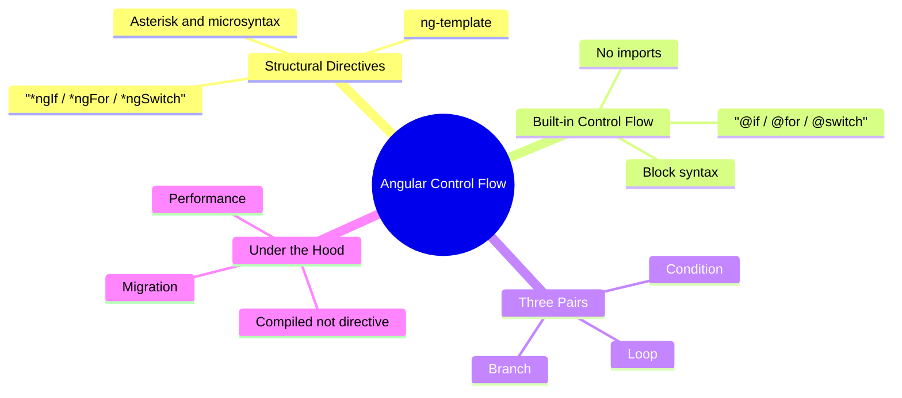
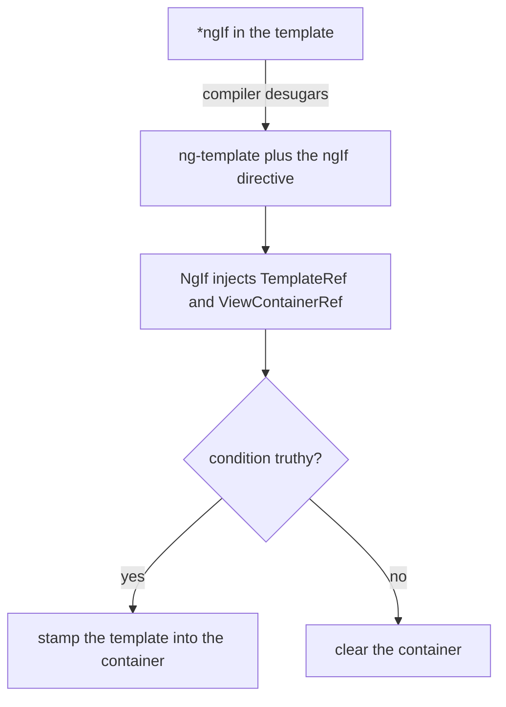
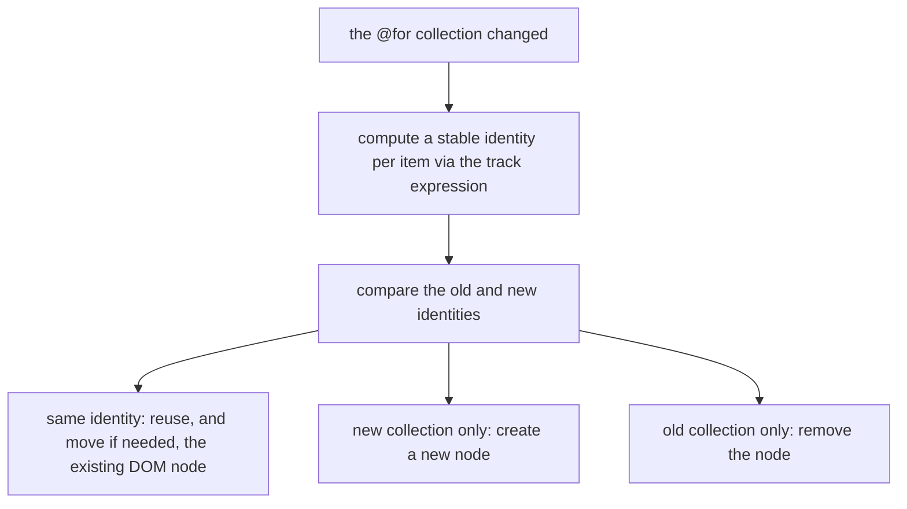
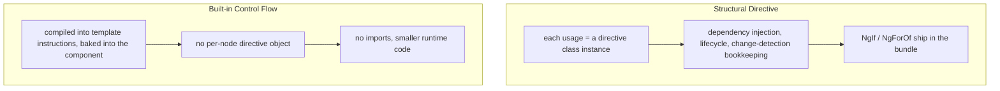

export const metadata = {
  title: 'Angular Control Flow: From Structural Directives to Built-in Blocks',
  date: '2026-06-23',
  excerpt: "A full comparison of Angular's two control-flow systems — the structural directives *ngIf, *ngFor, *ngSwitch, and the built-in block syntax @if, @for, @switch introduced in Angular 17. From the microsyntax behind the asterisk to the mechanism underneath, all the way to the performance @for buys with a mandatory track, the bundle savings, and how to actually migrate.",
  tags: ['Front-end', 'Angular'],
};

# Angular Control Flow: From Structural Directives to Built-in Blocks

From Angular 2 onward, there was just one way to write conditionals and loops in an Angular template: the structural directive. `*ngIf`, `*ngFor`, `*ngSwitch` — each carrying that faintly mysterious asterisk `*` out front. It worked, and it worked for a long time.

Angular 17 introduced another way — built-in control flow: `@if`, `@for`, `@switch`, written as `@`-prefixed blocks with braces around their content, reading much like JavaScript. On the surface this looks like the old syntax wearing new clothes. But dig one layer down and you find a completely different mechanism underneath. And it's that mechanism — not the cosmetics — that explains why the new syntax type-checks more precisely, ships less code, and, in the case of `@for`, runs dramatically faster.



- [Structural Directives and the Asterisk](#structural-directives-and-the-asterisk)
- [Built-in Control Flow: Block Syntax](#built-in-control-flow-block-syntax)
- [@if vs. *ngIf](#if-vs-ngif)
- [@for vs. *ngFor](#for-vs-ngfor)
- [@switch vs. *ngSwitch](#switch-vs-ngswitch)
- [Under the Hood and Performance](#under-the-hood-and-performance)
- [How to Migrate](#how-to-migrate)
- [Summary](#summary)

---

## Structural Directives and the Asterisk

To see what the new syntax improves, you first have to understand what the old syntax actually is. A structural directive is one that changes the structure of the DOM — adding, removing, or rearranging elements. `*ngIf`, `*ngFor`, and `*ngSwitch` all belong to this family, and the mark they share is that asterisk.

Here's the part most people never quite internalize, even after years of writing it: the `*` is pure syntactic sugar. This line:

```html
<div *ngIf="isLoggedIn" class="card">Welcome back</div>
```

is desugared by the compiler into an equivalent form built around an `<ng-template>`:

```html
<ng-template [ngIf]="isLoggedIn">
  <div class="card">Welcome back</div>
</ng-template>
```

`NgIf` is just an ordinary directive class. In its constructor it injects a `TemplateRef` (the wrapped template) and a `ViewContainerRef` (a container it can stamp content into), then decides — based on the condition — whether to stamp that template into the container. `*ngFor` works the same way; it just has a richer microsyntax:

```html
<div *ngFor="let item of items; let i = index; trackBy: trackById">
  {{ i }} - {{ item.name }}
</div>
```

which desugars into:

```html
<ng-template ngFor let-item [ngForOf]="items" let-i="index" [ngForTrackBy]="trackById">
  <div>{{ i }} - {{ item.name }}</div>
</ng-template>
```



This design carried Angular's entire early template system, but it comes with a few costs hidden in the details:

- The microsyntax is a bespoke mini-language. `let item of items; let i = index; trackBy: fn` looks like JavaScript but isn't — it's a string DSL the compiler parses with its own rules. The keywords (`of`, `let`, `trackBy`), the semicolons between clauses, the `as` aliasing — all of it has to be learned separately.
- One structural directive per element. You can't put `*ngIf` and `*ngFor` on the same element, because both want to claim the same host template. The standard workaround is to wrap one in an `<ng-container>`.
- else is awkward. To say "otherwise show this other thing," you write `*ngIf="cond; else other"` and then declare a separate `<ng-template #other>` somewhere else. The condition and its two branches end up scattered across the template.
- They're still directives. Every usage is a class instance, with the dependency injection, lifecycle, and change-detection bookkeeping that implies — and `NgIf`, `NgForOf`, `NgSwitch` have to be imported from `CommonModule` (especially visible in standalone components) before they land in your bundle.

None of these is fatal on its own, and Angular went a long way on this design. But added together, they form the case for a rethink.

---

## Built-in Control Flow: Block Syntax

Angular 17 (November 2023) introduced built-in control flow, which became stable in Angular 18. The same three jobs — condition, loop, branch — are now written as `@`-prefixed blocks:

```html
@if (isLoggedIn) {
  <p>Welcome back</p>
} @else {
  <p>Please sign in</p>
}
```

The crucial difference isn't that it reads more like JavaScript. It's that these are not directives. The Angular compiler understands `@if`, `@for`, and `@switch` natively and compiles them straight into template instructions baked into the component itself. That has a few direct consequences:

- Nothing to import. You don't import `CommonModule`, and you don't import `NgIf` — control flow is part of the language, available the moment you open a template. (Note: pipes like `async` and `date`, or attribute directives like `ngClass` and `ngStyle`, still come from `CommonModule`, so those imports stay.)
- It's the language, not a library. Because the syntax belongs to the compiler, the compiler can optimize it more deeply, type-check it more precisely, and emit less runtime code.

The three pairs line up roughly like this:

| Job | Structural Directive | Built-in Control Flow |
| - | - | - |
| Condition | `*ngIf` + an `else` template | `@if` / `@else if` / `@else` |
| Loop | `*ngFor` + optional `trackBy` | `@for` + mandatory `track` + `@empty` |
| Branch | `[ngSwitch]` + `*ngSwitchCase` | `@switch` / `@case` / `@default` |
| Imports | needs `CommonModule` | none |
| Nature | directive class instance | compiled template instruction |

The next three sections take these pairs apart one at a time.

---

## @if vs. *ngIf

For the simplest condition, the two are almost equally clean. Where they diverge is the "otherwise" case. `@if` has `@else if` and `@else` built in, so a chain of conditions reads top to bottom:

```html
@if (user.role === 'admin') {
  <admin-panel />
} @else if (user.role === 'editor') {
  <editor-panel />
} @else {
  <viewer-panel />
}
```

Expressing the same logic with `*ngIf` means doing the `ngIfElse`-plus-named-template dance:

```html
<div *ngIf="user.role === 'admin'; else editorTpl">
  <admin-panel />
</div>
<ng-template #editorTpl>
  <div *ngIf="user.role === 'editor'; else viewerTpl">
    <editor-panel />
  </div>
</ng-template>
<ng-template #viewerTpl>
  <viewer-panel />
</ng-template>
```

The condition and its branches get sliced into pieces scattered across separate `<ng-template>`s, and once the nesting deepens it's hard to read at a glance. `@if` pulls them back into one block, so the reading order matches the thinking order.

Aliasing carries over too, and more intuitively. You can bind a computed value — most commonly async data through the `async` pipe — to a local variable:

```html
@if (user$ | async; as user) {
  <p>{{ user.name }}</p>
  <p>{{ user.email }}</p>
}
```

Here `user` is scoped to this block alone — a clean, contained scope. There's also a quieter but very real benefit: type narrowing. Because the syntax belongs to the compiler, type inference inside an `@if` block is more reliable — within the block the compiler genuinely knows `user` is not `null`, and template type-checking sharpens accordingly.

---

## @for vs. *ngFor

The loop is where the two systems differ most — not just in how you write it, but in how fast it runs underneath. Start with the new syntax:

```html
@for (item of items; track item.id) {
  <li>{{ item.name }}</li>
} @empty {
  <li>No items yet</li>
}
```

Three things are worth taking apart one by one.

First, `track` went from optional to mandatory. In `*ngFor`, `trackBy` was an optimization you could take or leave, and most people left it. In `@for`, `track` is required by the compiler — leave it out and the template won't compile. It's also an expression (`item.id`) now, not a reference to a component method, which makes it lighter to write. Why is it non-negotiable? Because it's the key to the new high-speed diffing, which we'll get to in a moment.

Second, contextual variables are built in. With `*ngFor` you wrote `let i = index` to get the index; `@for` hands you a set of `$`-prefixed contextual variables ready to use:

| Variable | Meaning |
| - | - |
| `$index` | index of the current item |
| `$count` | total length of the collection |
| `$first` / `$last` | whether it's the first / last item |
| `$even` / `$odd` | whether the index is even / odd |

Rename them with `let` when you need to, which is especially handy in nested loops:

```html
@for (row of rows; track row.id; let rowIndex = $index) {
  @for (cell of row.cells; track cell.id; let colIndex = $index) {
    <td>{{ rowIndex }},{{ colIndex }}: {{ cell.value }}</td>
  }
}
```

Third, `@empty` is a first-class citizen. The content to show when the collection is empty goes right after the `@for`. With `*ngFor` you'd add a separate `*ngIf="items.length === 0"`, splitting the "has data" and "no data" states across two places to maintain.

### track and That 90%

`@for`'s heaviest selling point is runtime performance. According to community framework benchmarks (the js-framework-benchmark), the new `@for` can be up to roughly 90% faster at runtime than `*ngFor`. The mechanism behind that number is exactly what makes `track` mandatory.

`*ngFor` tracks collection changes through Angular's `IterableDiffer`. `@for` replaces that with a new, leaner diffing algorithm. And for any diffing to be fast, it has to be able to answer one question: "this item after the update — which item before the update is it the same as?" `track` is the answer you hand the compiler — it computes a stable identity for every item.



With stable identities, when the array is reordered or a few items are inserted in the middle, Angular can recognize which items haven't actually changed and move and reuse their existing DOM nodes instead of tearing everything down and rebuilding it. The creations and destructions you avoid are where the performance number comes from.

This is also why what you pick for `track` matters:

- When items move, reorder, get inserted or deleted, use a unique, stable identity, e.g. `track item.id`.
- For append-only or never-changing lists, `track $index` is enough.
- Never track by a value that's recomputed each time (such as a changing object), which forces Angular to treat every item as brand new — slower than not tracking at all.

In other words, making `track` mandatory isn't Angular being difficult. It takes the one decision that used to be easiest to skip yet mattered most for performance, and moves it somewhere you can't avoid facing it.

---

## @switch vs. *ngSwitch

The branch comparison best highlights the "a structural directive needs a host element" point. The new syntax is a set of pure blocks:

```html
@switch (status) {
  @case ('loading') {
    <spinner />
  }
  @case ('error') {
    <error-message />
  }
  @default {
    <dashboard />
  }
}
```

The old form needs a container element carrying `[ngSwitch]`, with the children each carrying `*ngSwitchCase`:

```html
<div [ngSwitch]="status">
  <spinner *ngSwitchCase="'loading'" />
  <error-message *ngSwitchCase="'error'" />
  <dashboard *ngSwitchDefault />
</div>
```

A few differences stand out:

- No wrapper element required. `[ngSwitch]` always needs a host element to live on (often adding an extra `<div>` or `<ng-container>` just for that); `@switch` needs none, since it is the block.
- `[ngSwitch]` is an attribute, `*ngSwitchCase` is structural. The old form actually mixes two kinds of directive — the `[ngSwitch]` on the container is *not* a structural directive; the asterisk directives on the children are what control display. `@switch` removes that bit of mental overhead entirely.
- Same comparison rule: strict equality. A `@case` value is compared against the `@switch` value with `===`, just like JavaScript's `switch`, which matches the old `ngSwitch` behavior. There's no fall-through; matching stops at the first `@case` that fits.

---

## Under the Hood and Performance

Everything in the three pairs above collapses into one sentence: structural directives are runtime directive objects; built-in control flow is a compile-time template instruction. Almost the entire difference grows out of that.



Three concrete benefits fall out of this:

- Smaller bundles. `NgIf`, `NgForOf`, and `NgSwitch` are no longer needed, and the whole `CommonModule` import can often go with them — and that runtime code leaving the bundle is what makes it smaller.
- Faster runtime. Partly from `@for`'s new diffing algorithm (up to ~90% faster), and partly from dropping the DI and change-detection overhead of "a directive instance per node."
- More precise type checking. With the syntax owned by the compiler, template type-checking and narrowing can go deeper and be more reliable.

| Aspect | Structural Directive | Built-in Control Flow |
| - | - | - |
| Nature | a directive class instance per usage | a compiled template instruction |
| Imports | needs `CommonModule` | none |
| `@for` diffing | `IterableDiffer` | new algorithm, up to ~90% faster |
| `track` / `trackBy` | optional | mandatory |
| Type narrowing | limited | fuller |
| Bundle impact | larger | smaller (drops the directives and imports) |

It's worth stressing that none of these come from "swapping in a prettier syntax." They all trace back to that one mechanical shift: turning control flow from a directive attached to an element into instructions the compiler understands and emits directly.

---

## How to Migrate

The good news is that this migration carries almost no risk.

The two systems coexist. You can use `*ngIf` and `@if` in the same project, even in the same template. There's no need to convert everything at once; you can move over gradually.

There's an official automated migration. Run one command and the schematic rewrites your project's templates into the new syntax, wiring up `else`, `@empty`, and `track` for you:

```bash
ng generate @angular/core:control-flow
```

It's careful about imports, too: it only drops the `CommonModule` import when nothing else (`ngClass`, `ngStyle`, or pipes like `async` and `date`) still needs it — so the bundle savings land safely.

Structural directives are not deprecated. As of Angular 20, `*ngIf`, `*ngFor`, and `*ngSwitch` still work normally — they aren't marked deprecated, and there's no removal timeline. Old code won't break; for new code, built-in control flow is simply the recommended default.

---

## Summary

From `*ngIf` to `@if`, what changes isn't just the syntax but the mechanism underneath:

- `*ngIf`, `*ngFor`, `*ngSwitch` and `@if`, `@for`, `@switch` do the same three jobs, but the former are runtime directive instances and the latter compile-time template instructions.
- The `*` is syntactic sugar that desugars into an `<ng-template>` plus a directive; the microsyntax, the one-structural-directive-per-element limit, and the awkward else are the costs of that design.
- Built-in control flow needs no imports and type-checks more precisely; `@if`'s `@else if` / `@else` and `@for`'s `@empty` are native to the language.
- `@for`'s `track` went from optional to mandatory and, paired with a new diffing algorithm, runs up to ~90% faster in community benchmarks — picking the right `track` is what makes that work.
- As of Angular 20 the structural directives aren't deprecated and both syntaxes coexist; but for new code the `@`-blocks are the recommended default, and `ng generate @angular/core:control-flow` migrates for you.
