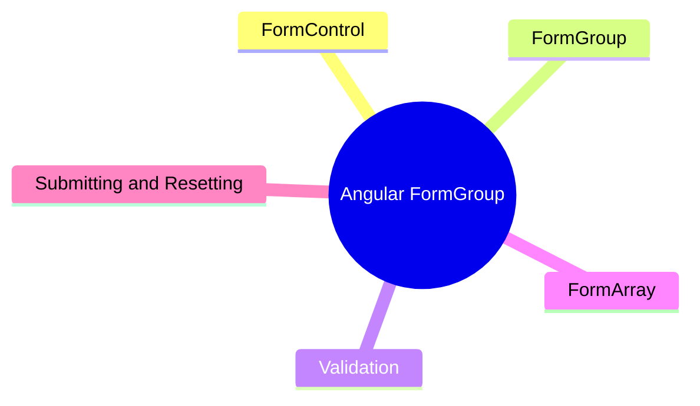

export const metadata = {
  title: 'Angular FormGroup: Reactive Forms',
  date: '2026-03-23',
  excerpt: 'A practical guide to Angular reactive forms — covering FormControl, FormGroup, built-in and custom validators, FormArray for dynamic fields, and form submission and reset.',
  tags: ['Front-end', 'Angular'],
};

# Angular FormGroup: Reactive Forms

Angular offers two approaches to handling forms: Template-driven Forms and Reactive Forms.

This article covers Reactive Forms, which manage form state in TypeScript using `FormGroup`, `FormControl`, and `FormArray`. The result is form logic that's easier to test, easier to control, and easier to scale.



- [FormControl](#formcontrol)
- [FormGroup](#formgroup)
- [Validation](#validation)
- [FormArray](#formarray)
- [Submitting and Resetting](#submitting-and-resetting)

---

## FormControl

`FormControl` is the basic unit of a reactive form — it represents a single input field.

```typescript
import { Component } from '@angular/core';
import { FormControl, ReactiveFormsModule } from '@angular/forms';

@Component({
  standalone: true,
  imports: [ReactiveFormsModule],
  template: `
    <input [formControl]="name" placeholder="Name" />
    <p>Current value: {{ name.value }}</p>
  `,
})
export class DemoComponent {
  name = new FormControl('');
}
```

### Reading and Setting Values

```typescript
// read
console.log(this.name.value);

// set
this.name.setValue('Charmy');
```

### Listening to Changes

```typescript
this.name.valueChanges.subscribe(value => {
  console.log(value);
});
```

---

## FormGroup

`FormGroup` combines multiple `FormControl` instances into a single group, representing the entire form or a section of it.

```typescript
import { Component } from '@angular/core';
import { FormGroup, FormControl, ReactiveFormsModule } from '@angular/forms';

@Component({
  standalone: true,
  imports: [ReactiveFormsModule],
  template: `
    <form [formGroup]="form">
      <input formControlName="name" placeholder="Name" />
      <input formControlName="email" placeholder="Email" />
    </form>
    <p>Form value: {{ form.value | json }}</p>
  `,
})
export class RegisterComponent {
  form = new FormGroup({
    name: new FormControl(''),
    email: new FormControl(''),
  });
}
```

### Reading and Setting Values

```typescript
// read the whole form
console.log(this.form.value); // { name: '', email: '' }

// read a single field
console.log(this.form.get('name')?.value);

// set all fields
this.form.setValue({
  name: 'Charmy',
  email: 'charmy@example.com',
});

// partial update — only updates the fields you specify
this.form.patchValue({
  name: 'Charmy',
});
```

### Form State

```typescript
this.form.valid    // all validations pass
this.form.invalid  // at least one validation fails
this.form.dirty    // at least one field has been modified
this.form.touched  // at least one field has been blurred
this.form.pristine // no fields have been modified yet
```

---

## Validation

### Built-in Validators

Angular's `Validators` class provides the most common validation rules out of the box:

```typescript
import { FormGroup, FormControl, Validators } from '@angular/forms';

form = new FormGroup({
  name: new FormControl('', [
    Validators.required,
    Validators.minLength(2),
    Validators.maxLength(50),
  ]),
  email: new FormControl('', [
    Validators.required,
    Validators.email,
  ]),
  age: new FormControl('', [
    Validators.min(0),
    Validators.max(120),
  ]),
});
```

Common built-in validators:

| Validator | Description |
| - | - |
| `Validators.required` | Field must not be empty |
| `Validators.minLength(n)` | At least n characters |
| `Validators.maxLength(n)` | At most n characters |
| `Validators.email` | Must be a valid email format |
| `Validators.min(n)` | Numeric value must be ≥ n |
| `Validators.max(n)` | Numeric value must be ≤ n |
| `Validators.pattern(regex)` | Must match the regex |

### Displaying Validation Errors

```html
<form [formGroup]="form">
  <input formControlName="name" placeholder="Name" />
  <div *ngIf="form.get('name')?.invalid && form.get('name')?.touched">
    <span *ngIf="form.get('name')?.errors?.['required']">Name is required</span>
    <span *ngIf="form.get('name')?.errors?.['minlength']">At least 2 characters required</span>
  </div>
</form>
```

### Custom Validators

A custom validator is a function that takes an `AbstractControl` and returns an error object if validation fails, or `null` if it passes:

```typescript
import { AbstractControl, ValidationErrors } from '@angular/forms';

function noSpaceValidator(control: AbstractControl): ValidationErrors | null {
  if (control.value && control.value.includes(' ')) {
    return { noSpace: true };
  }
  return null;
}
```

Using it:

```typescript
form = new FormGroup({
  username: new FormControl('', [
    Validators.required,
    noSpaceValidator,
  ]),
});
```

Displaying the custom error:

```html
<span *ngIf="form.get('username')?.errors?.['noSpace']">
  Username cannot contain spaces
</span>
```

---

## FormArray

`FormArray` manages a dynamic list of form controls — useful when the number of fields isn't known upfront, like a list of phone numbers or line items.

```typescript
import { Component } from '@angular/core';
import { FormGroup, FormControl, FormArray, Validators, ReactiveFormsModule } from '@angular/forms';
import { NgFor } from '@angular/common';

@Component({
  standalone: true,
  imports: [ReactiveFormsModule, NgFor],
  template: `
    <form [formGroup]="form">
      <div formArrayName="phones">
        <div *ngFor="let phone of phones.controls; let i = index">
          <input [formControlName]="i" placeholder="Phone number" />
          <button type="button" (click)="removePhone(i)">Remove</button>
        </div>
      </div>
      <button type="button" (click)="addPhone()">Add phone</button>
    </form>
  `,
})
export class ContactComponent {
  form = new FormGroup({
    phones: new FormArray([
      new FormControl('', Validators.required),
    ]),
  });

  get phones() {
    return this.form.get('phones') as FormArray;
  }

  addPhone() {
    this.phones.push(new FormControl('', Validators.required));
  }

  removePhone(index: number) {
    this.phones.removeAt(index);
  }
}
```

---

## Submitting and Resetting

### Submitting

```html
<form [formGroup]="form" (ngSubmit)="onSubmit()">
  <input formControlName="name" placeholder="Name" />
  <input formControlName="email" placeholder="Email" />
  <button type="submit" [disabled]="form.invalid">Submit</button>
</form>
```

```typescript
onSubmit() {
  if (this.form.valid) {
    console.log(this.form.value);
    // send the data...
  }
}
```

### Resetting

```typescript
// reset to empty
this.form.reset();

// reset to specific values
this.form.reset({
  name: '',
  email: '',
});
```

`reset` clears the values and also resets the `dirty`, `touched`, and other state flags.

---

## Summary

Reactive forms are built around three classes:

- `FormControl` — a single field, manages its value and validation state
- `FormGroup` — a group of fields representing a form or a section of one
- `FormArray` — a dynamic list of controls for when the field count isn't fixed

| | FormControl | FormGroup | FormArray |
| - | - | - | - |
| Use case | Single input | Form group | Dynamic fields |
| Read value | `.value` | `.value` | `.value` |
| Set value | `setValue` | `setValue` / `patchValue` | `push` / `removeAt` |
