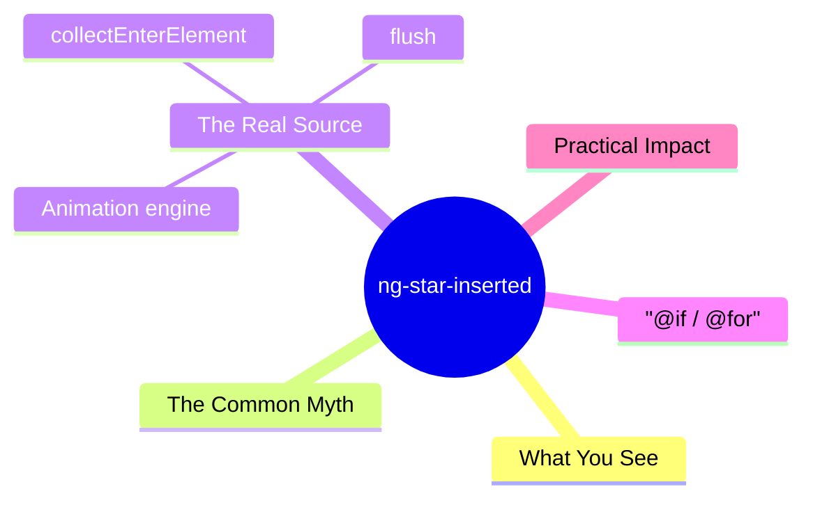
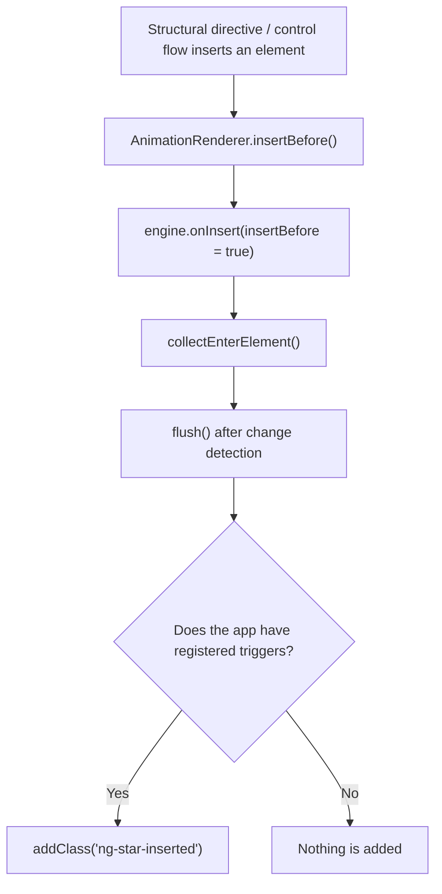

export const metadata = {
  title: 'Angular ng-star-inserted',
  date: '2026-06-25',
  excerpt: 'A close look at the ng-star-inserted class Angular leaves in the DOM — it is not added by structural directives, but by the animation engine. Where it really comes from, where the name comes from, and how @if / @for and a few real-world gotchas fit in.',
  tags: ['Front-end', 'Angular'],
};

# Angular ng-star-inserted

Open DevTools, inspect the DOM of any Angular app, and sooner or later you'll spot a class you never wrote: `ng-star-inserted`.

It has no styles, no behavior, and the official docs barely mention it. But where it comes from — and why it shows up on some elements but not others — is more interesting than most people assume. It has nothing directly to do with structural directives.



- [What You See](#what-you-see)
- [The Common Myth](#the-common-myth)
- [The Real Source Is the Animation Engine](#the-real-source-is-the-animation-engine)
- [@if and @for Behave the Same](#if-and-for-behave-the-same)
- [Practical Impact](#practical-impact)

---

## What You See

`ng-star-inserted` typically appears on elements rendered by a structural directive — `*ngIf`, `*ngFor`, `*ngSwitchCase`, or a custom one.

```html
<div *ngIf="isLoggedIn" class="card">Welcome back</div>
```

In some apps, that template renders as:

```html
<div class="card ng-star-inserted">Welcome back</div>
<!--bindings={ "ng-reflect-ng-if": "true" }-->
```

The mysterious `ng-star-inserted` sitting next to your `card` class, plus that trailing comment, are the two things people ask about most. The comment is the anchor left behind by the structural directive (`*ngIf` desugars into an `<ng-template>`, and the element is inserted just before that anchor). The class, meanwhile, is widely believed to be how Angular "marks" the elements it inserts.

It sounds reasonable. The trouble is, it's wrong.

---

## The Common Myth

Nearly every explanation online repeats the same line: *"structural directives automatically add `ng-star-inserted` to mark the elements they insert into the DOM."*

Testing it takes one experiment. Spin up a clean app with no animations at all and a single `*ngIf`.

```html
<div *ngIf="show" class="content">hello</div>
```

It renders as:

```html
<div class="content">hello</div>
```

No `ng-star-inserted`. The element was genuinely inserted by `*ngIf`, the structural directive worked exactly as expected, and yet the class simply isn't there.

In other words, structural directives don't add `ng-star-inserted`. Something else does — something you may not even realize is running.

---

## The Real Source Is the Animation Engine

Search the entire Angular source for the string `ng-star-inserted` and it shows up in exactly one package: `@angular/animations`. Not `@angular/core`, not `@angular/common`, not `@angular/platform-browser`. And that's been true the whole way from View Engine in v8 to Ivy in v20.

Here's the mechanism. When you enable animations (`provideAnimations()` or `BrowserAnimationsModule`), Angular wraps the underlying DOM renderer in an `AnimationRenderer`. From then on, every DOM insertion passes through the animation engine first. Structural directives insert their element *before* an anchor comment — that "insert before" is the signature of the `*` syntax. The engine intercepts those insertions and collects the elements; then, once change detection finishes and the engine runs `flush()`, it tags each one with `ng-star-inserted`.

```typescript
// inside @angular/animations (simplified)
const STAR_CLASSNAME = 'ng-star-inserted';

collectEnterElement(element) {
  this.collectedEnterElements.push(element);
}

flush() {
  // only runs when the app actually has registered animations
  if (this.totalAnimations && this.collectedEnterElements.length) {
    for (const elm of this.collectedEnterElements) {
      addClass(elm, STAR_CLASSNAME); // ← the class is added right here
    }
  }
  // ...
}
```



The name is buried in the source too. Right next to the logic that collects entering elements sits this comment: `// only *directives and host elements are inserted before`. The `star` refers to the asterisk `*` of structural directives; `inserted` means it was inserted into the DOM. Put together, `ng-star-inserted` means "an element the star syntax inserted, which the animation engine is now tracking."

So why does the engine bother marking them? So it can find them again. When a parent element later leaves, the engine needs to `query('.ng-star-inserted')` to round up the children that originally entered and run their leave animations correctly. The class is purely the engine's own bookkeeping.

One detail that's easy to misread: the condition is `totalAnimations` — the app needs at least one animation registered with `trigger()`. Just calling `provideAnimations()` without any element actually using an animation leaves `totalAnimations` at 0, and `ng-star-inserted` never appears.

---

## @if and @for Behave the Same

When Angular 17's new control flow landed, a common question followed: once you switch to `@if` and `@for`, does `ng-star-inserted` go away?

It doesn't. After compilation, `@if` and `@for` take the same "create an embedded view, then insert it" path as `*ngIf` and `*ngFor`. The animation engine intercepts, collects, and tags them through the exact same flow — so as long as the app has animations, control-flow elements get `ng-star-inserted` too.

```html
<!-- element has an animation, and the app enables animations -->
@if (show) {
  <div @fade class="content">hello</div>
}
```

```html
<div class="content ng-trigger ng-trigger-fade ng-star-inserted">hello</div>
```

For what it's worth, the `ng-trigger` and `ng-trigger-fade` classes on that same line come from the animation engine too — siblings of `ng-star-inserted` that mark "this element has an animation" and "which trigger applies." A whole row of `ng-`-prefixed classes in the DOM is almost always the animation engine's handiwork.

The key point is that this class was never tied to the `*` symbol itself. It's tied to "an element entering the DOM through a view the animation engine tracks." `star` is just a historical name from the asterisk era; the behavior is identical for old and new syntax.

| Scenario | Has `ng-star-inserted`? |
| - | - |
| `*ngIf` / `*ngFor`, app has no animations | No |
| `*ngIf` / `*ngFor`, element uses a `@trigger` animation | Yes |
| `@if` / `@for`, element uses a `@trigger` animation | Yes |
| Static element (not inside a structural directive or control flow) | No |

---

## Practical Impact

Don't target it in CSS, and don't assert on it in tests. It's an internal marker for the animation engine, not a public API; it only appears when animations are present, and Angular can change it without telling anyone. Any code that depends on it being there — or not being there — is built on sand.

Exact attribute selectors break because of it. A selector like `[class="content"]`, which demands the whole class string match exactly, fails the moment an extra `ng-star-inserted` token is added. Switch to a class selector `.content` (which matches individual tokens) and it's a non-issue. Any code or third-party library that assumes the class attribute contains only the tokens it set can trip over this extra one — Angular fielded reports of exactly that in the early days, the most famous being a clash with Font Awesome.

It's harmless. It isn't an error, it isn't a memory leak, and it doesn't mean an animation failed to finish. Seeing it in DevTools is nothing to worry about.

Really want it gone? The only way is to have no animations in the app — and almost nobody drops an entire animation setup over one harmless class. The pragmatic move is to know what it is and ignore it.

---

## Conclusion

- `ng-star-inserted` is added by `@angular/animations`, not by structural directives or the core renderer.
- No animations → it never appears; with a registered animation trigger → entering elements get tagged.
- `star` is the asterisk `*` of structural directives, `inserted` means it entered the DOM — together, it's how the animation engine tracks entering elements.
- `@if` / `@for` behave just like `*ngIf` / `*ngFor`; the new control flow doesn't make it disappear.
- It's an internal implementation detail — never tie styles or tests to it.
