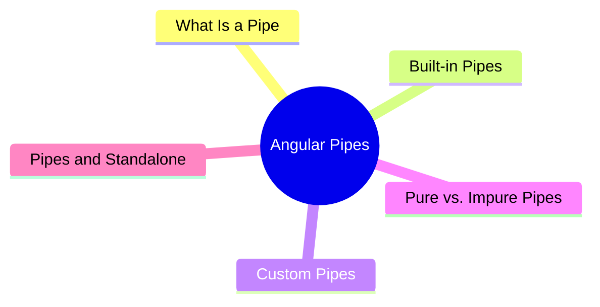

export const metadata = {
  title: 'Understanding Angular Pipe',
  date: '2026-03-22',
  excerpt: 'A practical guide to Angular pipes — covering built-in pipes, creating custom pipes, the difference between pure and impure pipes, and how to use them in standalone components.',
  tags: ['Front-end', 'Angular'],
};

# Angular Pipes

Pipes are Angular's way to transform data directly in templates.

Instead of formatting logic living in the component, pipes let you handle it inline — keeping components cleaner and templates more expressive.



- [What Is a Pipe](#what-is-a-pipe)
- [Built-in Pipes](#built-in-pipes)
- [Custom Pipes](#custom-pipes)
- [Pure vs. Impure Pipes](#pure-vs-impure-pipes)
- [Pipes and Standalone](#pipes-and-standalone)

---

## What Is a Pipe

Pipes use the `|` symbol to transform a value in a template:

```html
{{ value | pipeName }}
```

You can pass arguments:

```html
{{ value | pipeName:arg1:arg2 }}
```

And chain multiple pipes:

```html
{{ value | pipe1 | pipe2 }}
```

Pipes don't modify the original data — they only change how it's displayed.

---

## Built-in Pipes

Angular ships with a set of pipes that cover the most common formatting needs.

### DatePipe

Formats dates:

```html
{{ today | date }}
{{ today | date:'yyyy/MM/dd' }}
{{ today | date:'medium' }}
```

```typescript
today = new Date();
```

Common formats:

| Format | Example output |
| - | - |
| `'short'` | 1/15/24, 3:00 PM |
| `'medium'` | Jan 15, 2024, 3:00:00 PM |
| `'yyyy/MM/dd'` | 2024/01/15 |
| `'HH:mm'` | 15:00 |

### CurrencyPipe

Formats currency values:

```html
{{ price | currency }}
{{ price | currency:'TWD':'symbol':'1.0-0' }}
```

```typescript
price = 1200;
// output: NT$1,200
```

### DecimalPipe

Formats numbers:

```html
{{ 3.14159 | number:'1.2-2' }}
<!-- output: 3.14 -->
```

The format is `minIntegerDigits.minFractionDigits-maxFractionDigits`.

### PercentPipe

Formats percentages:

```html
{{ 0.85 | percent }}
<!-- output: 85% -->

{{ 0.85 | percent:'1.1-2' }}
<!-- output: 85.0% -->
```

### UpperCasePipe / LowerCasePipe / TitleCasePipe

```html
{{ 'hello world' | uppercase }}
<!-- output: HELLO WORLD -->

{{ 'HELLO WORLD' | lowercase }}
<!-- output: hello world -->

{{ 'hello world' | titlecase }}
<!-- output: Hello World -->
```

### JsonPipe

Serializes an object to JSON — handy for debugging:

```html
<pre>{{ user | json }}</pre>
```

### AsyncPipe

Subscribes to an Observable or Promise and automatically updates the displayed value. It also unsubscribes when the component is destroyed, so you don't have to manage it manually:

```html
{{ data$ | async }}
```

```typescript
data$ = this.userService.getUsers();
```

`AsyncPipe` is the standard way to handle async data in templates.

### SlicePipe

Returns a subset of an array or string:

```html
{{ [1, 2, 3, 4, 5] | slice:1:3 }}
<!-- output: [2, 3] -->

{{ 'Hello World' | slice:0:5 }}
<!-- output: Hello -->
```

---

## Custom Pipes

When the built-in pipes don't cover your use case, you can build your own.

### Creating a Custom Pipe

Use the `@Pipe` decorator and implement the `PipeTransform` interface:

```typescript
import { Pipe, PipeTransform } from '@angular/core';

@Pipe({
  name: 'truncate',
  standalone: true,
})
export class TruncatePipe implements PipeTransform {
  transform(value: string, limit: number = 50): string {
    if (value.length <= limit) {
      return value;
    }
    return value.slice(0, limit) + '...';
  }
}
```

### Using a Custom Pipe

Add it to the component's `imports`, then use it in the template:

```typescript
import { Component } from '@angular/core';
import { TruncatePipe } from './truncate.pipe';

@Component({
  standalone: true,
  imports: [TruncatePipe],
  template: `
    <p>{{ longText | truncate:20 }}</p>
  `,
})
export class ArticleComponent {
  longText = 'This is a very long text that needs to be truncated.';
}
```

Output:

```text
This is a very long...
```

### Multiple Parameters

`transform` can accept as many arguments as you need:

```typescript
@Pipe({
  name: 'highlight',
  standalone: true,
})
export class HighlightPipe implements PipeTransform {
  transform(value: string, keyword: string, color: string = 'yellow'): string {
    if (!keyword) return value;
    return value.replace(
      new RegExp(keyword, 'gi'),
      `<mark style="background:${color}">$&</mark>`
    );
  }
}
```

```html
<p [innerHTML]="text | highlight:'Angular':'lightblue'"></p>
```

---

## Pure vs. Impure Pipes

### Pure Pipes (default)

A pure pipe only re-runs when its **input reference** changes.

For primitives (`string`, `number`, `boolean`), any change in value triggers a recalculation.

For objects and arrays, only a **reference change** (reassignment) triggers it. Mutating the contents of an array or object won't:

```typescript
// does NOT trigger a pure pipe
this.items.push(newItem);

// DOES trigger a pure pipe (new array reference)
this.items = [...this.items, newItem];
```

Pure pipes are efficient because Angular doesn't have to recalculate them on every change detection cycle.

### Impure Pipes

Set `pure: false` in the `@Pipe` decorator to create an impure pipe:

```typescript
@Pipe({
  name: 'filter',
  standalone: true,
  pure: false,
})
export class FilterPipe implements PipeTransform {
  transform(items: any[], keyword: string): any[] {
    if (!keyword) return items;
    return items.filter(item =>
      item.name.toLowerCase().includes(keyword.toLowerCase())
    );
  }
}
```

Impure pipes re-run on every change detection cycle, so they catch mutations inside arrays and objects. The trade-off is performance — they can slow things down if the transformation is expensive.

**Default to pure pipes.** Use impure pipes only when you need them, and be mindful of the performance cost.

---

## Pipes and Standalone

In Angular 17+, pipes are standalone by default.

To use built-in pipes, import them individually in the component's `imports`:

```typescript
import { Component } from '@angular/core';
import { DatePipe, CurrencyPipe, AsyncPipe } from '@angular/common';

@Component({
  standalone: true,
  imports: [DatePipe, CurrencyPipe, AsyncPipe],
  template: `
    <p>{{ today | date:'yyyy/MM/dd' }}</p>
    <p>{{ price | currency:'TWD':'symbol':'1.0-0' }}</p>
    <p>{{ data$ | async }}</p>
  `,
})
export class DemoComponent {
  today = new Date();
  price = 1200;
  data$ = this.someService.getData();
}
```

Or import `CommonModule` to get all the common pipes at once:

```typescript
import { CommonModule } from '@angular/common';

@Component({
  standalone: true,
  imports: [CommonModule],
  template: `...`,
})
export class DemoComponent {}
```

Custom pipes with `standalone: true` can be added directly to a component's `imports` — no NgModule needed.

---

## Conclusion

Pipes keep formatting logic out of components and make templates more readable:

- Built-in pipes handle dates, currency, numbers, strings, and async data
- Custom pipes are built with `@Pipe` and `PipeTransform`
- Pure pipes (the default) only recalculate on reference changes — better for performance
- Impure pipes recalculate on every change detection cycle — use sparingly
- In standalone components, pipes go in the `imports` array
