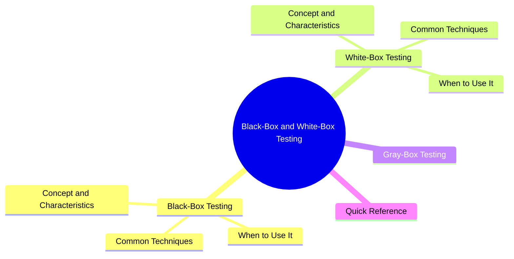
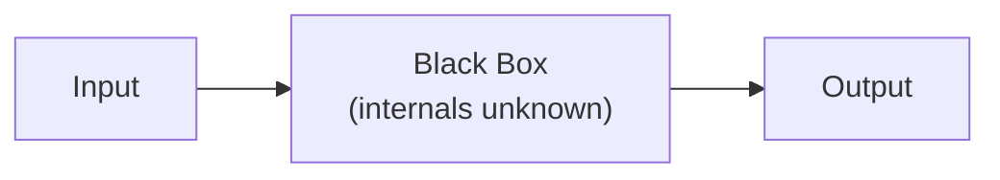
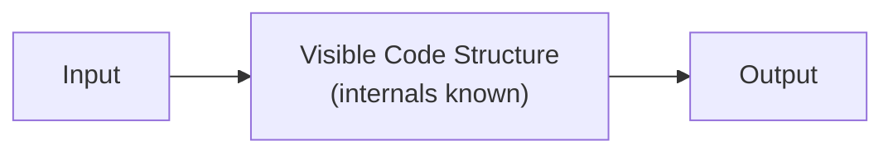

export const metadata = {
  title: 'Black-Box, White-Box, and Gray-Box Testing',
  date: '2026-03-31',
  excerpt: 'A practical guide to black-box, white-box, and gray-box testing — covering the key techniques, when to use each, and how they fit together in a complete testing strategy.',
  tags: ['Testing', 'Software Design'],
};

# Black-Box, White-Box, and Gray-Box Testing

Software testing methods are classified by how much the tester knows about the internal structure of the system:

- Black-box testing — no knowledge of the internals; tests inputs and outputs only
- White-box testing — full knowledge of the internals; tests are designed based on the code structure
- Gray-box testing — partial knowledge of the internals



- [Black-Box Testing](#black-box-testing)
- [White-Box Testing](#white-box-testing)
- [Gray-Box Testing](#gray-box-testing)
- [Quick Reference](#quick-reference)

---

## Black-Box Testing

### Concept and Characteristics

Black-box testing treats the system as a black box — the tester only knows what goes in and what should come out, with no knowledge of or interest in how it works internally.



Testers are typically QA engineers or end users who don't need to read source code. Tests are based on requirements, user stories, or API documentation.

### Common Techniques

Equivalence Partitioning

Divide inputs into equivalent classes and test one representative value from each.

For example, an age validation field (valid range 0–120):

```
Invalid class (negative): -1
Valid class (0–120): 60
Invalid class (over 120): 121
```

One value per class, rather than testing every possible input.

Boundary Value Analysis

Test values at and around the boundaries of equivalence partitions, since that's where bugs most often hide.

For the same age validation:

```
Test values: -1, 0, 1, 119, 120, 121
```

Decision Table Testing

Useful for logic with multiple condition combinations:

```
Condition A | Condition B | Expected Result
    T       |      T      |    Result 1
    T       |      F      |    Result 2
    F       |      T      |    Result 3
    F       |      F      |    Result 4
```

### When to Use It

- Acceptance testing — confirming the product meets user requirements
- Functional testing — verifying features work as specified
- Regression testing — ensuring existing features still work after changes
- API testing — validating input/output behavior against documentation

---

## White-Box Testing

### Concept and Characteristics

White-box testing (also called transparent-box or glass-box testing) gives the tester full visibility into the code. Tests are designed based on the internal structure and logic.



Testers are typically the developers themselves. The goal is to ensure every branch, path, and statement in the code is exercised.

### Common Techniques

Statement Coverage

Every line of code is executed at least once:

```javascript
function divide(a, b) {
  if (b === 0) {        // needs a test where b = 0
    return null;
  }
  return a / b;         // needs a test where b ≠ 0
}
```

Branch Coverage

Every branch of every conditional is tested:

```javascript
function classify(score) {
  if (score >= 60) {    // needs tests for both true and false
    return 'Pass';
  } else {
    return 'Fail';
  }
}
```

Path Coverage

Every possible execution path through the code is tested, including all combinations of conditions. Path coverage is the most thorough — and the hardest to achieve at 100%.

Unit Testing

The most common form of white-box testing — testing individual functions or modules in isolation:

```javascript
// The function under test
function add(a, b) {
  return a + b;
}

// Unit tests
test('add should return the sum of two numbers', () => {
  expect(add(1, 2)).toBe(3);
  expect(add(-1, 1)).toBe(0);
  expect(add(0, 0)).toBe(0);
});
```

### When to Use It

- Unit testing — testing individual functions or modules
- Integration testing — testing interactions between modules
- Security testing — identifying vulnerabilities in the code
- Code coverage analysis — measuring how much of the codebase is tested

---

## Gray-Box Testing

Gray-box testing sits between black-box and white-box — the tester has partial knowledge of the system's internals, but not full visibility.

Common scenarios:

- Knowing the database schema but not all the business logic
- Knowing how the frontend calls the backend, but not the backend's implementation details
- Security penetration testing with some knowledge of the system architecture

Gray-box testing produces more targeted test cases than pure black-box testing, without requiring the complete code understanding that white-box demands.

---

## Quick Reference

| | Black-Box | White-Box | Gray-Box |
| - | - | - | - |
| Internal knowledge | None | Full | Partial |
| Test basis | Requirements, user behavior | Code structure | Both combined |
| Who runs it | QA engineers, testers | Developers | Developers or testers |
| Strengths | User-perspective, implementation-agnostic | Can cover every code detail | Combines strengths of both |
| Weaknesses | May miss internal edge cases | May overlook real usage scenarios | Requires more background knowledge |
| Typical use | Functional testing, acceptance testing | Unit testing, code coverage | Integration testing, penetration testing |

---

## Conclusion

- Black-box testing — tests from the outside; no code knowledge required; validates that the system behaves according to requirements
- White-box testing — tests from the inside; based on code structure; ensures all paths and branches are covered
- Gray-box testing — partial internal knowledge; enables more targeted testing

In practice, a solid testing strategy combines all three: developers write unit tests (white-box), QA engineers handle functional and acceptance testing (black-box), and integration tests often fall somewhere in between (gray-box).
