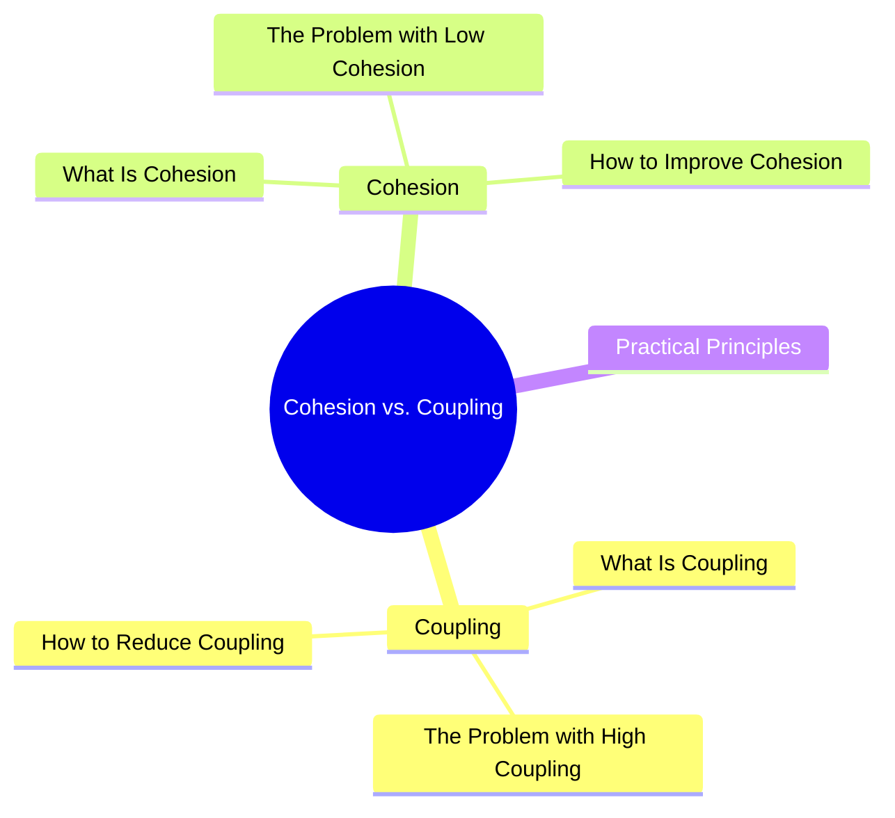

export const metadata = {
  title: 'Cohesion vs. Coupling',
  date: '2026-04-18',
  excerpt: 'A practical guide to cohesion and coupling — covering what high coupling and low cohesion look like, how to fix them with dependency injection and the Single Responsibility Principle, and practical questions to evaluate your own code.',
  tags: ['Software Design', 'Best Practice'],
};

# Cohesion vs. Coupling

Cohesion and coupling are two fundamental concepts for evaluating code quality.

The goal of good software design: high cohesion, low coupling.

- High cohesion — the elements inside a module are closely related and focused on one thing
- Low coupling — modules have minimal dependencies on each other and can change independently



- [Coupling](#coupling)
- [Cohesion](#cohesion)
- [Practical Principles](#practical-principles)

---

## Coupling

### What Is Coupling

Coupling describes how much one module depends on another. The higher the coupling, the more likely a change in one module will break something else.

High coupling:

```javascript
class UserComponent {
  getUser() {
    const db = new Database('mysql://localhost/users');
    const query = db.query('SELECT * FROM users WHERE id = 1');
    return query.result;
  }
}
```

This component reaches directly into the database. If you switch to PostgreSQL, this changes. If the query logic changes, this changes. If you want to test it with fake data, you're stuck.

Low coupling:

```javascript
class UserComponent {
  constructor(private userService: UserService) {}

  getUser(id: number) {
    return this.userService.getUser(id);
  }
}
```

Now `UserComponent` doesn't know or care how the data is fetched. Swap the implementation, write a test with a mock — just replace what gets injected.

### The Problem with High Coupling

- Hard to change — modifying one module forces changes in everything that depends on it
- Hard to test — the module relies on real external resources; setting up tests is painful
- Hard to reuse — the module is tied to a specific implementation and can't stand alone
- Hard to understand — a module's behavior depends on too many external factors

### How to Reduce Coupling

Dependency Injection

Don't create dependencies inside a module — pass them in from outside:

```javascript
// high coupling: creates its own dependency
class OrderService {
  constructor() {
    this.emailService = new EmailService();
  }
}

// low coupling: dependency is injected
class OrderService {
  constructor(emailService) {
    this.emailService = emailService;
  }
}
```

Depend on interfaces, not implementations

Code against abstractions so implementations can be swapped freely.

Event-driven communication

Modules communicate through events instead of calling each other's methods directly:

```javascript
// high coupling: direct call
orderService.complete(order);
emailService.sendConfirmation(order); // OrderService has to know about EmailService

// low coupling: event-driven
orderService.complete(order);
eventBus.emit('order.completed', order); // EmailService subscribes and handles it
```

---

## Cohesion

### What Is Cohesion

Cohesion describes how closely related the elements inside a module are. High cohesion means the module has a single, well-defined purpose. Low cohesion means it's doing too many unrelated things.

Low cohesion:

```javascript
class Utils {
  formatDate(date) { ... }
  sendEmail(to, subject) { ... }
  calculateTax(price) { ... }
  validatePassword(password) { ... }
  resizeImage(image, width) { ... }
}
```

This `Utils` class has no clear identity. Everything unrelated ends up here. That's low cohesion.

High cohesion:

```javascript
class DateFormatter {
  format(date) { ... }
  parse(string) { ... }
}

class EmailService {
  send(to, subject, body) { ... }
  validate(email) { ... }
}

class TaxCalculator {
  calculate(price, rate) { ... }
}
```

Each class owns its domain. The purpose of each one is immediately clear.

### The Problem with Low Cohesion

- Hard to understand — a module doing many unrelated things is difficult to reason about
- Hard to maintain — changing one feature risks accidentally breaking unrelated code in the same module
- Hard to test — too many unrelated scenarios to cover
- Hard to reuse — you can't pull out one piece without dragging everything else along

### How to Improve Cohesion

Single Responsibility Principle

Every module should have one reason to change. If you need "and" to describe what a module does, it probably needs to be split:

```javascript
// needs splitting: "manage users AND send notifications"
class UserManager {
  updateUser(user) { ... }
  sendWelcomeEmail(user) { ... } // this belongs elsewhere
}

// after splitting
class UserService {
  updateUser(user) { ... }
}

class NotificationService {
  sendWelcomeEmail(user) { ... }
}
```

---

## Practical Principles

### Frontend Component Design

Smart/Dumb Components is cohesion and coupling in action:

- Dumb components only accept props and emit events, with no service dependencies → low coupling
- Dumb components only handle UI rendering → high cohesion

### Function Design

```javascript
// low cohesion, high coupling
function processOrder(orderId) {
  const order = db.getOrder(orderId);      // reaches into the database
  const tax = order.price * 0.1;           // tax logic mixed in
  order.total = order.price + tax;
  db.saveOrder(order);                     // back to the database
  emailService.sendReceipt(order);         // depends on email service too
}

// high cohesion, low coupling
function calculateTotal(price, taxRate) {
  return price + price * taxRate;          // does one thing
}
```

### Questions to Ask Yourself

- Coupling: If module A changes, does module B need to change too? → possibly too coupled
- Cohesion: Can you describe this module's purpose in one sentence? → no → possibly too low cohesion
- Testability: Does testing this module require a lot of setup? → probably too coupled

---

## Summary

| | High | Low |
| - | - | - |
| Cohesion | Good — focused, easy to understand and maintain | Bad — scattered responsibilities, hard to maintain |
| Coupling | Bad — tightly dependent, hard to change | Good — independent, easy to swap and test |

The goal: high cohesion, low coupling.

These two concepts are the foundation of many design principles — SOLID, Clean Architecture, and others. Internalizing them will help you make better design decisions in everyday development.
