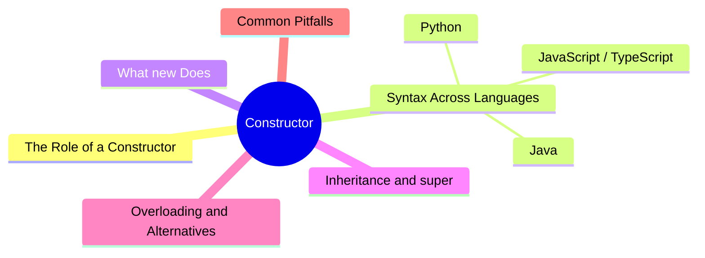
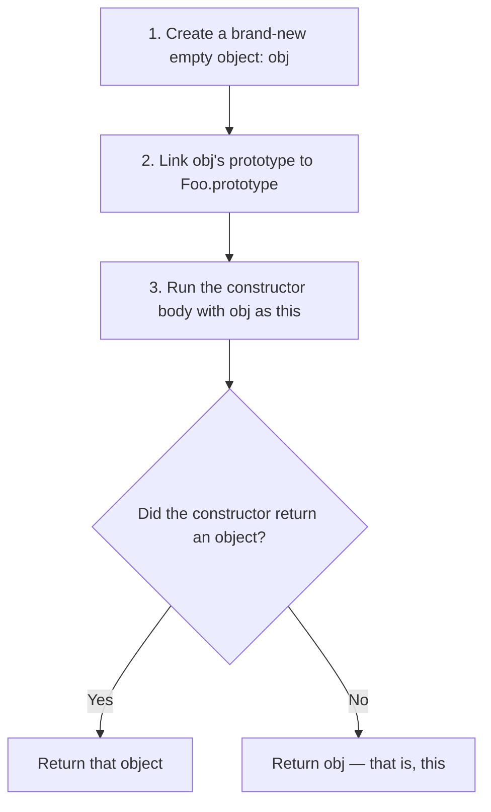
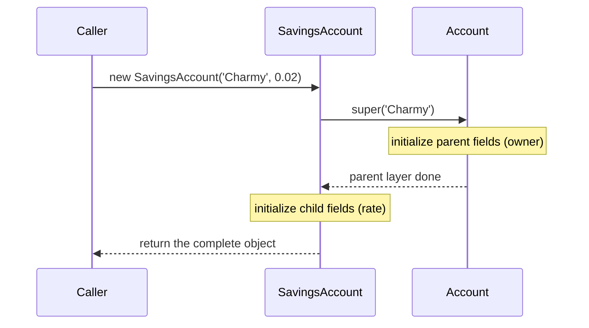

export const metadata = {
  title: 'Constructors: How an Object Gets Initialized',
  date: '2026-06-29',
  excerpt: 'A deep dive into what constructors actually do — the four steps behind new, the super() chain during inheritance, the trade-offs between overloading and static factory methods, and the pitfalls that bite in practice — illustrated across JavaScript, Python, and Java.',
  tags: ['OOP', 'Software Design'],
};

# Constructors: How an Object Gets Initialized

A constructor is the special method that runs the moment an object is created. Its one job is to take a freshly allocated, empty object and hand it back ready to use — arguments captured, fields set, invariants established.

Every time you write `new`, the constructor is the initialization code that runs once, and exactly once, per object. It pulls in the arguments, sets the fields, wires up whatever the object needs, and makes sure it's in a valid, usable state from the start.

Most frontend developers meet constructors through the ES6 `class`, but they're a concept shared by every object-oriented language. The syntax differs; the problem they solve doesn't — how do you guarantee that an object is whole from its very first line of life?



- [The Role of a Constructor](#the-role-of-a-constructor)
- [Syntax Across Languages](#syntax-across-languages)
- [What new Actually Does](#what-new-actually-does)
- [Inheritance and super()](#inheritance-and-super)
- [Constructor Overloading and Alternatives](#constructor-overloading-and-alternatives)
- [Common Pitfalls](#common-pitfalls)
- [Conclusion](#conclusion)

---

## The Role of a Constructor

To understand constructors, separate two ideas first: defining a class and creating an object. A class is a blueprint — it describes what an object looks like and what it can do — but the blueprint itself isn't an object. The thing that actually produces an object is `new`, and the constructor is the slice of `new` that gets the object ready.

Without a constructor, an object is born as an empty shell and filled in afterward, one field at a time. Until it's fully populated, it's a half-built thing:

```typescript
// No constructor: the object exists first, then gets filled in — a half-built state
class User {
  id!: string;
  name!: string;
}

const user = new User();
// Before these two lines, user's fields are all undefined
user.id = 'u-1';
user.name = 'Charmy';
```

The problem is that the half-built state leaks. Anyone who gets hold of `user` before it's fully populated can read `undefined`, and every place that creates a `User` has to remember to set every field — miss one and you've got a latent bug.

A constructor binds "create" and "make ready" into a single, indivisible step:

```typescript
// With a constructor: creation and initialization are one action — no half-built state
class User {
  constructor(
    public id: string,
    public name: string,
  ) {}
}

const user = new User('u-1', 'Charmy'); // whole from the moment it exists
```

> Writing `public id` directly in the constructor parameters is TypeScript's parameter properties shorthand. It declares a field of the same name and assigns the argument to it automatically, saving you the boilerplate `this.id = id`.

This buys you something deeper: the constructor is the object's single entry point for creation, so validation can live in one place. As long as the constructor guarantees that an invalid object can't be built at all, the rest of your code is free to assume that whatever object it holds is valid.

---

## Syntax Across Languages

The same scenario plays out in three languages below: a bank account with an owner and a starting balance, where the balance can't be negative.

### 1. JavaScript / TypeScript

The `constructor` keyword defines the constructor. It has no return type — `new` returns the instance for you. Paired with native private fields (`#`), you can reject invalid input at the exact moment of construction.

```typescript
class BankAccount {
  #balance: number;

  constructor(
    public readonly owner: string,
    initialBalance: number = 0,
  ) {
    if (initialBalance < 0) {
      throw new Error('Initial balance cannot be negative.');
    }
    this.#balance = initialBalance;
  }

  get balance(): number {
    return this.#balance;
  }
}

const account = new BankAccount('Charmy', 100);
console.log(account.owner);   // 'Charmy'
console.log(account.balance); // 100
// new BankAccount('Eve', -50); // throws Error: Initial balance cannot be negative.
```

Three ideas show up at once here: `readonly` locks `owner` after it's set, `initialBalance = 0` is a default parameter, and `throw` makes an invalid account impossible to construct.

### 2. Python

Python uses the `__init__` method for initialization. Its first parameter, `self`, refers to the instance currently being built.

```python
class BankAccount:
    def __init__(self, owner: str, initial_balance: float = 0):
        if initial_balance < 0:
            raise ValueError("Initial balance cannot be negative.")
        self.owner = owner
        self._balance = initial_balance  # single underscore is the conventional "private" prefix

    @property
    def balance(self) -> float:
        return self._balance

account = BankAccount("Charmy", 100)
print(account.owner)    # Charmy
print(account.balance)  # 100
```

Strictly speaking, `__init__` is the initializer, not the step that actually creates the object. Before calling `__init__`, Python calls `__new__` to allocate the instance, then passes that instance in as `self` for `__init__` to populate. Day to day you'll only ever touch `__init__`; you reach for `__new__` only in special cases like immutable types or singletons.

### 3. Java

A Java constructor must share the class's exact name, and it has no return type — not even `void`.

```java
public class BankAccount {
    private final String owner;
    private double balance;

    public BankAccount(String owner, double initialBalance) {
        if (initialBalance < 0) {
            throw new IllegalArgumentException("Initial balance cannot be negative.");
        }
        this.owner = owner;
        this.balance = initialBalance;
    }

    public double getBalance() {
        return this.balance;
    }
}
```

The `final` field `owner` must be assigned exactly once before the constructor finishes, which lets the compiler guarantee it stays immutable after construction. Java also has no default parameters, so supporting an "owner only" variant means reaching for constructor overloading, which we'll get to below.

---

## What new Actually Does

In JavaScript, `new` looks like a single keyword, but it runs four steps under the hood. Understand these four and almost every quirk around construction becomes explainable.



Recreating the behavior of `new` with a plain function looks roughly like this:

```javascript
function myNew(Constructor, ...args) {
  // Steps 1 & 2: create an empty object and link it to Constructor.prototype
  const obj = Object.create(Constructor.prototype);

  // Step 3: run the constructor with obj as this
  const result = Constructor.apply(obj, args);

  // Step 4: use the returned object if there is one, otherwise return obj
  return typeof result === 'object' && result !== null ? result : obj;
}
```

One caveat: this reproduces `new` for old-style `function` constructors only. You can't actually run it on an ES6 `class` — `Constructor.apply` throws the same "cannot be invoked without `new`" error you'll meet in pitfall 1 below — but the four steps still describe exactly what `new` does when you instantiate a class.

Two often-overlooked details are hiding in these four steps:

- Step 2 attaches the instance to the prototype chain. That's why an instance can reach its constructor through `account.constructor`, and why `account instanceof BankAccount` is `true`.
- Step 4 explains an obscure but dangerous behavior: if you `return` an object from a constructor, `new` hands you *that* object instead of the freshly built instance (more on this in the pitfalls section).

---

## Inheritance and super()

When a class `extends` another, the subclass constructor must call `super(...)` before it can initialize the parent's layer. This process — a subclass invoking its parent's constructor — is called constructor chaining.

```typescript
class Account {
  constructor(public readonly owner: string) {}
}

class SavingsAccount extends Account {
  constructor(
    owner: string,
    public rate: number,
  ) {
    super(owner);   // must come first, or the parent layer is never initialized
    // this.rate = rate; // accessing this before super() → ReferenceError
  }
}

const acc = new SavingsAccount('Charmy', 0.02);
```

In JavaScript, `this` sits in the temporal dead zone until `super()` finishes; touching it early throws a `ReferenceError`. The reasoning is intuitive: if the parent hasn't set up the fields it's responsible for, then reaching into `this` from the subclass means operating on an object that isn't fully formed yet.

The actual order of construction runs from the inside out — parent first, then child:



Languages differ slightly on how they treat `super()`, but the spirit is the same:

- JavaScript / TypeScript: if a subclass writes its own `constructor`, it must call `super()` before accessing `this`.
- Java: if you don't write it, the compiler inserts a no-argument `super()` as the first line for you, and traditionally it required `super(...)` to be the constructor's first statement (Java 25 relaxed this, while still forbidding access to `this` before `super()`).
- Python: you call `super().__init__(...)` manually, otherwise the parent's `__init__` simply doesn't run.

Here's a subtle detail that's easy to trip over: in JS/TS, subclass field initializers (like `public rate: number` or `value = 42`) run *after* `super()` returns. That ordering is exactly the source of one of the pitfalls in the next section.

---

## Constructor Overloading and Alternatives

In languages like Java, C++, and C#, a single class can have multiple constructors with the same name but different parameters, and the compiler picks one based on the argument types and count at the call site. This is constructor overloading.

```java
public class BankAccount {
    private final String owner;
    private double balance;

    public BankAccount(String owner, double initialBalance) {
        this.owner = owner;
        this.balance = initialBalance;
    }

    // overload: owner only, balance defaults to 0
    public BankAccount(String owner) {
        this(owner, 0); // delegate to the other constructor to avoid duplicating logic
    }
}
```

`this(owner, 0)` is constructor delegation — it lets one constructor hand its work to another, keeping the real initialization logic in a single place.

JavaScript and Python have no signature-based dispatch, so they don't support overloading — a class can only have one `constructor` or `__init__`. To express "multiple ways to create this object," there are two common routes.

### Option 1: Static factory methods

Rather than piling up overloaded constructors, give each way of creating the object a clear name with a static factory method:

```typescript
class Temperature {
  private constructor(public readonly celsius: number) {}

  static fromCelsius(c: number): Temperature {
    return new Temperature(c);
  }

  static fromFahrenheit(f: number): Temperature {
    return new Temperature(((f - 32) * 5) / 9);
  }
}

const a = Temperature.fromCelsius(25);
const b = Temperature.fromFahrenheit(77); // also 25°C
```

Compared with two identically-named constructors, `fromCelsius` and `fromFahrenheit` make the intent obvious at a glance. Making the constructor `private` forces everyone through these meaningful entry points. Static factories also have two powers a constructor doesn't: they can return a cached existing instance instead of always allocating a new one, and they can return a subclass.

### Option 2: An options object

When optional parameters pile up, instead of enumerating every combination as an overload, gather them into a single options object:

```typescript
interface ServerOptions {
  host?: string;
  port?: number;
  timeout?: number;
}

class Server {
  constructor(private options: ServerOptions = {}) {}
}

new Server({ port: 8080 }); // specify only what you need; the rest fall back to defaults
```

The caller only sets the fields they care about and doesn't have to remember parameter order — far more readable than a long list of positional arguments.

---

## Common Pitfalls

### 1. Forgetting new (JavaScript)

A `class` constructor must be called with `new`. Leave it off and JavaScript throws immediately:

```javascript
class BankAccount {
  constructor(owner) {
    this.owner = owner;
  }
}

const account = BankAccount('Charmy');
// TypeError: Class constructor BankAccount cannot be invoked without 'new'
```

For a `class`, that error is a good thing — it forces you to fix the call on the spot. The genuinely dangerous case is the old-style "function constructor": in non-strict mode, calling it without `new` makes `this` point at the global object, so the assignment quietly pollutes the global scope with no error at all. (In strict mode `this` is `undefined`, so the assignment throws — ironically the safer outcome.) That's one reason modern code favors `class`.

### 2. Returning an object from a constructor

Recall step 4 of `new`: if the constructor returns an object, that object is what `new` gives you — not the freshly built instance.

```javascript
class Widget {
  constructor() {
    return { hijacked: true }; // returning an object overrides the instance
  }
}

console.log(new Widget() instanceof Widget); // false
```

Returning a primitive (a number, a string) is ignored, but returning an object silently swaps out the entire instance. Unless you deliberately want that behavior, a constructor shouldn't `return` a value at all.

### 3. Calling overridable methods in a constructor

This is a classic cross-language trap — Java, C#, and TypeScript all fall for it. When a parent constructor calls a method that a subclass overrides, the subclass version runs, but at that point the subclass's own fields aren't initialized yet:

```typescript
class Base {
  constructor() {
    this.init(); // calls the subclass's overridden version
  }
  init() {}
}

class Derived extends Base {
  value = 42;
  init() {
    console.log(this.value); // undefined!
  }
}

new Derived();
```

The cause is the initialization order from earlier: the subclass field `value = 42` runs only after `super()` returns, and `super()` — the `Base` constructor — already called `init()`, when `value` was still `undefined`.

The rule is simple: don't call methods that a subclass might override from inside a constructor. When you need overridable initialization logic, move it into a method called after construction completes.

### 4. Doing too much in a constructor

A constructor's job is to set fields. It shouldn't fire off API requests, read or write files, or kick off background work. Once `new` becomes an operation with side effects, it's hard to test, hard to control, and has no good way to handle failure.

```typescript
// Avoid: doing async I/O inside the constructor
class UserRepo {
  constructor() {
    fetch('/api/users').then(/* ... */); // fires a request the instant you call new — out of the caller's control
  }
}

// Prefer: the constructor takes ready data; async logic lives in a static factory
class UserRepo2 {
  private constructor(private users: User[]) {}

  static async create(): Promise<UserRepo2> {
    const users = await fetch('/api/users').then((r) => r.json());
    return new UserRepo2(users);
  }
}
```

A constructor can't be `async`, so whenever initialization needs to wait or might fail, a static factory (like `static async create()`) is almost always the cleaner choice.

### 5. Mutable default arguments in Python

This trap is unique to Python but extremely common. A default argument's value is created once, when the function is defined, and every later call that omits the argument shares that same object:

```python
# Trap: the default [] is created once; all instances share the same list
class Cart:
    def __init__(self, items=[]):
        self.items = items

a = Cart()
a.items.append("apple")
b = Cart()
print(b.items)  # ['apple'] — b shares the same list a mutated
```

The fix is to use `None` as a sentinel and create a fresh list inside `__init__`:

```python
class Cart:
    def __init__(self, items=None):
        self.items = items if items is not None else []
```

---

## Conclusion

A constructor is the first event in an object's life: its job is to turn a freshly allocated, empty object into a valid, immediately usable instance.

A few principles keep constructors clean:

- Do initialization only — concentrate validation at this single entry point, and keep I/O and heavy computation out
- Call super() first when inheriting — and understand the parent-then-child field initialization order
- Don't call overridable methods — or you'll read subclass fields that aren't initialized yet
- Reach for static factory methods — when creation has several variations or can fail, they beat a constructor stuffed with overloads

Once you understand the four steps behind `new`, you can explain most construction-related "weirdness" — from the `this` problem of a forgotten `new` to the accidental swap caused by returning an object. A constructor may look like nothing more than a starting point, but it decides whether the object can be trusted from there on.
