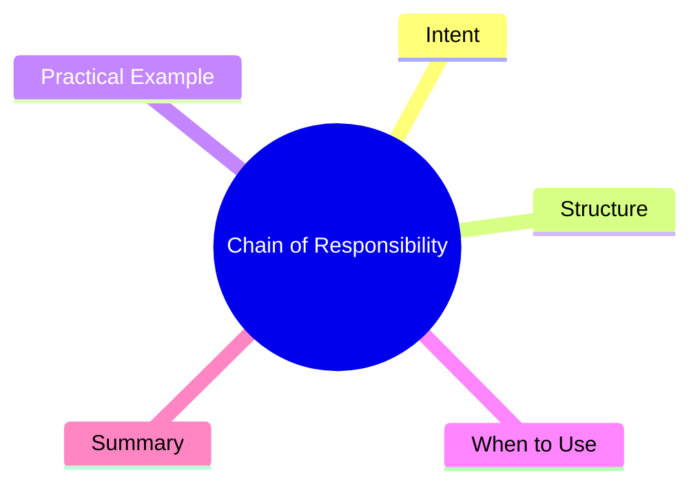

export const metadata = {
  title: 'Design Patterns: Chain of Responsibility',
  date: '2026-04-11',
  excerpt: 'A practical guide to the Chain of Responsibility pattern — passing requests along a chain of handlers, where each decides to process it or forward it to the next.',
  tags: ['Software Design', 'Design Patterns', 'OOP'],
};

# Design Patterns: Chain of Responsibility

Chain of Responsibility passes a request along a chain of handlers. Each handler decides whether to handle the request itself or pass it along to the next in line.



- [Intent](#intent)
- [Structure](#structure)
- [Practical Example: HTTP Middleware Chain](#practical-example-http-middleware-chain)
- [When to Use](#when-to-use)
- [Summary](#summary)

---

## Intent

A request needs to go through multiple checks or processing steps, but which steps actually run depends on context and timing.

Centralizing all that logic in one class creates tight coupling. Chain of Responsibility pulls each step into its own handler and lets you compose them freely.

---

## Structure

- **Handler**: interface for processing requests and setting the next handler
- **ConcreteHandler**: implements the logic; handles or passes along
- **Client**: assembles the chain and sends requests

---

## Practical Example: HTTP Middleware Chain

```typescript
interface Request {
  method: string;
  path: string;
  headers: Record<string, string>;
  body?: unknown;
}

interface Response {
  status: number;
  message: string;
}

abstract class Middleware {
  protected next: Middleware | null = null;

  setNext(handler: Middleware): Middleware {
    this.next = handler;
    return handler; // enables chaining
  }

  protected proceed(request: Request): Response | null {
    return this.next ? this.next.handle(request) : null;
  }

  abstract handle(request: Request): Response | null;
}

class AuthMiddleware extends Middleware {
  handle(request: Request): Response | null {
    const token = request.headers['authorization'];
    if (!token || !token.startsWith('Bearer ')) {
      return { status: 401, message: 'Unauthorized' };
    }
    console.log('[Auth] Passed');
    return this.proceed(request);
  }
}

class ContentTypeMiddleware extends Middleware {
  handle(request: Request): Response | null {
    if (request.body && request.headers['content-type'] !== 'application/json') {
      return { status: 415, message: 'Unsupported Media Type' };
    }
    console.log('[ContentType] Passed');
    return this.proceed(request);
  }
}

class LoggingMiddleware extends Middleware {
  handle(request: Request): Response | null {
    console.log(`[Log] ${request.method} ${request.path}`);
    const response = this.proceed(request);
    console.log(`[Log] Response: ${response?.status ?? 'none'}`);
    return response;
  }
}

class RouteHandler extends Middleware {
  handle(request: Request): Response | null {
    return { status: 200, message: `Handled ${request.path}` };
  }
}

const logging = new LoggingMiddleware();
const auth = new AuthMiddleware();
const contentType = new ContentTypeMiddleware();
const route = new RouteHandler();

logging.setNext(auth).setNext(contentType).setNext(route);

const response = logging.handle({
  method: 'POST',
  path: '/api/orders',
  headers: {
    authorization: 'Bearer abc123',
    'content-type': 'application/json',
  },
  body: { product: 'iPhone' },
});
console.log(response); // { status: 200, message: 'Handled /api/orders' }
```

---

## When to Use

**Good fits**

- Multiple objects can handle a request, and you don't know which one at compile time
- Processing steps need to be composed flexibly or request order matters
- HTTP middleware, event bubbling, approval workflows

---

## Summary

Chain of Responsibility hides the decision of *who* handles a request. The sender just passes the request to the chain head, and it flows naturally to the right handler.

Express.js middleware and NestJS Guards/Interceptors are both direct applications of this pattern.
