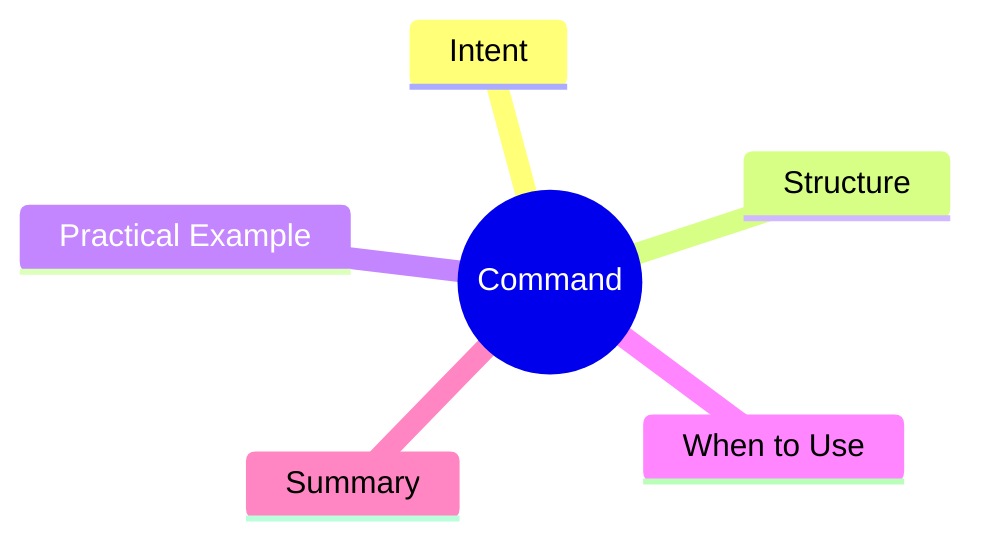

export const metadata = {
  title: 'Design Patterns: Command',
  date: '2026-04-03',
  excerpt: 'A practical guide to the Command pattern — how encapsulating requests as objects enables undo/redo, queuing, logging, and delayed execution without tightly coupling the sender and receiver.',
  tags: ['Software Design', 'Design Patterns', 'OOP'],
};

# Design Patterns: Command

Command encapsulates a request as an object. That object can be stored, passed around, queued, undone, or replayed — without the caller knowing anything about what the request actually does.



- [Intent](#intent)
- [Structure](#structure)
- [Practical Example: Text Editor Undo/Redo](#practical-example-text-editor-undoredo)
- [When to Use](#when-to-use)
- [Summary](#summary)

---

## Intent

Suppose a text editor needs to support Ctrl+Z undo and Ctrl+Y redo. Without a clear pattern, tracking state before and after every operation becomes a mess.

Command solves this by wrapping each operation in an object that knows both how to execute itself and how to reverse itself.

---

## Structure

- **Command**: interface declaring `execute()` and `undo()`
- **ConcreteCommand**: implements the operation and its reversal
- **Receiver**: the object that actually carries out the work (`TextEditor`)
- **Invoker**: triggers commands and maintains history (`CommandHistory`)

---

## Practical Example: Text Editor Undo/Redo

```typescript
interface Command {
  execute(): void;
  undo(): void;
}

// Receiver
class TextEditor {
  private content = '';

  getContent(): string { return this.content; }

  insertText(text: string, position: number): void {
    this.content = this.content.slice(0, position) + text + this.content.slice(position);
  }

  deleteText(position: number, length: number): void {
    this.content = this.content.slice(0, position) + this.content.slice(position + length);
  }
}

// ConcreteCommand: insert
class InsertCommand implements Command {
  constructor(
    private editor: TextEditor,
    private text: string,
    private position: number,
  ) {}

  execute(): void {
    this.editor.insertText(this.text, this.position);
  }

  undo(): void {
    this.editor.deleteText(this.position, this.text.length);
  }
}

// ConcreteCommand: delete
class DeleteCommand implements Command {
  private deletedText = '';

  constructor(
    private editor: TextEditor,
    private position: number,
    private length: number,
  ) {}

  execute(): void {
    this.deletedText = this.editor.getContent().slice(this.position, this.position + this.length);
    this.editor.deleteText(this.position, this.length);
  }

  undo(): void {
    this.editor.insertText(this.deletedText, this.position);
  }
}

// Invoker: manages command history
class CommandHistory {
  private history: Command[] = [];
  private redoStack: Command[] = [];

  execute(command: Command): void {
    command.execute();
    this.history.push(command);
    this.redoStack = []; // new action clears redo stack
  }

  undo(): void {
    const command = this.history.pop();
    if (command) {
      command.undo();
      this.redoStack.push(command);
    }
  }

  redo(): void {
    const command = this.redoStack.pop();
    if (command) {
      command.execute();
      this.history.push(command);
    }
  }
}

const editor = new TextEditor();
const history = new CommandHistory();

history.execute(new InsertCommand(editor, 'Hello', 0));
history.execute(new InsertCommand(editor, ' World', 5));
console.log(editor.getContent()); // 'Hello World'

history.undo();
console.log(editor.getContent()); // 'Hello'

history.redo();
console.log(editor.getContent()); // 'Hello World'
```

---

## When to Use

**Good fits**

- Undo/redo functionality
- Queuing, scheduling, or delaying operations
- Audit logging of every operation performed

---

## Summary

Command's core idea: **turn behavior into an object**. Once a request is an object, it can be stored, queued, passed around, and undone naturally.
