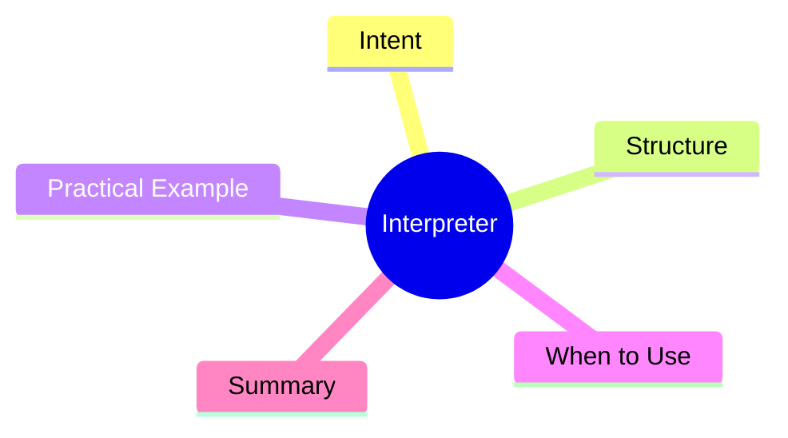

export const metadata = {
  title: 'Design Patterns: Interpreter',
  date: '2026-04-19',
  excerpt: 'A practical guide to the Interpreter pattern — defining a grammar representation for a language and building an interpreter to evaluate sentences in that language.',
  tags: ['Software Design', 'Design Patterns', 'OOP'],
};

# Design Patterns: Interpreter

Interpreter defines a grammar for a language and maps its sentences to an object tree — each node knows how to interpret itself.



- [Intent](#intent)
- [Structure](#structure)
- [Practical Example: Arithmetic Expression Evaluator](#practical-example-arithmetic-expression-evaluator)
- [When to Use](#when-to-use)
- [Summary](#summary)

---

## Intent

When a simple language needs to be evaluated or executed, you can represent its grammar as a hierarchy of objects (an AST), where each node type knows how to interpret itself.

Interpreter is one of the less commonly used GoF patterns. It's only worth reaching for when you're defining a small, controlled language: a config DSL, a simple rule engine, or a command set.

---

## Structure

- **AbstractExpression**: the `interpret(context)` interface
- **TerminalExpression**: leaf symbols with no sub-expressions (numbers, variables)
- **NonTerminalExpression**: composite expressions containing other expressions (add, multiply)
- **Context**: external state available during interpretation

---

## Practical Example: Arithmetic Expression Evaluator

```typescript
type Context = Map<string, number>;

interface Expression {
  interpret(context: Context): number;
}

// TerminalExpression: number literal
class NumberExpression implements Expression {
  constructor(private value: number) {}

  interpret(_context: Context): number {
    return this.value;
  }
}

// TerminalExpression: variable
class VariableExpression implements Expression {
  constructor(private name: string) {}

  interpret(context: Context): number {
    const value = context.get(this.name);
    if (value === undefined) throw new Error(`Undefined variable: ${this.name}`);
    return value;
  }
}

// NonTerminalExpression: addition
class AddExpression implements Expression {
  constructor(
    private left: Expression,
    private right: Expression,
  ) {}

  interpret(context: Context): number {
    return this.left.interpret(context) + this.right.interpret(context);
  }
}

// NonTerminalExpression: multiplication
class MultiplyExpression implements Expression {
  constructor(
    private left: Expression,
    private right: Expression,
  ) {}

  interpret(context: Context): number {
    return this.left.interpret(context) * this.right.interpret(context);
  }
}

// NonTerminalExpression: negation
class NegateExpression implements Expression {
  constructor(private expression: Expression) {}

  interpret(context: Context): number {
    return -this.expression.interpret(context);
  }
}

// Build AST for: (x + 5) * y
const context: Context = new Map([
  ['x', 3],
  ['y', 4],
]);

const expression = new MultiplyExpression(
  new AddExpression(
    new VariableExpression('x'),
    new NumberExpression(5),
  ),
  new VariableExpression('y'),
);

console.log(expression.interpret(context)); // (3 + 5) * 4 = 32

// Update context without touching the expression tree
context.set('x', 10);
console.log(expression.interpret(context)); // (10 + 5) * 4 = 60
```

---

## When to Use

**Good fits**

- You need to evaluate a simple language where sentences can be represented as an abstract syntax tree
- Config DSLs, simple rule engines, small command sets

**Important caveat**

- As grammar complexity grows, Interpreter leads to a class explosion. For a real language, use a dedicated parser generator like ANTLR instead.
- Understanding the pattern's design intent is more valuable than using it directly in most cases.

---

## Summary

Interpreter is the classic technique for mapping language grammar onto an object tree.

Understanding it unlocks one of the conceptual layers behind compilers and template engines — even if you never implement it from scratch.
