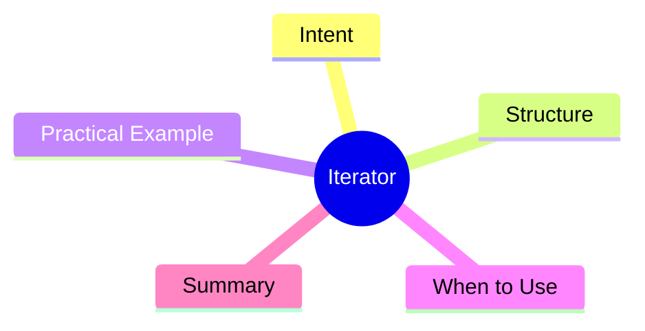

export const metadata = {
  title: 'Design Patterns: Iterator',
  date: '2026-04-05',
  excerpt: 'A practical guide to the Iterator pattern — separating traversal logic from collection internals so clients can iterate any collection without knowing how it\'s structured.',
  tags: ['Software Design', 'Design Patterns', 'OOP'],
};

# Design Patterns: Iterator

Iterator provides a way to access the elements of a collection sequentially, without exposing its underlying structure.



- [Intent](#intent)
- [Structure](#structure)
- [Practical Example: Order Collection Traversal](#practical-example-order-collection-traversal)
- [When to Use](#when-to-use)
- [Summary](#summary)

---

## Intent

When a collection has a complex internal structure (tree, graph, sorted result, paginated data), clients want to iterate it uniformly without knowing whether to walk a tree, traverse an array, or call an API.

Iterator provides a consistent traversal interface; the collection hides its implementation details.

---

## Structure

- **Iterator**: the traversal interface (`next()`, `hasNext()`)
- **Iterable**: the collection interface that creates iterators
- **ConcreteIterator**: implements the traversal logic
- **ConcreteAggregate**: the actual collection object

---

## Practical Example: Order Collection Traversal

```typescript
interface Iterator<T> {
  next(): T | undefined;
  hasNext(): boolean;
}

interface Iterable<T> {
  createIterator(): Iterator<T>;
}

interface Order {
  id: string;
  total: number;
  status: 'pending' | 'shipped' | 'delivered';
}

class OrderCollection implements Iterable<Order> {
  private orders: Order[] = [];

  add(order: Order): void {
    this.orders.push(order);
  }

  createIterator(): Iterator<Order> {
    return new OrderIterator(this.orders);
  }

  createFilteredIterator(status: Order['status']): Iterator<Order> {
    return new FilteredOrderIterator(this.orders, status);
  }
}

class OrderIterator implements Iterator<Order> {
  private index = 0;
  constructor(private orders: Order[]) {}
  hasNext(): boolean { return this.index < this.orders.length; }
  next(): Order | undefined { return this.orders[this.index++]; }
}

class FilteredOrderIterator implements Iterator<Order> {
  private filtered: Order[];
  private index = 0;

  constructor(orders: Order[], status: Order['status']) {
    this.filtered = orders.filter(o => o.status === status);
  }

  hasNext(): boolean { return this.index < this.filtered.length; }
  next(): Order | undefined { return this.filtered[this.index++]; }
}

const collection = new OrderCollection();
collection.add({ id: 'A001', total: 1200, status: 'pending' });
collection.add({ id: 'A002', total: 800, status: 'shipped' });
collection.add({ id: 'A003', total: 500, status: 'pending' });

const iterator = collection.createFilteredIterator('pending');
while (iterator.hasNext()) {
  const order = iterator.next()!;
  console.log(`Order ${order.id}: $${order.total}`);
}
```

---

## When to Use

**Good fits**

- You need a uniform way to traverse collections with different internal structures
- Client code shouldn't need to know or care about the collection's representation

**Practical note**

JavaScript/TypeScript has the iterator protocol built in (`Symbol.iterator`) and generator functions make implementing custom iterators concise. Custom iterators are often useful for virtual scrolling, range traversal, and paginated API responses.

---

## Summary

Iterator separates storage logic from traversal logic. Clients just consume an Iterator; they don't need to understand the underlying data structure.

The pattern is so foundational that it's built into every modern language's standard library.
