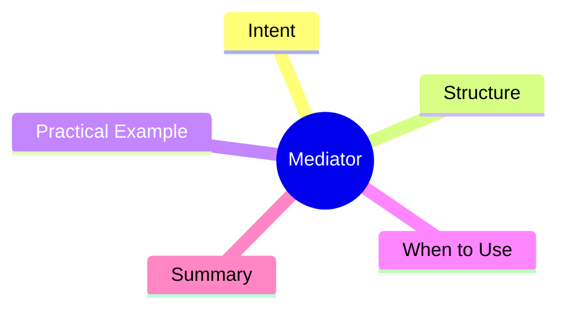

export const metadata = {
  title: 'Design Patterns: Mediator',
  date: '2026-04-13',
  excerpt: 'A practical guide to the Mediator pattern — centralizing communication between objects through a mediator to reduce many-to-many coupling to one-to-many.',
  tags: ['Software Design', 'Design Patterns', 'OOP'],
};

# Design Patterns: Mediator

Mediator centralizes communication between objects. Components no longer talk directly to each other; they route messages through the mediator, turning many-to-many coupling into star-topology.



- [Intent](#intent)
- [Structure](#structure)
- [Practical Example: Chat Room Mediator](#practical-example-chat-room-mediator)
- [When to Use](#when-to-use)
- [Summary](#summary)

---

## Intent

Imagine a UI with multiple components: a search box, a list, buttons, and a status bar. When the search box changes, it should filter the list, enable a button, and update the status bar.

If each component references the others directly, you get a tangled web of dependencies. Mediator funnels all that communication through a single coordinator.

---

## Structure

- **Mediator**: interface for component-to-component communication
- **ConcreteMediator**: implements coordination logic
- **Colleague**: each component that works through the mediator

---

## Practical Example: Chat Room Mediator

```typescript
interface ChatMediator {
  sendMessage(message: string, sender: User): void;
  addUser(user: User): void;
}

class User {
  constructor(
    public name: string,
    private mediator: ChatMediator,
  ) {}

  send(message: string): void {
    console.log(`${this.name} sends: ${message}`);
    this.mediator.sendMessage(message, this);
  }

  receive(message: string, from: User): void {
    console.log(`${this.name} received from ${from.name}: ${message}`);
  }
}

// ConcreteMediator: public chat room
class PublicChatRoom implements ChatMediator {
  private users: User[] = [];

  addUser(user: User): void {
    this.users.push(user);
  }

  sendMessage(message: string, sender: User): void {
    this.users
      .filter(user => user !== sender)
      .forEach(user => user.receive(message, sender));
  }
}

// ConcreteMediator: private DM channel
class DirectMessageRoom implements ChatMediator {
  private users: User[] = [];
  private messageHistory: string[] = [];

  addUser(user: User): void {
    if (this.users.length >= 2) {
      throw new Error('DM rooms support only two users');
    }
    this.users.push(user);
  }

  sendMessage(message: string, sender: User): void {
    this.messageHistory.push(`[${sender.name}] ${message}`);
    const recipient = this.users.find(u => u !== sender);
    recipient?.receive(message, sender);
  }

  getHistory(): string[] {
    return [...this.messageHistory];
  }
}

const publicRoom = new PublicChatRoom();
const alice = new User('Alice', publicRoom);
const bob = new User('Bob', publicRoom);
const charlie = new User('Charlie', publicRoom);

publicRoom.addUser(alice);
publicRoom.addUser(bob);
publicRoom.addUser(charlie);

alice.send('Hello everyone!');
// Bob received from Alice: Hello everyone!
// Charlie received from Alice: Hello everyone!
```

---

## When to Use

**Good fits**

- Multiple components reference each other directly, creating a tightly coupled mesh
- You need a central place to manage complex interaction logic between components

**Mediator vs. Observer**

| | Mediator | Observer |
|---|---|---|
| Communication | Centralized through mediator | Subject broadcasts to all observers |
| Coupling | Low (components only know the mediator) | Low (observers unaware of each other) |
| Typical use | UI dialog management | Event/state notification |

---

## Summary

Mediator converts many-to-many coupling into a star topology: all components only know the mediator. The mediator becomes the hub of the conversation, holding all the coordination logic.

In practice, form managers, message brokers, and component library event hubs are all Mediator in disguise.
