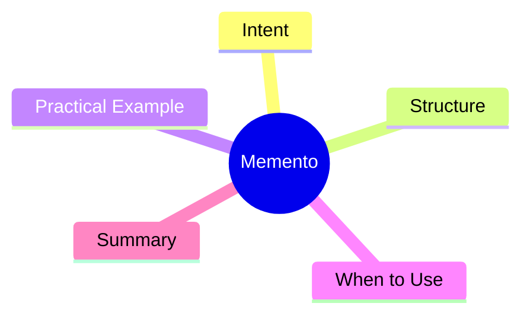

export const metadata = {
  title: 'Design Patterns: Memento',
  date: '2026-04-15',
  excerpt: 'A practical guide to the Memento pattern — capturing an object\'s internal state into a snapshot object so it can be restored later without exposing its internals.',
  tags: ['Software Design', 'Design Patterns', 'OOP'],
};

# Design Patterns: Memento

Memento captures an object's internal state into a snapshot. External caretakers can store and restore these snapshots without knowing the object's private implementation details.



- [Intent](#intent)
- [Structure](#structure)
- [Practical Example: Text Editor Undo History](#practical-example-text-editor-undo-history)
- [When to Use](#when-to-use)
- [Summary](#summary)

---

## Intent

Memento packages state into snapshot objects. External caretakers hold the history without needing to know what's inside.

The difference from Command: Command records *actions* and how to reverse them; Memento records *state snapshots*. Both are often used together in text editors.

---

## Structure

- **Originator**: creates mementos and restores from them
- **Memento**: an immutable snapshot of a specific point in time
- **Caretaker**: holds the memento history without modifying it

---

## Practical Example: Text Editor Undo History

```typescript
// Memento
class EditorMemento {
  constructor(
    private readonly content: string,
    private readonly cursorPosition: number,
    private readonly timestamp: Date = new Date(),
  ) {}

  getContent(): string { return this.content; }
  getCursorPosition(): number { return this.cursorPosition; }
  getTimestamp(): Date { return this.timestamp; }
}

// Originator
class TextEditor {
  private content = '';
  private cursorPosition = 0;

  type(text: string): void {
    this.content =
      this.content.slice(0, this.cursorPosition) +
      text +
      this.content.slice(this.cursorPosition);
    this.cursorPosition += text.length;
  }

  moveCursor(position: number): void {
    this.cursorPosition = Math.max(0, Math.min(position, this.content.length));
  }

  getContent(): string { return this.content; }
  getCursor(): number { return this.cursorPosition; }

  save(): EditorMemento {
    return new EditorMemento(this.content, this.cursorPosition);
  }

  restore(memento: EditorMemento): void {
    this.content = memento.getContent();
    this.cursorPosition = memento.getCursorPosition();
  }
}

// Caretaker
class EditorHistory {
  private mementos: EditorMemento[] = [];

  save(memento: EditorMemento): void {
    this.mementos.push(memento);
  }

  undo(): EditorMemento | undefined {
    return this.mementos.pop();
  }

  getCount(): number { return this.mementos.length; }
}

const editor = new TextEditor();
const history = new EditorHistory();

history.save(editor.save());
editor.type('Hello');

history.save(editor.save());
editor.type(', World');

history.save(editor.save());
editor.type('!');

console.log(editor.getContent()); // 'Hello, World!'

editor.restore(history.undo()!);
console.log(editor.getContent()); // 'Hello, World'

editor.restore(history.undo()!);
console.log(editor.getContent()); // 'Hello'
```

---

## When to Use

**Good fits**

- Undo/redo functionality or periodic snapshots
- Object internals shouldn't be exposed to external storage mechanisms

**Memento vs. Command**

Command records *what happened* and how to reverse it. Memento records *the state at a point in time*. Text editors often use both: Command tracks operations, Memento snapshots state before each change.

---

## Summary

Memento's core idea: save and restore state without exposing internals.

Draft state, rollback points, and auto-save before navigating away are all natural fits for Memento.
