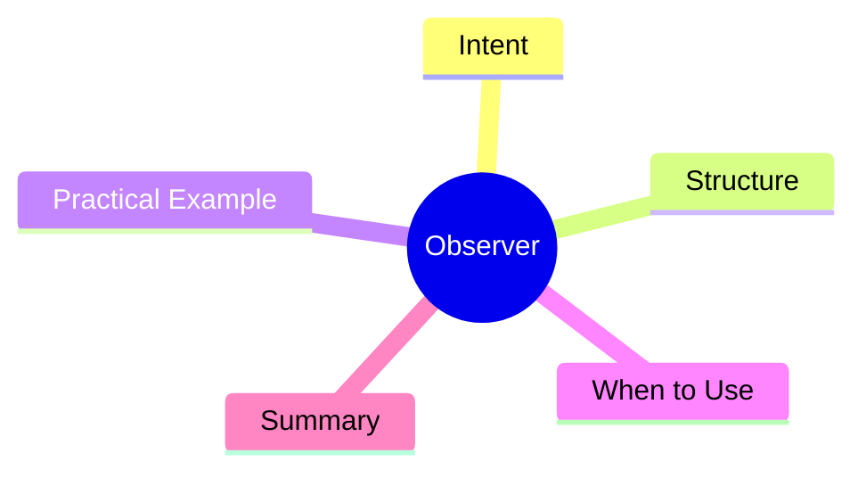

export const metadata = {
  title: 'Design Patterns: Observer',
  date: '2026-03-30',
  excerpt: 'A practical guide to the Observer pattern — how to establish a one-to-many dependency so that when an object changes state, all dependents are notified automatically.',
  tags: ['Software Design', 'Design Patterns', 'OOP'],
};

# Design Patterns: Observer

Observer establishes a one-to-many dependency. When a Subject changes state, all subscribed Observers are automatically notified and updated.



- [Intent](#intent)
- [Structure](#structure)
- [Practical Example: E-Commerce Stock Alert](#practical-example-e-commerce-stock-alert)
- [When to Use](#when-to-use)
- [Summary](#summary)

---

## Intent

Observer inverts the dependency direction: instead of observers polling the subject for changes, the subject pushes notifications when something changes.

Common applications:

- E-commerce stock alerts for subscribed users
- Frontend state management (RxJS, Redux)
- DOM event listeners

---

## Structure

- **Subject**: the observed object, maintains a list of observers
- **Observer**: the interface that subscribers implement
- **ConcreteSubject**: holds state, notifies observers when it changes
- **ConcreteObserver**: implements the reaction logic for notifications

---

## Practical Example: E-Commerce Stock Alert

```typescript
interface Observer {
  update(product: string, stock: number): void;
}

class StockSubject {
  private observers: Observer[] = [];
  private stock: Map<string, number> = new Map();

  subscribe(observer: Observer): void {
    this.observers.push(observer);
  }

  unsubscribe(observer: Observer): void {
    this.observers = this.observers.filter(o => o !== observer);
  }

  setStock(product: string, amount: number): void {
    this.stock.set(product, amount);
    this.notify(product, amount);
  }

  private notify(product: string, amount: number): void {
    this.observers.forEach(observer => observer.update(product, amount));
  }
}

// ConcreteObserver: user alert
class UserStockAlert implements Observer {
  constructor(private userId: string) {}

  update(product: string, stock: number): void {
    if (stock > 0) {
      console.log(`[${this.userId}] "${product}" is back in stock! ${stock} remaining.`);
    }
  }
}

// ConcreteObserver: inventory monitor
class InventoryMonitor implements Observer {
  update(product: string, stock: number): void {
    if (stock < 10) {
      console.log(`[Monitor] "${product}" is below 10 units. Reorder soon!`);
    }
  }
}

const stockManager = new StockSubject();

const user1 = new UserStockAlert('user-001');
const user2 = new UserStockAlert('user-002');
const monitor = new InventoryMonitor();

stockManager.subscribe(user1);
stockManager.subscribe(user2);
stockManager.subscribe(monitor);

stockManager.setStock('iPhone 16', 50); // all three observers notified
stockManager.setStock('AirPods', 5);    // monitor fires low-stock alert

stockManager.unsubscribe(user2);
stockManager.setStock('iPhone 16', 100); // only user1 and monitor notified
```

---

## When to Use

**Good fits**

- An object's state changes need to trigger reactions in other objects, and you don't know how many or which ones
- You want to decouple the Subject from its Observers rather than hardcoding dependencies

**Watch out for**

- Notification order is usually not guaranteed
- Many observers receiving frequent updates can become a performance bottleneck

---

## Summary

Observer is the backbone of event-driven architecture. JavaScript's `EventEmitter`, RxJS `Observable`, and frontend state management libraries all build on this pattern.

Understanding Observer unlocks the mental model behind most of the reactive tools in the modern frontend ecosystem.
