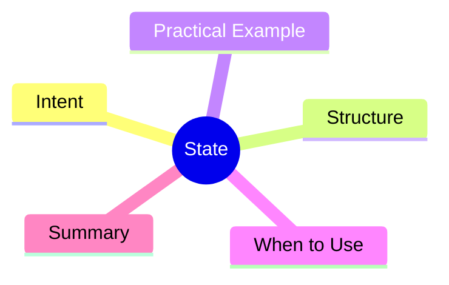

export const metadata = {
  title: 'Design Patterns: State',
  date: '2026-04-07',
  excerpt: 'A practical guide to the State pattern — encapsulating each state as a class so an object\'s behavior changes naturally as its state transitions, without a tangle of if-else checks.',
  tags: ['Software Design', 'Design Patterns', 'OOP'],
};

# Design Patterns: State

State encapsulates each of an object's states as a separate class. When the state changes, the object delegates to the new state object, swapping behavior automatically — no if-else chains needed.



- [Intent](#intent)
- [Structure](#structure)
- [Practical Example: Order State Machine](#practical-example-order-state-machine)
- [When to Use](#when-to-use)
- [Summary](#summary)

---

## Intent

Consider an `Order` object that can be `pending`, `processing`, `shipped`, `delivered`, or `cancelled`. The behavior of `cancel()` is completely different in each state.

Without State:

```typescript
cancel() {
  if (this.status === 'pending') { /* refund immediately */ }
  else if (this.status === 'processing') { /* trigger refund workflow */ }
  else if (this.status === 'shipped') { throw new Error('Cannot cancel'); }
  else throw new Error('Cannot cancel');
}
```

More states = more branches = harder to maintain. State replaces these with polymorphism.

---

## Structure

- **Context**: holds a reference to the current state (`Order`)
- **State**: interface defining state behavior
- **ConcreteState**: each specific state's implementation

---

## Practical Example: Order State Machine

```typescript
interface OrderState {
  name: string;
  confirm(order: Order): void;
  ship(order: Order): void;
  deliver(order: Order): void;
  cancel(order: Order): void;
}

class Order {
  state: OrderState = new PendingState();
  id: string;

  constructor(id: string) { this.id = id; }

  setState(state: OrderState): void { this.state = state; }

  confirm(): void { this.state.confirm(this); }
  ship(): void { this.state.ship(this); }
  deliver(): void { this.state.deliver(this); }
  cancel(): void { this.state.cancel(this); }
}

class PendingState implements OrderState {
  name = 'Pending';
  confirm(order: Order): void {
    console.log('Order confirmed, processing starts');
    order.setState(new ProcessingState());
  }
  ship(order: Order): void { throw new Error('Not confirmed yet'); }
  deliver(order: Order): void { throw new Error('Not shipped yet'); }
  cancel(order: Order): void {
    console.log('Order cancelled');
    order.setState(new CancelledState());
  }
}

class ProcessingState implements OrderState {
  name = 'Processing';
  confirm(order: Order): void { console.log('Already confirmed'); }
  ship(order: Order): void {
    console.log('Order shipped');
    order.setState(new ShippedState());
  }
  deliver(order: Order): void { throw new Error('Not shipped yet'); }
  cancel(order: Order): void {
    console.log('Processing order cancelled, initiating refund');
    order.setState(new CancelledState());
  }
}

class ShippedState implements OrderState {
  name = 'Shipped';
  confirm(order: Order): void { console.log('Already shipped'); }
  ship(order: Order): void { console.log('Already shipped'); }
  deliver(order: Order): void {
    console.log('Order delivered');
    order.setState(new DeliveredState());
  }
  cancel(order: Order): void { throw new Error('Cannot cancel a shipped order'); }
}

class DeliveredState implements OrderState {
  name = 'Delivered';
  confirm(): void { console.log('Already delivered'); }
  ship(): void { throw new Error('Already delivered'); }
  deliver(): void { console.log('Already delivered'); }
  cancel(): void { throw new Error('Cannot cancel a delivered order'); }
}

class CancelledState implements OrderState {
  name = 'Cancelled';
  confirm(): void { throw new Error('Order is cancelled'); }
  ship(): void { throw new Error('Order is cancelled'); }
  deliver(): void { throw new Error('Order is cancelled'); }
  cancel(): void { console.log('Already cancelled'); }
}

const order = new Order('ORD-001');
order.confirm();
order.ship();
order.deliver();
```

---

## When to Use

**Good fits**

- Object behavior changes drastically depending on its state
- A growing collection of if-else branches checking `this.status` is becoming a maintenance burden
- State transitions need to be clearly defined and enforced

---

## Summary

State's core idea: **replace if-else with polymorphism**.

Each state is a class that owns its behavior and its transition logic. Adding a new state or changing a transition means touching only the relevant state class.
