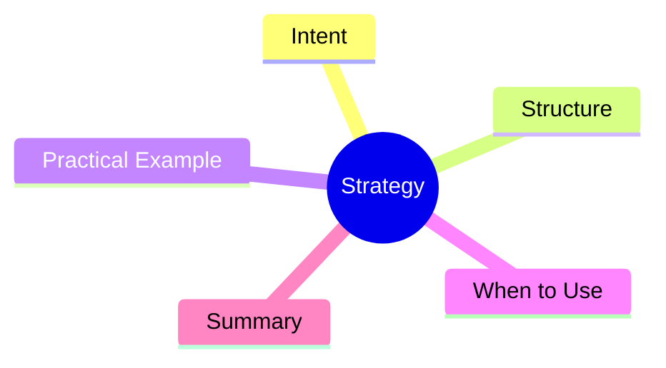

export const metadata = {
  title: 'Design Patterns: Strategy',
  date: '2026-04-01',
  excerpt: 'A practical guide to the Strategy pattern — encapsulating a family of algorithms as interchangeable objects so clients can switch behavior at runtime without changing their code.',
  tags: ['Software Design', 'Design Patterns', 'OOP'],
};

# Design Patterns: Strategy

Strategy encapsulates a family of algorithms into interchangeable objects. A context uses whichever strategy is plugged in at runtime, without knowing how it works inside.



- [Intent](#intent)
- [Structure](#structure)
- [Practical Example: Shopping Cart Sorting](#practical-example-shopping-cart-sorting)
- [When to Use](#when-to-use)
- [Summary](#summary)

---

## Intent

The problem Strategy typically solves: a class has multiple variants of the same operation, selected via switch-case or if-else.

Strategy moves each variant into its own class behind a shared interface. The context holds a reference to a strategy and delegates to it, with no knowledge of the implementation.

---

## Structure

- **Strategy**: the common interface for all algorithms
- **ConcreteStrategy**: each specific algorithm implementation
- **Context**: holds a Strategy reference and provides a unified entry point

---

## Practical Example: Shopping Cart Sorting

```typescript
interface SortStrategy<T> {
  sort(items: T[]): T[];
}

class SortByPriceAsc implements SortStrategy<Product> {
  sort(items: Product[]): Product[] {
    return [...items].sort((a, b) => a.price - b.price);
  }
}

class SortByPriceDesc implements SortStrategy<Product> {
  sort(items: Product[]): Product[] {
    return [...items].sort((a, b) => b.price - a.price);
  }
}

class SortByRating implements SortStrategy<Product> {
  sort(items: Product[]): Product[] {
    return [...items].sort((a, b) => b.rating - a.rating);
  }
}

class SortByName implements SortStrategy<Product> {
  sort(items: Product[]): Product[] {
    return [...items].sort((a, b) => a.name.localeCompare(b.name));
  }
}

class ShoppingCart {
  constructor(
    private items: Product[],
    private sortStrategy: SortStrategy<Product>,
  ) {}

  setStrategy(strategy: SortStrategy<Product>): void {
    this.sortStrategy = strategy;
  }

  getSortedItems(): Product[] {
    return this.sortStrategy.sort(this.items);
  }
}

const cart = new ShoppingCart(products, new SortByPriceAsc());
console.log(cart.getSortedItems());

// switch at runtime
cart.setStrategy(new SortByRating());
console.log(cart.getSortedItems());
```

Adding a new sort order means adding a new class. `ShoppingCart` stays untouched.

---

## When to Use

**Good fits**

- An operation has multiple variants currently selected by switch-case or if-else
- You want to encapsulate complex algorithms and keep them independent
- You need to swap behavior at runtime

**Strategy and OCP**

Strategy is one of the most direct implementations of OCP: extend with new strategy classes; never modify the context.

---

## Summary

Strategy is one of the most frequently used patterns in practice. Any time you pass a function as a parameter to customize internal behavior, you're using the functional equivalent of Strategy.

When the logic gets complex enough that a plain function isn't enough, Strategy with a full class hierarchy gives you the same flexibility with more structure.
