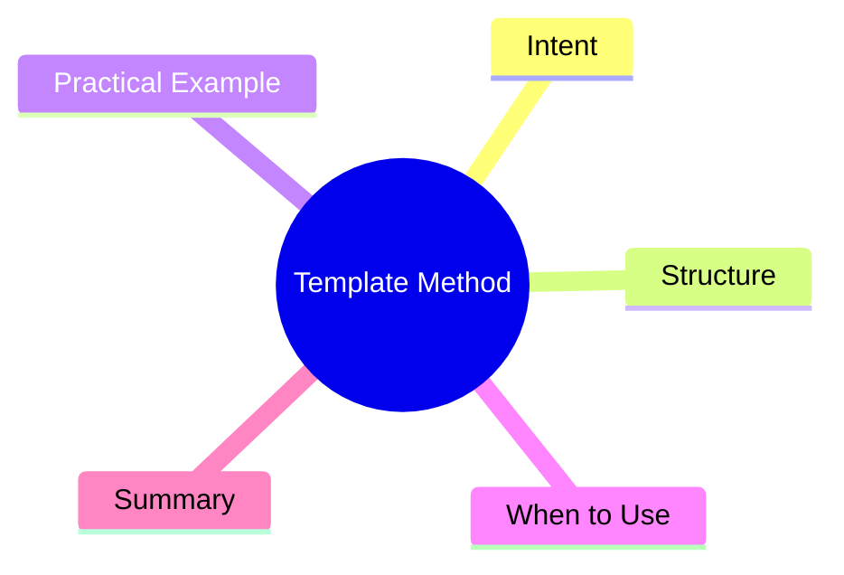

export const metadata = {
  title: 'Design Patterns: Template Method',
  date: '2026-04-09',
  excerpt: 'A practical guide to the Template Method pattern — defining an algorithm skeleton in a base class and letting subclasses fill in the specific steps without changing the overall structure.',
  tags: ['Software Design', 'Design Patterns', 'OOP'],
};

# Design Patterns: Template Method

Template Method defines the skeleton of an algorithm in a base class. Subclasses override specific steps to customize behavior without touching the overall flow.



- [Intent](#intent)
- [Structure](#structure)
- [Practical Example: Report Generation Pipeline](#practical-example-report-generation-pipeline)
- [When to Use](#when-to-use)
- [Summary](#summary)

---

## Intent

Imagine a reporting system where each report type goes through the same steps: fetch data, process it, render output. But the actual content of each step varies by report type.

Without abstraction, each report class duplicates the same flow skeleton. Template Method locks the flow in the base class and lets subclasses implement only the variable parts.

---

## Structure

- **AbstractClass**: defines the template method (the flow skeleton) and abstract steps
- **templateMethod()**: calls the steps in order; not overridable
- **abstractStep()**: hooks that subclasses must implement
- **ConcreteClass**: provides the step implementations

---

## Practical Example: Report Generation Pipeline

```typescript
abstract class ReportGenerator {
  // Template method: fixed flow
  generate(): string {
    const data = this.fetchData();
    const processed = this.processData(data);
    const header = this.renderHeader();
    const body = this.renderBody(processed);
    const footer = this.renderFooter();
    return [header, body, footer].join('\n');
  }

  // Abstract steps: subclasses implement these
  protected abstract fetchData(): Record<string, number>[];
  protected abstract renderBody(data: Record<string, number>[]): string;

  // Default implementations: subclasses may override
  protected processData(data: Record<string, number>[]): Record<string, number>[] {
    return data;
  }

  protected renderHeader(): string {
    return '=== Report ===';
  }

  protected renderFooter(): string {
    return `Generated at ${new Date().toISOString()}`;
  }
}

class SalesReport extends ReportGenerator {
  protected fetchData(): Record<string, number>[] {
    return [
      { product: 1, revenue: 12000 },
      { product: 2, revenue: 8500 },
    ];
  }

  protected processData(data: Record<string, number>[]): Record<string, number>[] {
    return [...data].sort((a, b) => b['revenue'] - a['revenue']);
  }

  protected renderBody(data: Record<string, number>[]): string {
    return data.map(row => `Product ${row['product']}: $${row['revenue']}`).join('\n');
  }

  protected renderHeader(): string {
    return '=== Sales Report ===';
  }
}

class InventoryReport extends ReportGenerator {
  protected fetchData(): Record<string, number>[] {
    return [
      { sku: 1001, stock: 45 },
      { sku: 1002, stock: 3 },
    ];
  }

  protected renderBody(data: Record<string, number>[]): string {
    return data
      .map(row => {
        const warning = row['stock'] < 10 ? ' [LOW STOCK]' : '';
        return `SKU ${row['sku']}: ${row['stock']} units${warning}`;
      })
      .join('\n');
  }
}

const sales = new SalesReport();
console.log(sales.generate());

const inventory = new InventoryReport();
console.log(inventory.generate());
```

---

## When to Use

**Good fits**

- Multiple classes share the same execution flow, but differ in individual steps
- You want to enforce an invariant structure while allowing subclasses to customize specifics

**Template Method vs. Strategy**

| | Template Method | Strategy |
|---|---|---|
| Flow skeleton | Fixed in base class | Fully replaceable |
| Mechanism | Inheritance | Composition |
| Swap timing | Compile time | Runtime |

---

## Summary

Template Method is inversion of control at the class level: the base class calls the subclass, not the other way around.

When multiple classes share the same process flow but differ in a few steps, Template Method eliminates the duplication cleanly.
