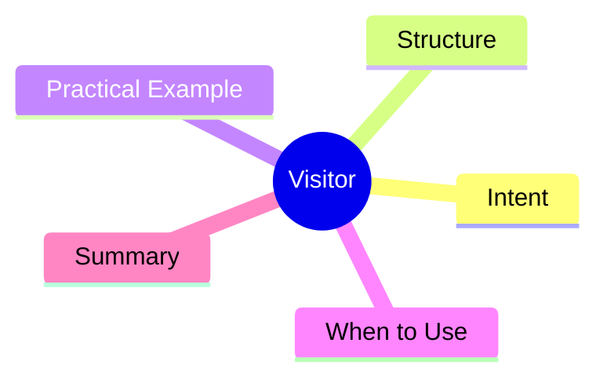

export const metadata = {
  title: 'Design Patterns: Visitor',
  date: '2026-04-17',
  excerpt: 'A practical guide to the Visitor pattern — separating operations from object structures so you can add new behaviors without modifying the elements themselves.',
  tags: ['Software Design', 'Design Patterns', 'OOP'],
};

# Design Patterns: Visitor

Visitor separates operations from the objects they operate on. You add new behaviors by writing new visitors, not by modifying the element classes.



- [Intent](#intent)
- [Structure](#structure)
- [Practical Example: Document Export Visitors](#practical-example-document-export-visitors)
- [When to Use](#when-to-use)
- [Summary](#summary)

---

## Intent

Imagine a file system with `Folder`, `TextFile`, and `ImageFile` nodes. You need to implement multiple export formats: PDF, HTML, Markdown.

If you add each export method directly to the element classes, every new format requires modifying every element class. From an OCP standpoint, that's a problem.

Visitor extracts operations out: each export format is a visitor that knows how to handle each node type.

---

## Structure

- **Visitor**: interface declaring a visit method for each element type
- **ConcreteVisitor**: implements the operation (PDF exporter, HTML exporter...)
- **Element**: interface declaring `accept(visitor)`
- **ConcreteElement**: calls `visitor.visitXxx(this)` — passing itself in

---

## Practical Example: Document Export Visitors

```typescript
interface DocumentElement {
  accept(visitor: ExportVisitor): string;
  name: string;
}

interface ExportVisitor {
  visitFolder(folder: Folder): string;
  visitTextFile(file: TextFile): string;
  visitImageFile(file: ImageFile): string;
}

class Folder implements DocumentElement {
  name: string;
  children: DocumentElement[] = [];

  constructor(name: string) { this.name = name; }

  add(element: DocumentElement): void {
    this.children.push(element);
  }

  accept(visitor: ExportVisitor): string {
    return visitor.visitFolder(this);
  }
}

class TextFile implements DocumentElement {
  constructor(public name: string, public content: string) {}

  accept(visitor: ExportVisitor): string {
    return visitor.visitTextFile(this);
  }
}

class ImageFile implements DocumentElement {
  constructor(public name: string, public width: number, public height: number) {}

  accept(visitor: ExportVisitor): string {
    return visitor.visitImageFile(this);
  }
}

class HtmlExportVisitor implements ExportVisitor {
  visitFolder(folder: Folder): string {
    const children = folder.children.map(c => c.accept(this)).join('');
    return `<div class="folder" data-name="${folder.name}">${children}</div>`;
  }

  visitTextFile(file: TextFile): string {
    return `<article><h2>${file.name}</h2><p>${file.content}</p></article>`;
  }

  visitImageFile(file: ImageFile): string {
    return ``;
  }
}

class MarkdownExportVisitor implements ExportVisitor {
  visitFolder(folder: Folder): string {
    const children = folder.children.map(c => c.accept(this)).join('\n');
    return `## ${folder.name}\n${children}`;
  }

  visitTextFile(file: TextFile): string {
    return `### ${file.name}\n${file.content}`;
  }

  visitImageFile(file: ImageFile): string {
    return ``;
  }
}

const root = new Folder('docs');
root.add(new TextFile('README.md', 'Welcome'));
root.add(new ImageFile('logo.png', 200, 100));

const htmlVisitor = new HtmlExportVisitor();
console.log(root.accept(htmlVisitor));

const mdVisitor = new MarkdownExportVisitor();
console.log(root.accept(mdVisitor));
```

---

## When to Use

**Good fits**

- Object structure is stable, but you need to add many new operations over it
- You don't want to keep adding methods to element classes for each new operation

**Double Dispatch**

`element.accept(visitor)` is an implementation of double dispatch: the first dispatch resolves the element type, the second dispatch resolves the visitor operation.

---

## Summary

Visitor is the pattern for adding new operations to a stable structure without modifying its elements.

AST traversal in compilers, linter rule application, and document serialization are all classic Visitor territory.
