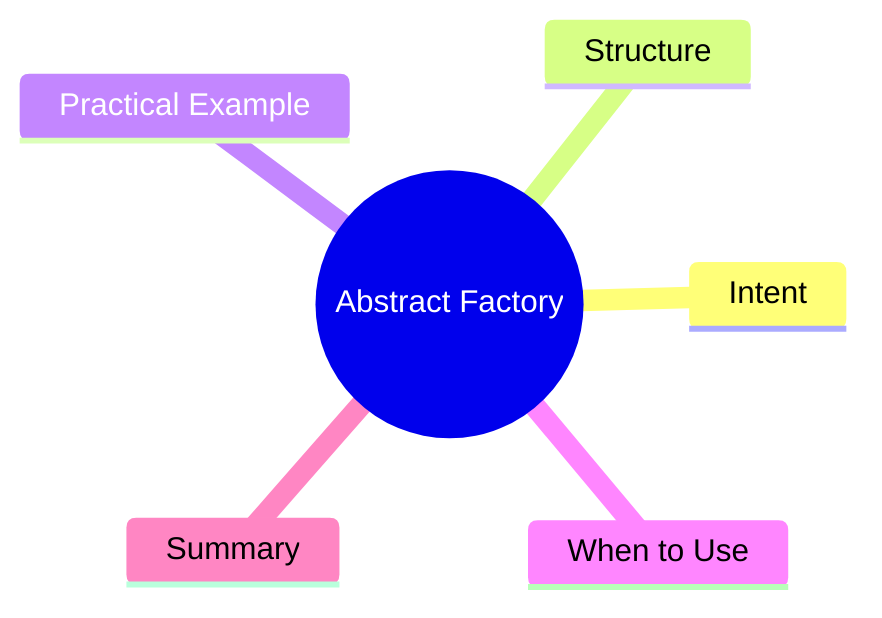

export const metadata = {
  title: 'Design Patterns: Abstract Factory',
  date: '2026-03-09',
  excerpt: 'A practical guide to the Abstract Factory pattern — how it creates families of related objects and guarantees compatibility between them without specifying their concrete classes.',
  tags: ['Software Design', 'Design Patterns', 'OOP'],
};

# Design Patterns: Abstract Factory

Abstract Factory is Factory Method taken one level up. Instead of creating a single object, it **creates a whole family of related objects and guarantees they're compatible with each other.**



- [Intent](#intent)
- [Structure](#structure)
- [Practical Example: UI Theme System](#practical-example-ui-theme-system)
- [When to Use](#when-to-use)
- [Summary](#summary)

---

## Intent

Imagine building a UI component library that supports both light and dark themes. Each theme has its own buttons, inputs, dialogs...

The problem: once a theme is selected, how do you make sure every component created belongs to that theme?

Abstract Factory's answer: define a factory interface with one method per component type. Each concrete factory implements that interface for one theme, producing a consistent family.

---

## Structure

- **AbstractFactory**: interface declaring creation methods (`UIFactory`)
- **ConcreteFactory**: implements the factory for one product family (`LightThemeFactory`, `DarkThemeFactory`)
- **AbstractProduct**: interface for each product type (`Button`, `Input`)
- **ConcreteProduct**: actual implementations (`LightButton`, `DarkButton`)

---

## Practical Example: UI Theme System

```typescript
// AbstractProduct interfaces
interface Button {
  render(): string;
}

interface Input {
  render(): string;
}

// LightTheme products
class LightButton implements Button {
  render(): string { return '<button class="light-btn">Click</button>'; }
}

class LightInput implements Input {
  render(): string { return '<input class="light-input" />'; }
}

// DarkTheme products
class DarkButton implements Button {
  render(): string { return '<button class="dark-btn">Click</button>'; }
}

class DarkInput implements Input {
  render(): string { return '<input class="dark-input" />'; }
}

// AbstractFactory interface
interface UIFactory {
  createButton(): Button;
  createInput(): Input;
}

// ConcreteFactories
class LightThemeFactory implements UIFactory {
  createButton(): Button { return new LightButton(); }
  createInput(): Input { return new LightInput(); }
}

class DarkThemeFactory implements UIFactory {
  createButton(): Button { return new DarkButton(); }
  createInput(): Input { return new DarkInput(); }
}

// client code works only against UIFactory — no theme knowledge required
function buildForm(factory: UIFactory): void {
  const button = factory.createButton();
  const input = factory.createInput();
  console.log(input.render());
  console.log(button.render());
}

const isDark = true;
const factory: UIFactory = isDark ? new DarkThemeFactory() : new LightThemeFactory();
buildForm(factory);
```

Adding a new theme? Add a new ConcreteFactory and its matching ConcreteProducts. `buildForm` stays untouched.

---

## When to Use

**Good fits**

- The system needs to create a family of related objects and compatibility between them must be guaranteed
- You're supporting multiple "vendors" or "themes," each with their own product family
- You want the type of factory to be the enforcement mechanism for consistency

**Abstract Factory vs. Factory Method**

Factory Method creates one type of object. Abstract Factory creates a family of related objects.

If you find yourself with several factory methods that logically belong together, you're looking at an Abstract Factory.

---

## Summary

Abstract Factory is a "factory of factories" — it doesn't just manage single object creation; it manages the creation of an entire coordinated object family.

The biggest value is **compatibility guarantees**: client code never needs to know the concrete implementations. Swap the factory, get a completely different but internally consistent set of objects.
