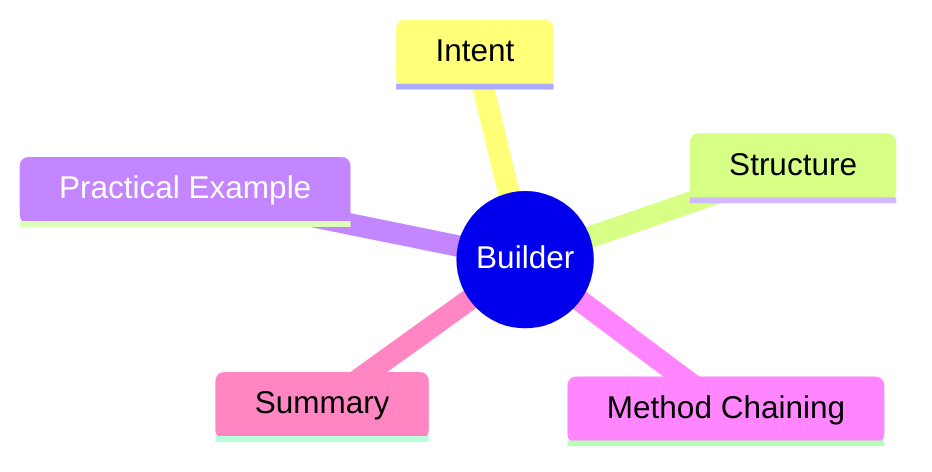

export const metadata = {
  title: 'Design Patterns: Builder',
  date: '2026-03-11',
  excerpt: 'A practical guide to the Builder pattern — how to construct complex objects step by step, avoid telescoping constructors, and make object creation readable and maintainable.',
  tags: ['Software Design', 'Design Patterns', 'OOP'],
};

# Design Patterns: Builder

Builder separates the construction of a complex object from its representation, building it step by step rather than through a massive constructor.

It fits best when: **an object has many optional properties, and different contexts need different combinations of them.**



- [Intent](#intent)
- [Structure](#structure)
- [Practical Example: HTTP Request Builder](#practical-example-http-request-builder)
- [Method Chaining](#method-chaining)
- [Summary](#summary)

---

## Intent

Suppose you're building an HTTP request object:

```typescript
// minimal version
const req = new HttpRequest('GET', '/api/users');

// but there are tons of options: headers, timeout, retries, auth, cache...
const req2 = new HttpRequest('POST', '/api/users', { 'Content-Type': 'application/json' },
  null, 30000, 3, 'Bearer token123', false, true);
```

When a constructor takes this many parameters, callers can't easily remember the order. And reading the call site tells you almost nothing about what each argument means.

Builder turns this into clearly labeled, step-by-step construction.

---

## Structure

- **Product**: the complex object being built (`HttpRequest`)
- **Builder**: interface defining the build steps
- **ConcreteBuilder**: implements the build steps (`HttpRequestBuilder`)
- **Director** (optional): defines the order of steps; useful for common preset configurations

---

## Practical Example: HTTP Request Builder

```typescript
interface RequestOptions {
  method: string;
  url: string;
  headers: Record<string, string>;
  body?: unknown;
  timeout: number;
  retries: number;
}

class HttpRequestBuilder {
  private options: RequestOptions = {
    method: 'GET',
    url: '',
    headers: {},
    timeout: 5000,
    retries: 0,
  };

  method(method: string): this {
    this.options.method = method;
    return this;
  }

  url(url: string): this {
    this.options.url = url;
    return this;
  }

  header(key: string, value: string): this {
    this.options.headers[key] = value;
    return this;
  }

  body(body: unknown): this {
    this.options.body = body;
    return this;
  }

  timeout(ms: number): this {
    this.options.timeout = ms;
    return this;
  }

  retries(count: number): this {
    this.options.retries = count;
    return this;
  }

  build(): RequestOptions {
    if (!this.options.url) throw new Error('URL is required');
    return { ...this.options };
  }
}

const request = new HttpRequestBuilder()
  .method('POST')
  .url('/api/users')
  .header('Content-Type', 'application/json')
  .header('Authorization', 'Bearer token123')
  .body({ name: 'Alice' })
  .timeout(10000)
  .retries(3)
  .build();
```

Each step is named. The call site reads like a description of the request being built.

---

## Method Chaining

The `return this` on each method is intentional — it returns the builder itself so calls can be chained. This is the Builder pattern's signature style.

You see it everywhere: the Fetch API, ORM query builders, test assertion libraries. When an API feels natural to compose step by step, Builder is usually behind it.

---

## Summary

Builder works best in two situations:

1. The object has many optional parameters, and different callers need different combinations
2. Construction has a clear step sequence, and each step has its own semantic meaning

If your constructor is accumulating parameters and callers are passing `null` or `undefined` just to get to the one they actually want, Builder is the right fix.
