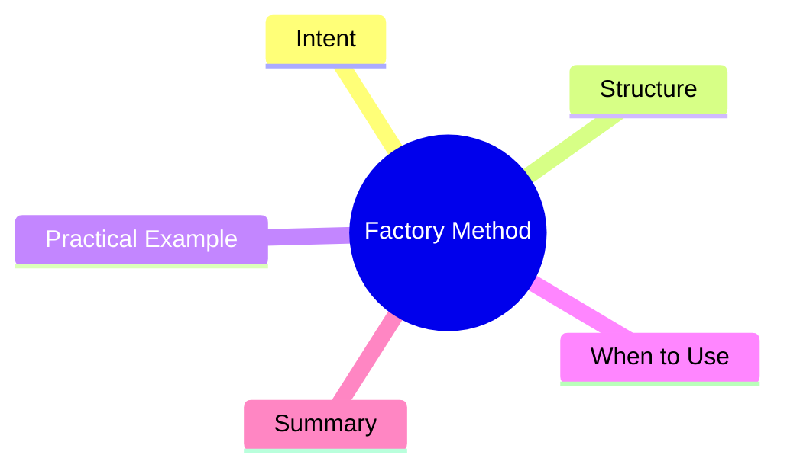

export const metadata = {
  title: 'Design Patterns: Factory Method',
  date: '2026-03-07',
  excerpt: 'A practical guide to the Factory Method pattern — how it defers object creation to subclasses, why that makes adding new types cheap, and when a simple factory function is actually enough.',
  tags: ['Software Design', 'Design Patterns', 'OOP'],
};

# Design Patterns: Factory Method

Factory Method is a creational pattern that solves a specific problem: **a parent class knows it needs to create objects, but doesn't know which concrete type to create.**

It defines a factory method as an interface, then lets subclasses decide which class to instantiate.



- [Intent](#intent)
- [Structure](#structure)
- [Practical Example: Notification System](#practical-example-notification-system)
- [When to Use](#when-to-use)
- [Summary](#summary)

---

## Intent

Imagine a notification system that can send Email, SMS, or Push messages. The logic for which channel to use varies based on user settings or environment config.

Factory Method lets you:

- Encapsulate the creation logic for each notification type in its own subclass
- Add new notification channels without modifying existing code
- Keep the calling code working only against the abstract `Notification` interface

---

## Structure

Four key roles:

- **Product**: the abstract interface for what's being created (`Notification`)
- **ConcreteProduct**: concrete implementations (`EmailNotification`, `SMSNotification`)
- **Creator**: abstract class declaring the factory method (`NotificationSender`)
- **ConcreteCreator**: subclasses implementing the factory method (`EmailSender`, `SMSSender`)

---

## Practical Example: Notification System

```typescript
// Product interface
interface Notification {
  send(message: string): void;
}

// ConcreteProducts
class EmailNotification implements Notification {
  constructor(private to: string) {}

  send(message: string): void {
    console.log(`Sending email to ${this.to}: ${message}`);
  }
}

class SMSNotification implements Notification {
  constructor(private phone: string) {}

  send(message: string): void {
    console.log(`Sending SMS to ${this.phone}: ${message}`);
  }
}

class PushNotification implements Notification {
  constructor(private deviceToken: string) {}

  send(message: string): void {
    console.log(`Sending push to ${this.deviceToken}: ${message}`);
  }
}

// Creator abstract class — declares the factory method
abstract class NotificationSender {
  abstract createNotification(target: string): Notification;

  // shared business logic that uses the factory method
  notify(target: string, message: string): void {
    const notification = this.createNotification(target);
    notification.send(message);
  }
}

// ConcreteCreators
class EmailSender extends NotificationSender {
  createNotification(email: string): Notification {
    return new EmailNotification(email);
  }
}

class SMSSender extends NotificationSender {
  createNotification(phone: string): Notification {
    return new SMSNotification(phone);
  }
}

class PushSender extends NotificationSender {
  createNotification(deviceToken: string): Notification {
    return new PushNotification(deviceToken);
  }
}

// usage
const sender: NotificationSender = new EmailSender();
sender.notify('user@example.com', 'Your order has shipped');

// adding LINE notifications: just add new classes, nothing else changes
class LineNotification implements Notification {
  constructor(private userId: string) {}
  send(message: string): void {
    console.log(`Sending LINE to ${this.userId}: ${message}`);
  }
}

class LineSender extends NotificationSender {
  createNotification(userId: string): Notification {
    return new LineNotification(userId);
  }
}
```

Adding LINE support doesn't touch `NotificationSender`, `EmailSender`, or `SMSSender`.

---

## When to Use

**Good fits**

- The exact type to create needs to be determined by subclasses
- There's shared business logic in the creator that reuses the factory method
- You expect to add more types over time and want extension to be additive

**Factory Method vs. simple factory function**

If you just need to centralize creation logic, a plain function is often enough:

```typescript
function createNotification(type: 'email' | 'sms', target: string): Notification {
  if (type === 'email') return new EmailNotification(target);
  return new SMSNotification(target);
}
```

Factory Method earns its complexity when the creator has shared logic that leverages the factory method — when inheritance and the template method structure are already in play.

---

## Summary

Factory Method's core idea: **defer object creation to subclasses**.

The parent class can work with objects without knowing their concrete type. Subclasses control what gets created. Adding a new type means adding a new subclass — not editing a growing if-else chain or an existing class.
