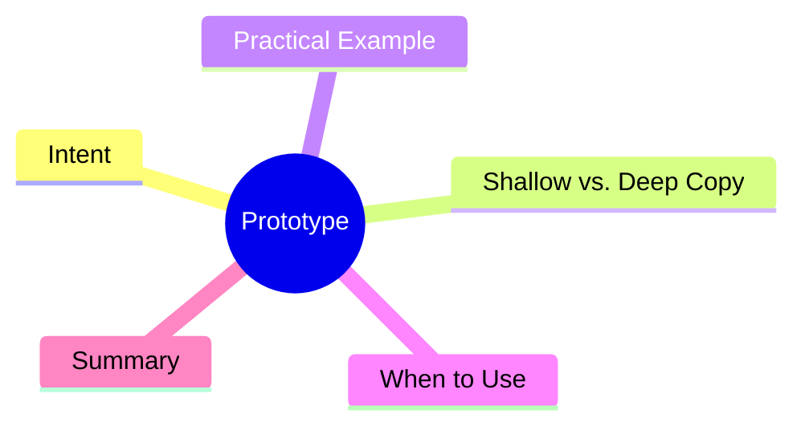

export const metadata = {
  title: 'Design Patterns: Prototype',
  date: '2026-03-13',
  excerpt: 'A practical guide to the Prototype pattern — how cloning an existing object is sometimes better than constructing a new one, and why shallow vs. deep copy matters more than you think.',
  tags: ['Software Design', 'Design Patterns', 'OOP'],
};

# Design Patterns: Prototype

Prototype creates new objects by cloning an existing one. Instead of going through the full initialization process again, you start from an existing instance and adjust from there.

Fits best when: **object initialization is expensive, and new objects are mostly slight variations of existing ones.**



- [Intent](#intent)
- [Shallow vs. Deep Copy](#shallow-vs-deep-copy)
- [Practical Example: Graphics Editor](#practical-example-graphics-editor)
- [When to Use](#when-to-use)
- [Summary](#summary)

---

## Intent

Core idea: copy an existing object, then make small adjustments to the copy.

Common scenarios:

- Duplicating graphic layers in a design tool
- Cloning object templates in a game engine (bullets, NPC types)
- Settings pages with presets that users customize

---

## Shallow vs. Deep Copy

This is the most important part of working with Prototype.

**Shallow copy**: copies only the top-level properties. Nested objects and arrays are still shared between the original and the clone.

```typescript
const original = { a: 1, b: { c: 2 } };
const shallow = { ...original };

shallow.b.c = 99;
console.log(original.b.c); // 99 — both point to the same object!
```

**Deep copy**: copies everything, including nested objects. The two instances are fully independent.

```typescript
const deep = JSON.parse(JSON.stringify(original));
deep.b.c = 99;
console.log(original.b.c); // 2 — safe
```

`JSON.parse(JSON.stringify(...))` is simple but limited — it doesn't handle `undefined`, `Date`, functions, or circular references. For complex objects, a proper `clone()` method is the right approach.

---

## Practical Example: Graphics Editor

```typescript
interface Cloneable {
  clone(): this;
}

class Shape implements Cloneable {
  constructor(
    public type: string,
    public x: number,
    public y: number,
    public style: { color: string; strokeWidth: number },
  ) {}

  // deep clone — style object is copied too
  clone(): this {
    return Object.assign(Object.create(Object.getPrototypeOf(this)), {
      ...this,
      style: { ...this.style },
    });
  }

  moveTo(x: number, y: number): this {
    this.x = x;
    this.y = y;
    return this;
  }
}

const original = new Shape('circle', 10, 20, { color: 'red', strokeWidth: 2 });

// clone and move to a new position
const cloned = original.clone().moveTo(50, 60);

console.log(original.x, original.y); // 10, 20 — unchanged
cloned.style.color = 'blue';
console.log(original.style.color); // 'red' — safe, independent copy
```

---

## When to Use

**Good fits**

- Object initialization is expensive or resource-intensive, and new objects are mostly variations
- You need to snapshot an object's state and branch from that point in the future

**Watch out for**

- Objects with internal references require a decision: shallow or deep?
- The `clone()` method must account for all internal state, including inherited properties

---

## Summary

Prototype lets you create a new object without knowing its exact class — just clone an existing instance. It's commonly used for preset configurations, object templates, state snapshots, and object pool initialization.

Always default to shallow copy awareness. If an object has reference-type properties, implement `clone()` explicitly.
