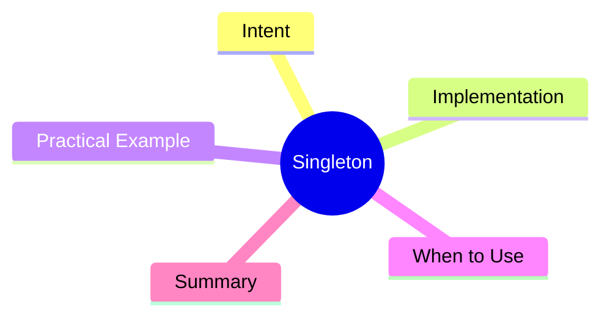

export const metadata = {
  title: 'Design Patterns: Singleton',
  date: '2026-03-05',
  excerpt: 'A practical guide to the Singleton pattern — how to guarantee a single instance across your application, when that\'s actually the right call, and the tradeoffs you\'re accepting.',
  tags: ['Software Design', 'Design Patterns', 'OOP'],
};

# Design Patterns: Singleton

Singleton is the simplest creational pattern — and one of the most misused. The goal is straightforward: **ensure a class has only one instance and provide a global access point to it.**



- [Intent](#intent)
- [Implementation](#implementation)
- [Practical Example: Structured Logger](#practical-example-structured-logger)
- [When to Use (and When Not To)](#when-to-use-and-when-not-to)
- [Summary](#summary)

---

## Intent

Singleton applies when:

- A global configuration object needs to be consistent across the app
- A logger should collect all entries in one place
- A database connection pool is expensive to set up and should be shared
- A cache holds data that needs to be shared across modules

The common thread: the resource is expensive to create, or shared state is genuinely necessary — not just convenient.

---

## Implementation

The TypeScript approach is clean and direct:

```typescript
class Singleton {
  private static instance: Singleton;

  // private constructor prevents external `new`
  private constructor() {}

  static getInstance(): Singleton {
    if (!Singleton.instance) {
      Singleton.instance = new Singleton();
    }
    return Singleton.instance;
  }

  doSomething(): void {
    console.log('Singleton is working');
  }
}

const a = Singleton.getInstance();
const b = Singleton.getInstance();
console.log(a === b); // true
```

The private constructor is the key. External code can't call `new Singleton()` — the only way in is through `getInstance()`, which lazily creates and then caches the instance.

---

## Practical Example: Structured Logger

```typescript
type LogLevel = 'info' | 'warn' | 'error';

class Logger {
  private static instance: Logger;
  private logs: string[] = [];

  private constructor(private prefix: string = '[App]') {}

  static getInstance(): Logger {
    if (!Logger.instance) {
      Logger.instance = new Logger();
    }
    return Logger.instance;
  }

  log(level: LogLevel, message: string): void {
    const entry = `${this.prefix} [${level.toUpperCase()}] ${new Date().toISOString()} - ${message}`;
    this.logs.push(entry);
    console.log(entry);
  }

  getLogs(): string[] {
    return [...this.logs];
  }
}

// no matter where you call getInstance(), you get the same Logger
const logger1 = Logger.getInstance();
const logger2 = Logger.getInstance();

logger1.log('info', 'Application started');
logger2.log('warn', 'Memory usage high');

console.log(logger1.getLogs()); // includes both entries
```

Every module in the application gets the same Logger instance. All log entries accumulate in one place.

---

## When to Use (and When Not To)

**Good fits**

- The resource is expensive to create and building it once is sufficient
- Shared state is genuinely required, not just convenient
- The global nature of the instance is a feature, not a side effect

**Common pitfalls**

- **Testing headaches**: shared state between tests is the biggest problem. State from test A bleeds into test B, causing flaky, order-dependent results.
- **Hidden global state**: modules silently depend on a shared instance; the dependency is invisible and hard to trace.
- **Overuse**: many cases that seem to call for a Singleton are better served by dependency injection, which keeps dependencies explicit.

Practical rule: **try dependency injection first. Reach for Singleton only when shared instance semantics are genuinely necessary.**

---

## Summary

Singleton solves a specific, narrow problem: eliminating the cost of duplicate resource creation and providing a consistent global access point.

Its downside is exactly what makes it appealing — the global instance. Global state makes dependencies implicit and tests fragile.

Used in the right place, it's efficient and clean. Used as a shortcut for "I need this everywhere," it becomes the kind of thing you'll spend hours debugging six months later.
