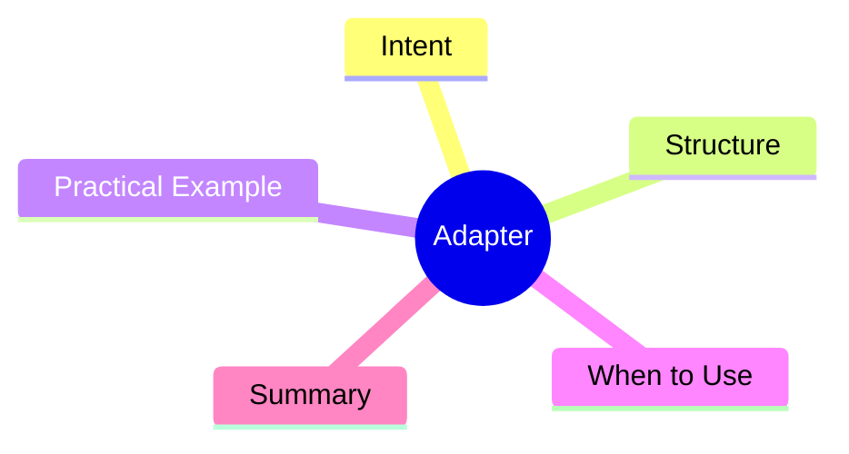

export const metadata = {
  title: 'Design Patterns: Adapter',
  date: '2026-03-16',
  excerpt: 'A practical guide to the Adapter pattern — how to convert one interface into another so that incompatible classes can work together without modifying either one.',
  tags: ['Software Design', 'Design Patterns', 'OOP'],
};

# Design Patterns: Adapter

Adapter is like a power adapter for code: **it converts one interface into another, letting otherwise incompatible classes work together cleanly.**

Most often used when integrating third-party libraries, connecting legacy code to a new interface, or wrapping an external module to match internal expectations.



- [Intent](#intent)
- [Structure](#structure)
- [Practical Example: Logger Adapter](#practical-example-logger-adapter)
- [When to Use](#when-to-use)
- [Summary](#summary)

---

## Intent

Suppose your system uses a unified `Logger` interface:

```typescript
interface Logger {
  log(level: 'info' | 'warn' | 'error', message: string): void;
}
```

Now you want to use a third-party logging library, but its API looks different:

```typescript
class WinstonLogger {
  info(msg: string): void { /* ... */ }
  warn(msg: string): void { /* ... */ }
  error(msg: string, err?: Error): void { /* ... */ }
}
```

You can't modify the third-party library. An Adapter bridges the gap.

---

## Structure

- **Target**: the interface clients expect (`Logger`)
- **Adaptee**: the existing, incompatible class (`WinstonLogger`)
- **Adapter**: implements Target and delegates to Adaptee (`WinstonAdapter`)

---

## Practical Example: Logger Adapter

```typescript
interface Logger {
  log(level: 'info' | 'warn' | 'error', message: string): void;
}

class WinstonLogger {
  info(msg: string): void { console.log(`[INFO] ${msg}`); }
  warn(msg: string): void { console.warn(`[WARN] ${msg}`); }
  error(msg: string, err?: Error): void { console.error(`[ERROR] ${msg}`, err); }
}

// Adapter: implements Logger, uses WinstonLogger internally
class WinstonAdapter implements Logger {
  constructor(private winston: WinstonLogger) {}

  log(level: 'info' | 'warn' | 'error', message: string): void {
    if (level === 'info') this.winston.info(message);
    else if (level === 'warn') this.winston.warn(message);
    else this.winston.error(message);
  }
}

// client code only knows about Logger
function writeLog(logger: Logger): void {
  logger.log('info', 'Application started');
  logger.log('error', 'Something went wrong');
}

const winston = new WinstonLogger();
const adapter = new WinstonAdapter(winston);
writeLog(adapter); // seamless, fully compatible
```

Swapping to `PinoLogger` later? Write a `PinoAdapter`. `writeLog` and all other callers stay untouched.

---

## When to Use

**Good fits**

- Integrating a third-party library whose API doesn't match your internal contracts
- Connecting legacy code to a new interface without modifying the legacy code
- Normalizing different data formats from multiple sources

**Don't overuse it**

Adapter solves incompatibility. If you can design the interfaces to be compatible from the start, you don't need one.

---

## Summary

Adapter's job is **interface translation**. It doesn't change behavior — it wraps one interface and presents it as another.

In practice, every time you bring in a third-party service or an old module, writing an adapter is the cleanest way to keep your internal code consistent.
