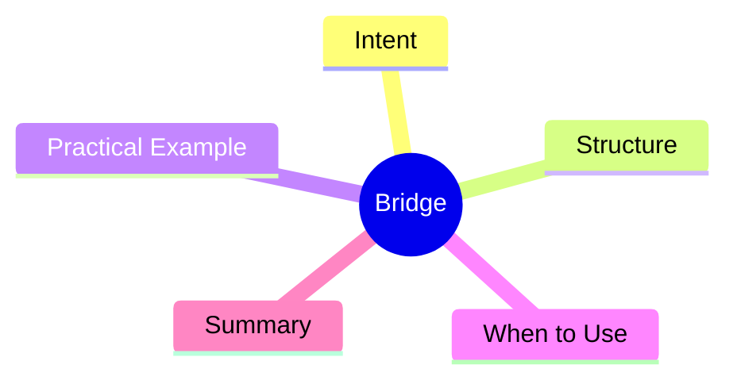

export const metadata = {
  title: 'Design Patterns: Bridge',
  date: '2026-03-18',
  excerpt: 'A practical guide to the Bridge pattern — how separating abstraction from implementation prevents class hierarchy explosion and lets both sides evolve independently.',
  tags: ['Software Design', 'Design Patterns', 'OOP'],
};

# Design Patterns: Bridge

Bridge separates abstraction from implementation so both can vary independently. The shift: inheritance → composition.



- [Intent](#intent)
- [Structure](#structure)
- [Practical Example: Remote Control](#practical-example-remote-control)
- [When to Use](#when-to-use)
- [Summary](#summary)

---

## Intent

Here's the problem Bridge solves:

Imagine a remote control that can operate both TVs and SoundBars. Using inheritance:

- `RemoteControl`
- `TVRemoteControl extends RemoteControl`
- `SoundBarRemoteControl extends RemoteControl`
- `SmartTVRemoteControl extends TVRemoteControl`
- `SmartSoundBarRemoteControl extends SoundBarRemoteControl`

The class count is **remote types × device types**. Two independent dimensions are tangled in one hierarchy.

Bridge splits them: remote control types live in one hierarchy, device types in another. Each can grow independently.

---

## Structure

- **Abstraction**: the remote's high-level layer (`RemoteControl`)
- **RefinedAbstraction**: extended abstractions (`SmartRemoteControl`)
- **Implementor**: the device interface (`Device`)
- **ConcreteImplementor**: concrete devices (`TV`, `SoundBar`)

---

## Practical Example: Remote Control

```typescript
// Implementor interface
interface Device {
  isOn(): boolean;
  turnOn(): void;
  turnOff(): void;
  getVolume(): number;
  setVolume(volume: number): void;
}

// ConcreteImplementors
class TV implements Device {
  private on = false;
  private volume = 50;

  isOn(): boolean { return this.on; }
  turnOn(): void { this.on = true; console.log('TV on'); }
  turnOff(): void { this.on = false; console.log('TV off'); }
  getVolume(): number { return this.volume; }
  setVolume(volume: number): void {
    this.volume = Math.max(0, Math.min(100, volume));
  }
}

class SoundBar implements Device {
  private on = false;
  private volume = 30;

  isOn(): boolean { return this.on; }
  turnOn(): void { this.on = true; console.log('SoundBar on'); }
  turnOff(): void { this.on = false; console.log('SoundBar off'); }
  getVolume(): number { return this.volume; }
  setVolume(volume: number): void {
    this.volume = Math.max(0, Math.min(100, volume));
  }
}

// Abstraction — holds a reference to a Device (the bridge)
class RemoteControl {
  constructor(protected device: Device) {}

  togglePower(): void {
    if (this.device.isOn()) this.device.turnOff();
    else this.device.turnOn();
  }

  volumeUp(): void {
    this.device.setVolume(this.device.getVolume() + 10);
  }

  volumeDown(): void {
    this.device.setVolume(this.device.getVolume() - 10);
  }
}

// RefinedAbstraction — adds functionality without touching Device
class SmartRemoteControl extends RemoteControl {
  mute(): void {
    this.device.setVolume(0);
    console.log('Muted');
  }
}

// any combination works
const tvRemote = new RemoteControl(new TV());
const smartSoundbar = new SmartRemoteControl(new SoundBar());

tvRemote.togglePower();
smartSoundbar.mute();
```

Instead of one hierarchy for every combination, you have two independent hierarchies that can grow separately.

---

## When to Use

**Good fits**

- A class has two independently varying dimensions, and inheritance would cause an explosion in class count
- You want to swap implementations at runtime

---

## Summary

Bridge is about **inheritance → composition**.

Once you notice a class that might grow in two independent directions, consider pulling one dimension out as a separate interface — that's the bridge. Both sides can then expand fully without touching each other.
