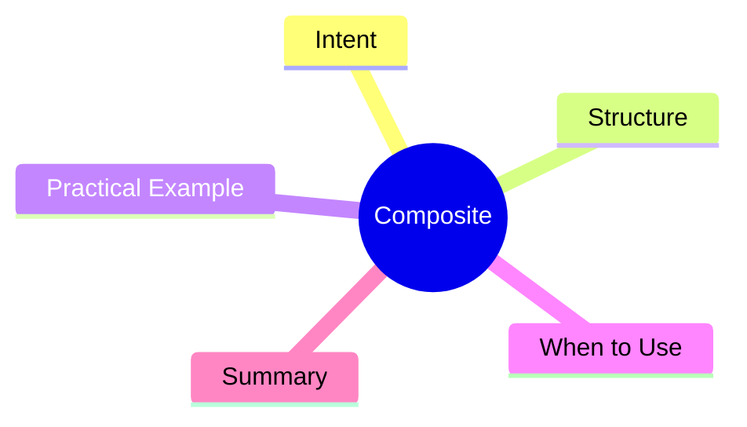

export const metadata = {
  title: 'Design Patterns: Composite',
  date: '2026-03-20',
  excerpt: 'A practical guide to the Composite pattern — how to compose objects into tree structures so client code treats individual objects and compositions uniformly.',
  tags: ['Software Design', 'Design Patterns', 'OOP'],
};

# Design Patterns: Composite

Composite composes objects into tree structures and lets client code treat individual nodes and containers the same way.



- [Intent](#intent)
- [Structure](#structure)
- [Practical Example: File System](#practical-example-file-system)
- [When to Use](#when-to-use)
- [Summary](#summary)

---

## Intent

File systems are the canonical example: files and directories can both be moved, deleted, and listed. But handling them separately fills code with `if (isFile)` and `if (isDirectory)` branches.

Composite's goal: make files and directories implement the same interface. Client code doesn't need to know whether it's dealing with a leaf or a container.

---

## Structure

- **Component**: the common interface (`FileSystemNode`)
- **Leaf**: a tree leaf with no children (`File`)
- **Composite**: a container that can hold child components (`Directory`)

---

## Practical Example: File System

```typescript
// Component interface
interface FileSystemNode {
  name: string;
  getSize(): number;
  print(indent?: string): void;
}

// Leaf
class File implements FileSystemNode {
  constructor(public name: string, private size: number) {}

  getSize(): number { return this.size; }

  print(indent = ''): void {
    console.log(`${indent}📄 ${this.name} (${this.size}B)`);
  }
}

// Composite
class Directory implements FileSystemNode {
  private children: FileSystemNode[] = [];

  constructor(public name: string) {}

  add(node: FileSystemNode): void {
    this.children.push(node);
  }

  remove(node: FileSystemNode): void {
    this.children = this.children.filter(c => c !== node);
  }

  // recursively sums child sizes — client doesn't have to know
  getSize(): number {
    return this.children.reduce((sum, child) => sum + child.getSize(), 0);
  }

  print(indent = ''): void {
    console.log(`${indent}📁 ${this.name}`);
    this.children.forEach(child => child.print(indent + '  '));
  }
}

const root = new Directory('project');
const src = new Directory('src');
const dist = new Directory('dist');

src.add(new File('index.ts', 1200));
src.add(new File('utils.ts', 800));
dist.add(new File('bundle.js', 45000));

root.add(src);
root.add(dist);
root.add(new File('package.json', 400));

root.print();
console.log(`Total: ${root.getSize()}B`); // recursive, transparent
```

Calling `root.getSize()` or `file.getSize()` works identically. No branching on type.

---

## When to Use

**Good fits**

- Data naturally forms a tree (file systems, UI component trees, org charts, billing line items)
- Client code genuinely needs to treat individual objects and compositions the same

---

## Summary

Composite makes recursive tree operations natural. Client code calls the same methods on leaves and containers, and the tree handles the rest. File systems, UI trees, and ASTs are the most common applications.
