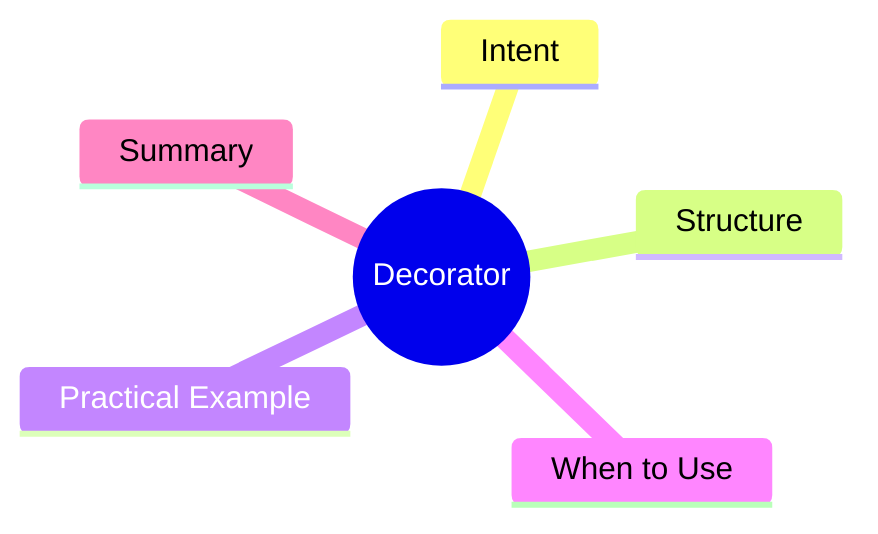

export const metadata = {
  title: 'Design Patterns: Decorator',
  date: '2026-03-22',
  excerpt: 'A practical guide to the Decorator pattern — how to dynamically attach new behavior to objects through wrapping, without modifying the original class or relying on inheritance.',
  tags: ['Software Design', 'Design Patterns', 'OOP'],
};

# Design Patterns: Decorator

Decorator lets you attach new behavior to objects at runtime by wrapping them — without modifying the underlying class or building a subclass for every combination.



- [Intent](#intent)
- [Structure](#structure)
- [Practical Example: Coffee Shop](#practical-example-coffee-shop)
- [When to Use](#when-to-use)
- [Summary](#summary)

---

## Intent

Inheritance is static — you create a new subclass for every combination of behaviors. Decorator makes that composition dynamic: combine behaviors at runtime, freely.

Common examples:

- Coffee shop orders (base coffee + milk + syrup)
- HTTP middleware (logging + auth + rate limiting)
- Node.js streams (compression, encryption)

---

## Structure

- **Component**: the behavioral interface (`Coffee`)
- **ConcreteComponent**: the base implementation (`SimpleCoffee`)
- **Decorator**: implements the interface and wraps a Component
- **ConcreteDecorator**: adds specific behavior (`MilkDecorator`, `SyrupDecorator`)

---

## Practical Example: Coffee Shop

```typescript
// Component interface
interface Coffee {
  cost(): number;
  description(): string;
}

// ConcreteComponent
class SimpleCoffee implements Coffee {
  cost(): number { return 30; }
  description(): string { return 'Black coffee'; }
}

// Decorator base
class CoffeeDecorator implements Coffee {
  constructor(protected coffee: Coffee) {}
  cost(): number { return this.coffee.cost(); }
  description(): string { return this.coffee.description(); }
}

// ConcreteDecorators
class MilkDecorator extends CoffeeDecorator {
  cost(): number { return this.coffee.cost() + 15; }
  description(): string { return this.coffee.description() + ', milk'; }
}

class SyrupDecorator extends CoffeeDecorator {
  cost(): number { return this.coffee.cost() + 10; }
  description(): string { return this.coffee.description() + ', syrup'; }
}

class LargeDecorator extends CoffeeDecorator {
  cost(): number { return this.coffee.cost() + 20; }
  description(): string { return this.coffee.description() + ' (large)'; }
}

// compose behaviors dynamically
let myOrder: Coffee = new SimpleCoffee();
myOrder = new MilkDecorator(myOrder);
myOrder = new SyrupDecorator(myOrder);
myOrder = new LargeDecorator(myOrder);

console.log(myOrder.description()); // 'Black coffee, milk, syrup (large)'
console.log(myOrder.cost());        // 75
```

No `MilkSyrupLargeCoffee` subclass needed. Each decorator wraps the previous layer, composing behavior dynamically.

---

## When to Use

**Good fits**

- You need to add behavior to objects dynamically, and the combinations vary
- You want to extend functionality without modifying existing code (OCP)

**Decorator vs. Inheritance**

Inheritance is decided at compile time. Decorator is decided at runtime — and you can layer the same decorator multiple times.

---

## Summary

Decorator is one of the cleanest ways to implement OCP in practice — open for extension, closed for modification. TypeScript's decorator syntax (stage 3 proposal) takes its name directly from this pattern.
