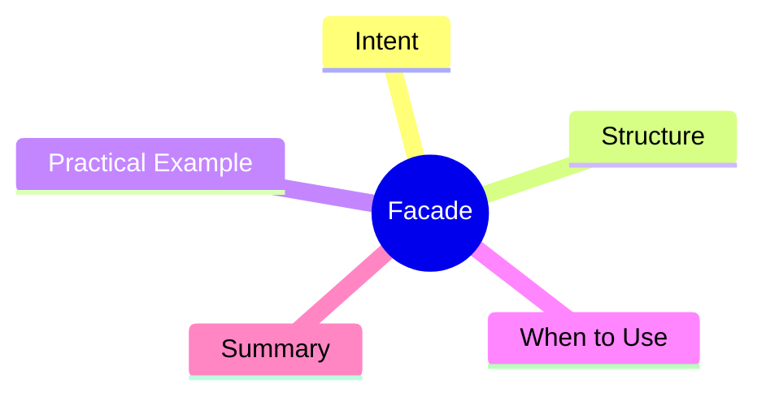

export const metadata = {
  title: 'Design Patterns: Facade',
  date: '2026-03-24',
  excerpt: 'A practical guide to the Facade pattern — how to provide a simplified interface to a complex subsystem and keep client code from having to know about the moving parts underneath.',
  tags: ['Software Design', 'Design Patterns', 'OOP'],
};

# Design Patterns: Facade

Facade provides a simplified entry point to a complex subsystem, so client code doesn't need to understand what's happening underneath.



- [Intent](#intent)
- [Structure](#structure)
- [Practical Example: Home Theater System](#practical-example-home-theater-system)
- [When to Use](#when-to-use)
- [Summary](#summary)

---

## Intent

Starting a movie requires:

1. Turning on the projector
2. Turning on the sound system
3. Dimming the lights and lowering the blinds
4. Setting up the streaming player

The client just wants to call `homeTheater.startMovie(movie)`. Facade wraps all that coordination in a single, clean method.

---

## Structure

- **Facade**: the simplified interface that coordinates the subsystems
- **Subsystem classes**: complex internal implementations that know nothing about the Facade

---

## Practical Example: Home Theater System

```typescript
class Projector {
  on(): void { console.log('Projector on'); }
  off(): void { console.log('Projector off'); }
  setInput(source: string): void { console.log(`Projector input: ${source}`); }
}

class SoundSystem {
  on(): void { console.log('Sound system on'); }
  off(): void { console.log('Sound system off'); }
  setVolume(level: number): void { console.log(`Volume: ${level}`); }
}

class Lights {
  dim(level: number): void { console.log(`Lights dimmed to ${level}%`); }
  on(): void { console.log('Lights on'); }
}

class Blinds {
  down(): void { console.log('Blinds down'); }
  up(): void { console.log('Blinds up'); }
}

class StreamingPlayer {
  play(movie: string): void { console.log(`Playing: ${movie}`); }
  stop(): void { console.log('Stopped'); }
}

// Facade
class HomeTheaterFacade {
  constructor(
    private projector: Projector,
    private sound: SoundSystem,
    private lights: Lights,
    private blinds: Blinds,
    private player: StreamingPlayer,
  ) {}

  startMovie(movie: string): void {
    console.log('\u2014\u2014 Movie starting \u2014\u2014');
    this.lights.dim(10);
    this.blinds.down();
    this.projector.on();
    this.projector.setInput('HDMI');
    this.sound.on();
    this.sound.setVolume(40);
    this.player.play(movie);
  }

  endMovie(): void {
    console.log('\u2014\u2014 Movie ended \u2014\u2014');
    this.player.stop();
    this.sound.off();
    this.projector.off();
    this.blinds.up();
    this.lights.on();
  }
}

// client only needs the Facade
const theater = new HomeTheaterFacade(
  new Projector(), new SoundSystem(), new Lights(), new Blinds(), new StreamingPlayer()
);

theater.startMovie('Inception');
// later...
theater.endMovie();
```

Two calls from client code. All the coordination is hidden inside the Facade.

---

## When to Use

**Good fits**

- A complex subsystem needs a simplified public API
- You want a single entry point for a common workflow
- You're isolating internal subsystems from external layers

**Note**

Facade doesn't prevent clients from accessing subsystems directly if they need fine-grained control. It's a convenience layer, not a lock.

---

## Summary

Facade's value is **simplification**. It doesn't care how complex the internals are — it just provides one clean, consistent entry point that hides the coordination.

In practice, SDK design, layered architecture boundaries, and service-level abstractions all use this pattern constantly.
