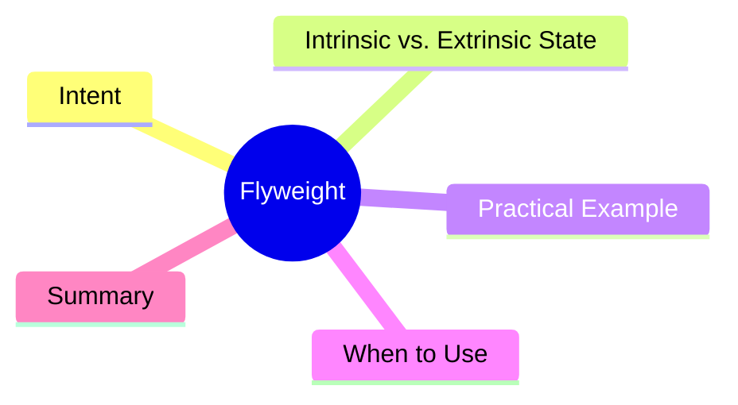

export const metadata = {
  title: 'Design Patterns: Flyweight',
  date: '2026-03-26',
  excerpt: 'A practical guide to the Flyweight pattern — how sharing intrinsic state across large numbers of fine-grained objects can dramatically reduce memory usage.',
  tags: ['Software Design', 'Design Patterns', 'OOP'],
};

# Design Patterns: Flyweight

Flyweight reduces memory consumption by sharing common internal state across a large number of fine-grained objects, rather than duplicating it for every instance.



- [Intent](#intent)
- [Intrinsic vs. Extrinsic State](#intrinsic-vs-extrinsic-state)
- [Practical Example: Text Rendering Engine](#practical-example-text-rendering-engine)
- [When to Use](#when-to-use)
- [Summary](#summary)

---

## Intent

Imagine a text editor with 100,000 characters. Each character has font, size, color, and position. Storing a full copy of font + size + color per character would consume enormous memory.

Most characters sharing the same font and style can share a single style object. Only position is unique to each character.

---

## Intrinsic vs. Extrinsic State

Flyweight divides object state into two categories:

- **Intrinsic state**: shared, immutable data → stored inside the Flyweight object
- **Extrinsic state**: unique, per-instance data → passed in by the client at call time

---

## Practical Example: Text Rendering Engine

```typescript
// Intrinsic state: font and style (shared)
interface CharacterStyle {
  font: string;
  size: number;
  color: string;
  render(char: string, x: number, y: number): void;
}

class ConcreteCharacterStyle implements CharacterStyle {
  constructor(
    public font: string,
    public size: number,
    public color: string,
  ) {}

  render(char: string, x: number, y: number): void {
    console.log(`'${char}' at (${x},${y}) [${this.font} ${this.size}px ${this.color}]`);
  }
}

// Flyweight Factory — controls shared instances
class CharacterStyleFactory {
  private cache = new Map<string, CharacterStyle>();

  getStyle(font: string, size: number, color: string): CharacterStyle {
    const key = `${font}-${size}-${color}`;
    if (!this.cache.has(key)) {
      this.cache.set(key, new ConcreteCharacterStyle(font, size, color));
      console.log(`New style created: ${key}`);
    }
    return this.cache.get(key)!;
  }

  getCount(): number { return this.cache.size; }
}

// Extrinsic state: character and position (unique per instance)
interface CharInstance {
  char: string;
  x: number;
  y: number;
  style: CharacterStyle;
}

const factory = new CharacterStyleFactory();
const characters: CharInstance[] = [];

// 100 characters, mostly 'Arial 14px black'
for (let i = 0; i < 100; i++) {
  characters.push({
    char: String.fromCharCode(65 + (i % 26)),
    x: i * 10, y: 0,
    style: factory.getStyle('Arial', 14, 'black'),
  });
}

// a few in red
['H', 'e', 'l', 'l', 'o'].forEach((char, i) => {
  characters.push({
    char, x: i * 20, y: 50,
    style: factory.getStyle('Georgia', 18, 'red'),
  });
});

console.log(`Total characters: ${characters.length}`); // 105
console.log(`Shared styles: ${factory.getCount()}`);   // 2

// extrinsic state passed at render time
characters.slice(0, 3).forEach(c => c.style.render(c.char, c.x, c.y));
```

105 characters, only 2 style objects. The factory cache does the sharing.

---

## When to Use

**Good fits**

- You need a large number of fine-grained objects with significant shared state
- Memory usage is a measurable bottleneck

**Trade-off**

Flyweight trades time complexity (factory lookup) for memory. If you don't have hundreds of thousands of objects or the duplication ratio is low, the complexity isn't worth it.

---

## Summary

Flyweight is a performance-oriented pattern, not an everyday architectural choice. Reach for it when you've profiled a real memory problem.

Common applications: particle systems in game engines, text rendering pipelines, map tiles with thousands of repeated objects.
