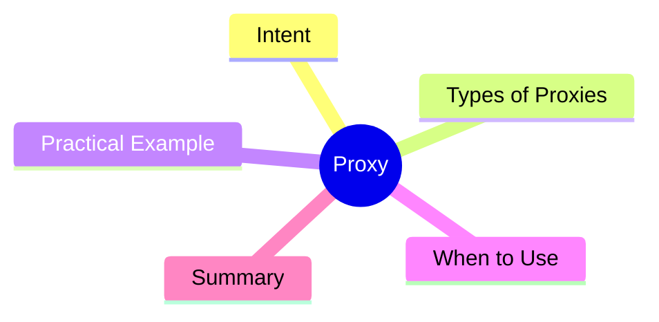

export const metadata = {
  title: 'Design Patterns: Proxy',
  date: '2026-03-28',
  excerpt: 'A practical guide to the Proxy pattern — how a surrogate object controls access to another object to enable lazy loading, caching, access control, and logging.',
  tags: ['Software Design', 'Design Patterns', 'OOP'],
};

# Design Patterns: Proxy

Proxy provides a surrogate for another object, controlling access to it. Client code thinks it's talking directly to the real object; it's actually going through the proxy.



- [Intent](#intent)
- [Types of Proxies](#types-of-proxies)
- [Practical Example: Caching Proxy](#practical-example-caching-proxy)
- [When to Use](#when-to-use)
- [Summary](#summary)

---

## Intent

Proxy provides the same interface as the real object and performs additional operations before or after forwarding the request — without changing how clients use it.

Three main use cases:

- **Virtual Proxy**: defers creating an expensive object until it's actually needed
- **Protection Proxy**: controls access and validates permissions
- **Remote Proxy**: wraps the details of communicating with a remote object

---

## Types of Proxies

**Caching Proxy**: stores results and avoids repeating expensive operations. This is the most common application in practice.

---

## Practical Example: Caching Proxy

```typescript
interface DataService {
  fetchUser(id: string): Promise<User>;
}

// the real implementation
class RealDataService implements DataService {
  async fetchUser(id: string): Promise<User> {
    console.log(`Calling API: /users/${id}`);
    // imagine this is a slow network request
    return { id, name: 'Alice', email: 'alice@example.com' };
  }
}

// Caching Proxy — same interface, adds a cache layer
class CachedDataService implements DataService {
  private cache = new Map<string, User>();

  constructor(private realService: DataService) {}

  async fetchUser(id: string): Promise<User> {
    if (this.cache.has(id)) {
      console.log(`Cache hit: ${id}`);
      return this.cache.get(id)!;
    }
    const user = await this.realService.fetchUser(id);
    this.cache.set(id, user);
    return user;
  }
}

// client only knows the DataService interface
async function main() {
  const service: DataService = new CachedDataService(new RealDataService());

  await service.fetchUser('123'); // API call
  await service.fetchUser('123'); // cache hit
  await service.fetchUser('456'); // API call
  await service.fetchUser('456'); // cache hit
}

main();
```

The client has no idea caching is happening. `CachedDataService` is fully interchangeable with `RealDataService`.

---

## When to Use

**Good fits**

- Lazy initialization of expensive resources (Virtual Proxy)
- Access control and permission checks (Protection Proxy)
- Result caching (Caching Proxy)
- Logging operations without modifying the real object

**Proxy vs. Decorator**

Proxy controls **access**. Decorator adds **behavior**. The structures look similar, but the intent is different.

---

## Summary

Proxy is everywhere in modern web development: JavaScript's built-in `Proxy` object, Vue.js reactivity, Angular's `HttpClient` interceptors — all of these are this pattern in action.

The core idea: **control access to and behavior around an object without changing its interface.**
