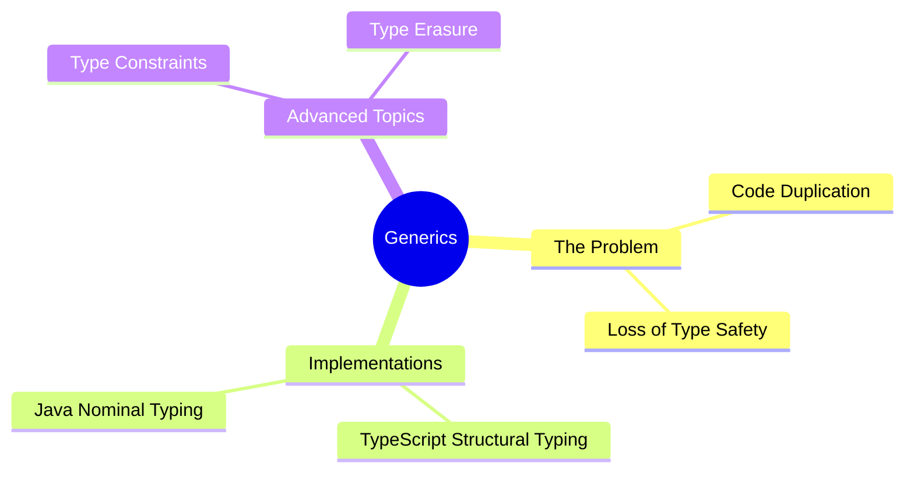

export const metadata = {
  title: 'Generics: Reusable Code with Full Type Safety',
  date: '2026-06-11',
  excerpt: 'A practical guide to generics: covering why any and Object fall short, how TypeScript and Java each implement the pattern, type constraints, and what type erasure means under the hood.',
  tags: ['Software Design'],
};

# Generics: Reusable Code with Full Type Safety

Writing reusable code and maintaining type safety often feel like competing goals. Use `any` or `Object` for flexibility and you lose type information. Hardcode every type and you end up duplicating the same logic for every type you need to support.

Generics resolve this by parameterizing types: you write a function, class, or interface once without committing to a specific type, and the actual type gets filled in at the call site.



- [The Problem Before Generics](#the-problem-before-generics)
- [Cross-Language Comparison: TypeScript vs. Java](#cross-language-comparison-typescript-vs-java)
- [Advanced Abstraction: Generic Constraints](#advanced-abstraction-generic-constraints)
- [Under the Hood: How Generics Work](#under-the-hood-how-generics-work)
- [Conclusion](#conclusion)

---

## The Problem Before Generics

Before generics, building a reusable container meant relying on a language's catch-all type, and accepting that type errors would only surface at runtime.

### TypeScript

Reaching for `any` in TypeScript turns off the static type checker entirely:

```typescript
function copyValue(arg: any): any {
  return arg;
}

const userName = copyValue("Charmy"); 
// 'userName' is inferred as 'any'. The compiler won't warn you if you accidentally call a number method on it later.
```

### Java

Prior to Java 5, a reusable container had to use the top-level `Object` class, which forced explicit downcasting when reading data back out:

```java
// Traditional Java approach
public class Box {
    private Object object;
    public void set(Object object) { this.object = object; }
    public Object get() { return object; }
}

// Requires explicit casting — a ClassCastException at runtime if the type is wrong
Box box = new Box();
box.set("Hello");
String str = (String) box.get(); 
```

Generics move this risk from runtime to compile time: the wrong type gets caught during development, before anything runs.

---

## Cross-Language Comparison: TypeScript vs. Java

The underlying implementations differ, but the core syntax and mental model are consistent across languages.

### 1. Generic Functions and Methods

Generic functions guarantee that the input and output types stay consistent, whether you're transforming data on the frontend or mapping objects on the backend.

TypeScript:

```typescript
function identity<T>(arg: T): T {
  return arg;
}
const output = identity<string>("Vite + React");
```

Java:

```java
public class Utility {
    public static <T> T identity(T arg) {
        return arg;
    }
}
String output = Utility.<String>identity("Spring Boot");
```

### 2. Generic Classes and Data Structures

A common real-world use case is a typed API response wrapper: the same structure reused across every endpoint, with the payload type changing each time.

TypeScript (front-end API response):

```typescript
interface ApiResponse<T> {
  code: number;
  message: string;
  data: T;
}

interface UserProfile {
  id: string;
  email: string;
}

const userResponse: ApiResponse<UserProfile> = {
  code: 200,
  message: "Success",
  data: { id: "u_01", email: "charmy@example.com" }
};
```

Java (back-end unified response wrapper):

```java
public class Result<T> {
    private int code;
    private String message;
    private T data;

    // Getters and Setters
}

// Reused across controller layer
Result<UserEntity> result = new Result<>();
```

---

## Advanced Abstraction: Generic Constraints

Generics are flexible by design, but sometimes you need to restrict what types are allowed in. That's where constraints come in.

### Structural Constraints in TypeScript

TypeScript uses a structural type system, so constraints check whether an object has the right shape, not what class it belongs to:

```typescript
interface HasId {
  id: string | number;
}

// T must match the shape of HasId
function processEntity<T extends HasId>(entity: T): void {
  console.log(`Processing entity with ID: ${entity.id}`);
}

processEntity({ id: 101, name: "Product A" }); // valid
// processEntity({ name: "Invalid" }); // compile error: missing 'id'
```

### Nominal Constraints in Java

Java uses a nominal type system, so constraints require that the type explicitly extends a class or implements an interface:

```java
public interface Identifiable {
    String getId();
}

// T must explicitly implement or extend Identifiable
public class EntityProcessor<T extends Identifiable> {
    public void process(T entity) {
        System.out.println("Processing: " + entity.getId());
    }
}
```

---

## Under the Hood: How Generics Work

TypeScript and Java are very different ecosystems, but they arrive at a similar strategy for implementing generics: type erasure.

### TypeScript

TypeScript generics exist entirely at compile time. When the code is compiled to JavaScript, all type annotations and generic markers like `<T>` are stripped out completely. There's no trace of them at runtime, and no overhead for it.

### Java

Java takes the same approach, largely for backward compatibility with pre-generics code. The compiler replaces generic type parameters with their upper bounds (usually `Object`, or the constrained base type) and inserts the necessary casts into the compiled bytecode automatically.

In both cases, the conclusion is the same: generics are a development-time tool. They help you write safer, cleaner code; they don't change what happens when the code runs.

---

## Conclusion

Generics let you write reusable functions, classes, and interfaces without giving up type safety. Instead of duplicating logic for every type, or losing type information with `any` or `Object`, you write it once and let the type get filled in at the call site.

