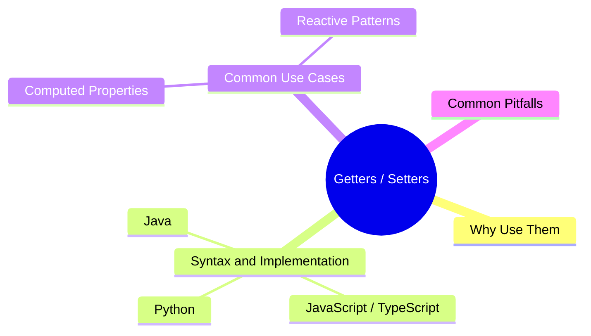

export const metadata = {
  title: 'Getters and Setters: Controlled Access to Object Properties',
  date: '2026-06-17',
  excerpt: 'A practical guide to getters and setters: covering why controlled access matters, how data validation and computed properties work, and how the pattern is implemented across JavaScript, Python, and Java.',
  tags: ['OOP', 'Software Design'],
};

# Getters and Setters: Controlled Access to Object Properties

When a class exposes its internal fields directly, any code can write anything, valid or not. Getters and setters fix that by intercepting property reads and writes.

Instead of letting outside code reach directly into an object's state, you define the logic that runs whenever a value is read or changed. You get to validate input, derive values on the fly, and trigger side effects, all while the outside world just sees a clean property interface. That's encapsulation in practice.

The concept isn't unique to JavaScript. Every major language has its own way to implement accessors, even if the syntax looks different.



- [Why Use Getters and Setters](#why-use-getters-and-setters)
- [Syntax and Implementation](#syntax-and-implementation)
- [Common Use Cases](#common-use-cases)
- [Common Pitfalls](#common-pitfalls)
- [Conclusion](#conclusion)

---

## Why Use Getters and Setters

On the surface, direct property access and accessor-driven access look identical:

```typescript
// Direct access — no guardrails
user.age = -5; // Corrupt data enters without any check

// Accessor-driven — controlled access
user.age = -5; // Intercepted, throws an error or silently rejects
```

But accessors give you several things raw property access can't:

- **Data validation**: reject invalid values before they corrupt internal state (e.g. age can't be negative)
- **Computed properties**: derive a value on read instead of storing a redundant copy (e.g. calculate `age` from a birthdate)
- **Read-only properties**: expose a getter without a setter and the property becomes immutable from the outside
- **Side effects**: automatically run logging, state sync, or UI updates when a value changes

---

## Syntax and Implementation

The same scenario plays out in three languages below: a private age field with a negative-value check.

### 1. JavaScript / TypeScript

ES6+ and TypeScript use the `get` and `set` keywords. Paired with native private fields (`#`), the implementation is fully encapsulated while still looking like a normal property from the outside.

```typescript
class User {
  #age: number = 0;

  constructor(age: number) {
    this.age = age; // routes through the setter on init
  }

  get age(): number {
    return this.#age;
  }

  set age(value: number) {
    if (value < 0) {
      throw new Error('Age cannot be negative.');
    }
    this.#age = value;
  }
}

const user = new User(25);
console.log(user.age); // 25
user.age = 30;         // updates successfully
// user.age = -5;      // throws Error: Age cannot be negative.
```

### 2. Python

Python uses the `@property` decorator for the getter and `@<name>.setter` for the setter. The result is the same clean property-access syntax, but with the control you'd expect from a method.

```python
class User:
    def __init__(self, age: int):
        self.age = age  # routes through the setter

    @property
    def age(self) -> int:
        return self._age  # single underscore is the conventional "private" prefix

    @age.setter
    def age(self, value: int) -> None:
        if value < 0:
            raise ValueError("Age cannot be negative.")
        self._age = value

user = User(25)
print(user.age)  # 25
user.age = 30    # updates successfully
```

### 3. Java

Java doesn't have syntactic sugar that makes methods look like property accesses. Instead, it follows the JavaBean convention: declare fields as `private`, then expose them through explicit `getX()` and `setX()` methods.

```java
public class User {
    private int age;

    public User(int age) {
        setAge(age); // routes through the setter on init
    }

    public int getAge() {
        return this.age;
    }

    public void setAge(int age) {
        if (age < 0) {
            throw new IllegalArgumentException("Age cannot be negative.");
        }
        this.age = age;
    }
}

public class Main {
    public static void main(String[] args) {
        User user = new User(25);
        System.out.println(user.getAge()); // 25
        user.setAge(30);                   // updates successfully
    }
}
```

---

## Common Use Cases

### Computed Properties

Instead of storing a derived value and keeping it in sync manually, compute it on demand:

```typescript
class Product {
  constructor(public price: number, public discount: number) {}

  get finalPrice(): number {
    return this.price * (1 - this.discount);
  }
}

const item = new Product(100, 0.2);
console.log(item.finalPrice); // 80
```

`finalPrice` doesn't have a backing field. Every read calculates it fresh from `price` and `discount`. If either changes, the result is automatically correct, with no manual sync required.

### Reactive Patterns

Use a setter to notify other parts of the system when state changes. This is the pattern behind many frontend reactivity systems and state machines:

```typescript
class Task {
  #status: string = 'pending';

  get status(): string {
    return this.#status;
  }

  set status(newStatus: string) {
    const oldStatus = this.#status;
    this.#status = newStatus;
    this.onStatusChange(oldStatus, newStatus);
  }

  private onStatusChange(oldState: string, newState: string) {
    console.log(`[LOG] Task state changed: ${oldState} → ${newState}`);
  }
}
```

---

## Common Pitfalls

### Infinite recursion

In JavaScript and Python, assigning to the same name as the setter inside the setter body calls itself recursively until the stack overflows:

```typescript
// wrong
set age(value: number) {
  this.age = value; // triggers set age() again — infinite loop
}
```

The fix is to store the value in a differently named field: `#age` or `_age`.

### Expensive operations inside a getter

From the outside, `user.age` looks like a property read. Callers expect it to be fast. If your getter runs a database query or a heavy computation, those costs are invisible at the call site and easy to miss. Operations like those belong in explicit methods, not getters.

---

## Conclusion

Getters and setters are how you keep internal state under control without changing how external code interacts with your objects.

That's also what makes them a natural fit for the Open-Closed Principle: the public interface stays the same, and you're free to change the validation logic or internal storage structure whenever you need to. Correct use of accessors makes data bugs easier to catch at the source and keeps your objects predictable as business logic evolves.
