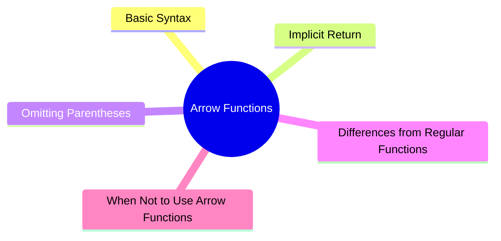

export const metadata = {
  title: 'JavaScript Arrow Functions: The ES6 Syntax Guide',
  date: '2026-03-15',
  excerpt: 'A practical guide to ES6 arrow functions — covering syntax, implicit returns, lexical this, and when to stick with regular functions.',
  tags: ['Front-end', 'JavaScript'],
};

# JavaScript Arrow Functions: The ES6 Syntax Guide

ES6 (ECMAScript 2015) introduced a cleaner way to write functions in JavaScript: the arrow function.

Arrow functions offer a more concise syntax — and in some cases, they also change how a function behaves, most notably how `this` works.



- [What Is an Arrow Function](#what-is-an-arrow-function)
- [Basic Syntax](#basic-syntax)
- [Implicit Return](#implicit-return)
- [Omitting Parentheses](#omitting-parentheses)
- [The `this` Difference](#the-this-difference)
- [When Not to Use Arrow Functions](#when-not-to-use-arrow-functions)
- [Real-World Usage](#real-world-usage)

---

## What Is an Arrow Function

An arrow function is a function syntax introduced in ES6.

It uses `=>` to define a function — hence the name.

---

## Basic Syntax

Regular function:

```javascript
function plus(a, b) {
  return a + b;
}
```

Arrow function:

```javascript
const plus = (a, b) => {
  return a + b;
};
```

The pattern is:

```text
(parameters) => { body }
```

---

## Implicit Return

When a function body contains just one expression, you can drop the `return` keyword and the curly braces:

```javascript
const multiply = (a, b) => a * b;
```

This is called an implicit return. JavaScript automatically returns the result of the expression.

---

## Omitting Parentheses

When a function has exactly one parameter, you can omit the parentheses:

```javascript
const square = x => x * x;
```

For zero parameters or multiple parameters, parentheses are still required:

```javascript
const sayHi = () => "Hi";

const plus = (a, b) => a + b;
```

---

## The `this` Difference

One of the biggest differences between arrow functions and regular functions is how they handle `this`.

Regular function — `this` refers to the object that called the function:

```javascript
const obj = {
  value: 10,
  show: function () {
    console.log(this.value); // 10
  }
};
```

Arrow function — `this` is not bound dynamically. Instead, it's inherited from the surrounding lexical scope.

```javascript
const obj = {
  value: 10,
  show: () => {
    console.log(this.value); // undefined
  }
};
```

This is why arrow functions are generally not recommended for object methods.

---

## When Not to Use Arrow Functions

Arrow functions aren't a drop-in replacement for regular functions. Here are the cases where you should stick with regular functions:

### Object Methods

```javascript
const user = {
  name: "Charmy",
  greet() {
    console.log(this.name); // "Charmy"
  }
};
```

Using an arrow function here breaks `this`:

```javascript
const user = {
  name: "Charmy",
  greet: () => {
    console.log(this.name); // undefined
  }
};
```

### Constructor Functions

Arrow functions can't be used as constructors — they have no `prototype` and don't support `new`.
```javascript
const Person = (name) => {
  this.name = name;
};

new Person("Charmy"); // TypeError
```

Use a regular function instead:

```javascript
function Person(name) {
  this.name = name;
}
```

### The `arguments` Object

Arrow functions don't have their own `arguments` object — just like `this`, it's looked up in the outer scope:

```javascript
function test() {
  console.log(arguments); // works
}

const test = () => {
  console.log(arguments); // may throw an error
};
```

Use a rest parameter instead:

```javascript
const test = (...args) => {
  console.log(args);
};
```

---

## Real-World Usage

Arrow functions are everywhere in modern JavaScript, especially with array methods:

```javascript
const numbers = [1, 2, 3];

const doubled = numbers.map(n => n * 2);
```

### Promises

```javascript
fetch(url)
  .then(response => response.json())
  .then(data => console.log(data));
```

### Event Handlers

```javascript
button.addEventListener("click", () => {
  console.log("clicked");
});
```

---

## Conclusion

Arrow functions are one of the most useful additions in ES6 — cleaner syntax, implicit returns, and lexical `this`.

Once you're comfortable with arrow functions, the natural next topics are:

- Arrow functions and `this`
- Closures
- Execution Context
- Prototypes

These concepts will give you a much deeper understanding of how JavaScript functions actually work.
