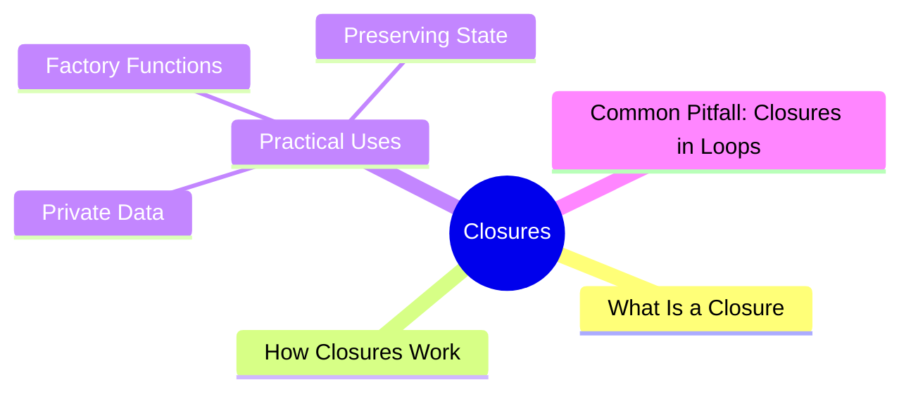

export const metadata = {
  title: 'JavaScript Closures',
  date: '2026-03-19',
  excerpt: 'A practical guide to JavaScript closures — covering how they work, common use cases like private data and factory functions, and the classic loop pitfall.',
  tags: ['Front-end', 'JavaScript'],
};

# JavaScript Closures

Closures show up everywhere in JavaScript, but they're easy to misunderstand until you see what's actually happening.

The short version: a function remembers the scope it was defined in, even when it's executed somewhere else.



- [What Is a Closure](#what-is-a-closure)
- [How Closures Work](#how-closures-work)
- [Practical Uses](#practical-uses)
- [Common Pitfall: Closures in Loops](#common-pitfall-closures-in-loops)

---

## What Is a Closure

When a function is defined inside another function, the inner function has access to the outer function's variables.

Even after the outer function has finished running, the inner function still holds a reference to those variables. That's a closure.

```javascript
function outer() {
  const message = "Hello";

  function inner() {
    console.log(message); // "Hello"
  }

  return inner;
}

const fn = outer();
fn(); // "Hello"
```

`outer` has finished executing, so you'd expect `message` to be gone — but `fn` (which is `inner`) can still access it.

That's the closure: `inner` holds onto the scope it was created in.

---

## How Closures Work

Closures work because JavaScript uses lexical scope — functions remember the scope environment they were defined in, including all the variables in any outer scopes.

When a function is returned or passed somewhere else, that scope environment travels with it.

```javascript
function makeCounter() {
  let count = 0;

  return function () {
    count++;
    console.log(count);
  };
}

const counter = makeCounter();

counter(); // 1
counter(); // 2
counter(); // 3
```

Each call to `counter` increments `count`. The variable isn't global — it lives in the scope that `makeCounter` created — but the returned function still has access to it. The value persists across calls because it's the same `count` being referenced each time.

---

## Practical Uses

### Private Data

Closures let you create variables that can't be accessed or modified directly from outside:

```javascript
function createUser(name) {
  let _name = name;

  return {
    getName() {
      return _name;
    },
    setName(newName) {
      _name = newName;
    }
  };
}

const user = createUser("Charmy");

console.log(user.getName()); // "Charmy"
user.setName("Charmying");
console.log(user.getName()); // "Charmying"
console.log(user._name); // undefined
```

`_name` is only accessible through `getName` and `setName`. There's no way to read or change it directly from outside.

### Factory Functions

Closures let functions capture different values and produce different behavior:

```javascript
function multiply(x) {
  return function (y) {
    return x * y;
  };
}

const double = multiply(2);
const triple = multiply(3);

console.log(double(5)); // 10
console.log(triple(5)); // 15
```

`double` and `triple` each close over a different `x`, so they behave independently.

### Preserving State

Closures are a clean way to maintain state across function calls without reaching for global variables:

```javascript
function makeIdGenerator() {
  let id = 0;

  return function () {
    id++;
    return id;
  };
}

const generateId = makeIdGenerator();

console.log(generateId()); // 1
console.log(generateId()); // 2
console.log(generateId()); // 3
```

---

## Common Pitfall: Closures in Loops

Using `var` with closures inside a loop is a classic gotcha:

```javascript
for (var i = 0; i < 3; i++) {
  setTimeout(function () {
    console.log(i);
  }, 100);
}
```

Output:

```text
3
3
3
```

The problem: `var` is function-scoped, so there's only one `i` shared across all iterations. By the time the callbacks run, the loop has finished and `i` is already `3`.

Fix 1: Use `let`

`let` is block-scoped, so each iteration gets its own `i`:

```javascript
for (let i = 0; i < 3; i++) {
  setTimeout(function () {
    console.log(i);
  }, 100);
}
// 0, 1, 2
```

Fix 2: Use an IIFE

An IIFE creates a new scope on each iteration, capturing the current value of `i`:

```javascript
for (var i = 0; i < 3; i++) {
  (function (x) {
    setTimeout(function () {
      console.log(x);
    }, 100);
  })(i);
}
// 0, 1, 2
```

---

## Conclusion

A closure is a function that remembers the scope it was created in — even after that scope is gone.

Closures let you:

- Access outer variables after the outer function has returned
- Create private data that can't be touched from outside
- Maintain state across function calls without global variables

Once you're comfortable with closures, the natural next topics are:

- Execution Context
- IIFE
- Module Pattern
