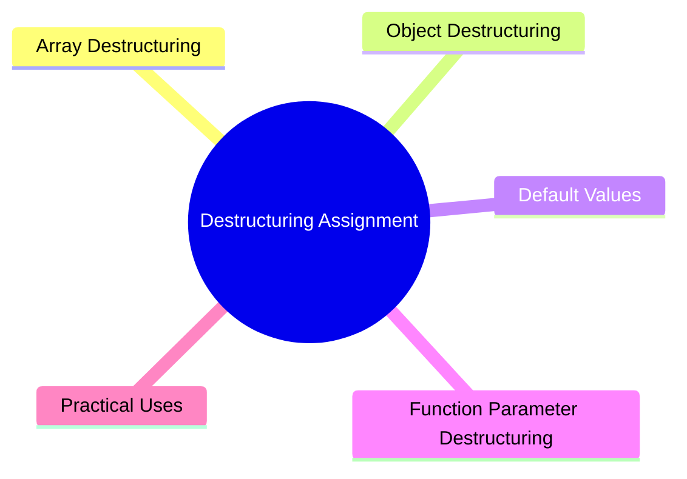

export const metadata = {
  title: 'JavaScript Destructuring Assignment',
  date: '2026-03-20',
  excerpt: 'A practical guide to JavaScript destructuring — covering array and object destructuring, default values, renaming, rest elements, and destructuring in function parameters.',
  tags: ['Front-end', 'JavaScript'],
};

# JavaScript Destructuring Assignment

Destructuring is an ES6 syntax that lets you pull values out of arrays or objects and assign them to variables in one clean step.



- [Array Destructuring](#array-destructuring)
- [Object Destructuring](#object-destructuring)
- [Default Values](#default-values)
- [Function Parameter Destructuring](#function-parameter-destructuring)
- [Practical Uses](#practical-uses)

---

## Array Destructuring

Extract values from an array by position:

```javascript
const colors = ['red', 'green', 'blue'];

const [first, second, third] = colors;

console.log(first);  // "red"
console.log(second); // "green"
console.log(third);  // "blue"
```

### Skipping Elements

Use a comma to skip positions you don't need:

```javascript
const [, second, , fourth] = [1, 2, 3, 4];

console.log(second); // 2
console.log(fourth); // 4
```

### Rest Elements

Use `...` to collect everything that's left:

```javascript
const [first, ...rest] = [1, 2, 3, 4, 5];

console.log(first); // 1
console.log(rest);  // [2, 3, 4, 5]
```

### Swapping Variables

Destructuring makes variable swapping clean and easy:

```javascript
let a = 1;
let b = 2;

[a, b] = [b, a];

console.log(a); // 2
console.log(b); // 1
```

---

## Object Destructuring

Extract values from an object by property name:

```javascript
const user = { name: 'Charmy', age: 29, city: 'Taichung' };

const { name, age } = user;

console.log(name); // "Charmy"
console.log(age);  // 29
```

### Renaming

You can rename a variable while destructuring:

```javascript
const { name: userName, age: userAge } = user;

console.log(userName); // "Charmy"
console.log(userAge);  // 29
```

### Rest Properties

Collect the remaining properties with `...`:

```javascript
const { name, ...rest } = user;

console.log(name); // "Charmy"
console.log(rest); // { age: 29, city: 'Taichung' }
```

### Nested Destructuring

You can go as deep as you need:

```javascript
const user = {
  name: 'Charmy',
  address: {
    city: 'Taichung',
    zip: '100'
  }
};

const { name, address: { city } } = user;

console.log(name); // "Charmy"
console.log(city); // "Taichung"
```

Note: `address` here is just a destructuring path — it doesn't become a variable. If you need both `address` and `city`, declare them separately:

```javascript
const { address, address: { city } } = user;
```

---

## Default Values

If the extracted value is `undefined`, you can fall back to a default:

```javascript
// array
const [a = 1, b = 2] = [10];

console.log(a); // 10 (value exists)
console.log(b); // 2  (undefined, default kicks in)
```

```javascript
// object
const { name = 'Guest', role = 'user' } = { name: 'Charmy' };

console.log(name); // "Charmy"
console.log(role); // "user"
```

Defaults only trigger on `undefined` — not `null`:

```javascript
const { value = 'default' } = { value: null };

console.log(value); // null
```

---

## Function Parameter Destructuring

Destructuring works directly in function parameters, which makes signatures much easier to read.

### Object Parameters

```javascript
function greet({ name, age }) {
  console.log(`${name}, age ${age}`);
}

greet({ name: 'Charmy', age: 29 }); // "Charmy, age 29"
```

With defaults:

```javascript
function createUser({ name, role = 'user', active = true } = {}) {
  return { name, role, active };
}

createUser({ name: 'Charmy' });
// { name: 'Charmy', role: 'user', active: true }
```

The `= {}` at the end means the function won't throw if called with no arguments.

### Array Parameters

```javascript
function sum([a, b, c = 0]) {
  return a + b + c;
}

sum([1, 2, 3]); // 6
sum([1, 2]);    // 3
```

---

## Practical Uses

### Extracting API Response Data

```javascript
const response = {
  status: 200,
  data: {
    user: { name: 'Charmy', email: 'charmy@example.com' }
  }
};

const { data: { user: { name, email } } } = response;

console.log(name);  // "Charmy"
console.log(email); // "charmy@example.com"
```

### Importing Modules

```javascript
import { useState, useEffect } from 'react';
import { Router, Route } from '@angular/router';
```

### Returning Multiple Values from a Function

```javascript
function getMinMax(numbers) {
  return {
    min: Math.min(...numbers),
    max: Math.max(...numbers),
  };
}

const { min, max } = getMinMax([3, 1, 4, 1, 5, 9]);

console.log(min); // 1
console.log(max); // 9
```

---

## Conclusion

Destructuring makes extracting values from arrays and objects concise and readable:

- Array destructuring extracts by position; object destructuring by property name
- You can rename, set defaults, and collect the rest with `...`
- Destructuring in function parameters keeps signatures clean and self-documenting
- Default values only apply when the extracted value is `undefined` — not `null`
