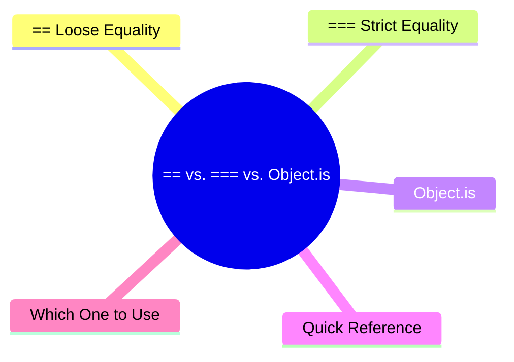

export const metadata = {
  title: 'Equality in JavaScript: == vs. === vs. Object.is',
  date: '2026-03-21',
  excerpt: 'A practical guide to JavaScript equality — comparing ==, ===, and Object.is, covering type coercion, the special cases of NaN and -0, and when to use each.',
  tags: ['Front-end', 'JavaScript'],
};

# Equality in JavaScript: `==` vs. `===` vs. `Object.is`

JavaScript has three ways to check equality, and they don't all behave the same way.

- `==` — loose equality, performs type conversion before comparing
- `===` — strict equality, no type conversion
- `Object.is` — like `===`, but handles `NaN` and `-0` differently



- [`==` Loose Equality](#-loose-equality)
- [`===` Strict Equality](#-strict-equality)
- [`Object.is`](#objectis)
- [Quick Reference](#quick-reference)
- [Which One to Use](#which-one-to-use)

---

## `==` Loose Equality

When comparing values of different types, `==` performs type coercion — it converts one or both values before comparing.

The results can be surprising:

```javascript
1 == "1"          // true  ("1" coerced to number 1)
0 == false        // true  (false coerced to number 0)
0 == ""           // true  ("" coerced to number 0)
null == undefined // true  (special rule)
null == 0         // false (null only equals undefined)
"" == false       // true
[] == false       // true
[] == 0           // true
```

### How the Coercion Works

The main rules behind `==`:

- `null` and `undefined` are equal to each other, but nothing else
- Number vs. string: the string is converted to a number
- Boolean comparisons: the boolean is converted to a number first (`true` → `1`, `false` → `0`)
- Object vs. primitive: the object is converted via `.valueOf()` or `.toString()`

The rules are complex and easy to get wrong. The rules are complex enough that most developers just avoid `==` altogether.

---

## `===` Strict Equality

`===` does no type conversion. If the types are different, it returns `false` immediately.

```javascript
1 === "1"           // false (different types)
0 === false         // false (different types)
null === undefined  // false (different types)
1 === 1             // true
"hello" === "hello" // true
```

The rules are simple:

1. Different types → `false`
2. Same type, same value → `true`
3. Same type, different value → `false`

One exception: `NaN === NaN` is `false`:

```javascript
NaN === NaN // false
```

`NaN` is the only value in JavaScript that isn't equal to itself.

---

## `Object.is`

`Object.is` behaves almost identically to `===`, with two differences:

### `NaN` Comparisons

```javascript
NaN === NaN         // false
Object.is(NaN, NaN) // true
```

`Object.is` considers `NaN` equal to itself, which is often more useful when you're explicitly checking for `NaN`.

### `-0` and `+0`

```javascript
-0 === 0            // true
Object.is(-0, 0)    // false
Object.is(-0, -0)   // true
```

`===` treats `-0` and `+0` as equal. `Object.is` distinguishes between them.

For most code, the difference between `-0` and `+0` doesn't matter. But in cases where direction or sign is meaningful — like vector math or coordinate systems — `Object.is` gives you a more precise comparison.

---

## Quick Reference

| Comparison | `==` | `===` | `Object.is` |
| - | - | - | - |
| `1` vs. `"1"` | `true` | `false` | `false` |
| `0` vs. `false` | `true` | `false` | `false` |
| `null` vs. `undefined` | `true` | `false` | `false` |
| `NaN` vs. `NaN` | `false` | `false` | `true` |
| `-0` vs. `0` | `true` | `true` | `false` |
| Type coercion | Yes | No | No |

---

## Which One to Use

### Default to `===`

In almost every situation, `===` is the right choice:

- No unexpected type coercion
- Predictable, easy to reason about

```javascript
// good
if (value === null) { ... }
if (typeof x === "string") { ... }
```

### The One Case for `==`

Some developers use `== null` as a shorthand to check for both `null` and `undefined` at once:

```javascript
if (value == null) {
  // value is null or undefined
}
```

This is equivalent to:

```javascript
if (value === null || value === undefined) {
  // ...
}
```

It works, but it relies on a specific quirk of `==` that not everyone knows. If your team is comfortable with it, fine — otherwise, the explicit version is clearer.

### When to Use `Object.is`

Use it when you need to check for `NaN`, or when you need to distinguish between `-0` and `+0`:

```javascript
// checking for NaN
function isNaNValue(value) {
  return Object.is(value, NaN);
}

// more precise than isNaN(), which returns true for isNaN("hello")
```

---

## Conclusion

- `==` — coerces types before comparing, results are hard to predict, avoid it in most cases
- `===` — no coercion, predictable, the default choice for everyday comparisons
- `Object.is` — nearly identical to `===`, but correctly handles `NaN` and `-0` for cases where precision matters
