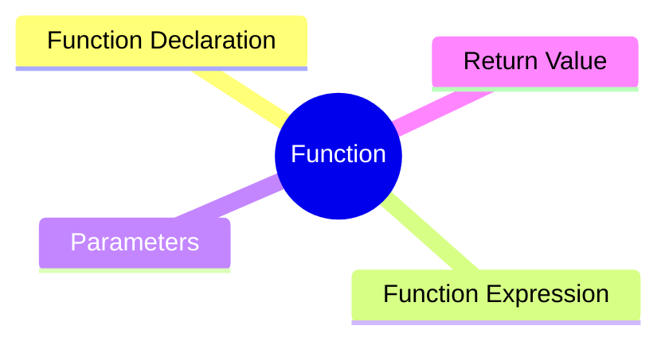
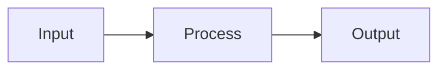
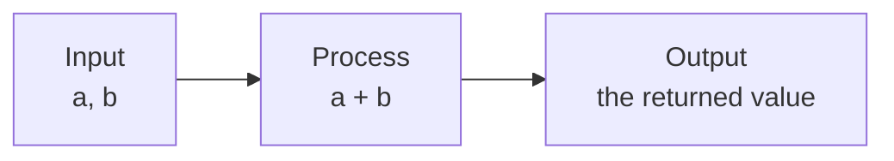

export const metadata = {
  title: 'JavaScript Functions: Understanding the Fundamentals',
  date: '2026-03-15',
  excerpt: 'A practical guide to JavaScript functions — covering declarations, expressions, parameters, return values, callbacks, scope, hoisting and higher-order functions.',
  tags: ['Front-end', 'JavaScript'],
};

# JavaScript Functions: Understanding the Fundamentals

When you find yourself writing the same logic more than once, that's usually a sign it belongs in a function.

Functions let you break a program into small, focused pieces — making your code easier to read, maintain, and reuse.



- [What Is a Function](#what-is-a-function)
- [Why Use Functions](#why-use-functions)
- [Function Declaration](#function-declaration)
- [Function Expression](#function-expression)
- [Parameters](#parameters)
- [Return Values](#return-values)
- [First-Class Functions](#first-class-functions)
- [Callback Functions](#callback-functions)
- [Functions and Scope](#functions-and-scope)
- [Hoisting](#hoisting)
- [Higher-Order Functions](#higher-order-functions)
- [Real-World Usage](#real-world-usage)
- [What happens when a function is executed](#what-happens-when-a-function-is-executed)

---

## What Is a Function

A function is a reusable block of code.

You can think of a function as a small tool that encapsulates a piece of logic. At a high level, most functions follow the same pattern:



- Input — data passed into the function (parameters)
- Process — the logic that runs inside
- Output — the returned value

For example:

```javascript
function plus(a, b) {
  return a + b;
}
```

Breaking it down:



To use it, just call it:

```javascript
plus(3, 5);
```

---

## Why Use Functions

Without functions, code tends to be:

- Repetitive
- Hard to maintain
- Difficult to read

For example:

```javascript
let total1 = 100 + 200;
let total2 = 300 + 400;
let total3 = 500 + 600;
```

With a function:

```javascript
function plus(a, b) {
  return a + b;
}

plus(100, 200);
plus(300, 400);
plus(500, 600);
```

The benefits:

- Reusability — write the logic once, use it anywhere
- Readability — a well-named function is self-documenting:
    createUser();
    sendEmail();
    validateForm();
- Modularity — split a large program into small, focused pieces

---

## Function Declaration

The most straightforward way to define a function:

```javascript
function functionName(param1, param2) {
  // logic
}
```

Example:

```javascript
function greet() {
  console.log("Hello");
}
```

Call it by name:

```javascript
greet();
```

---

## Function Expression

Functions can also be assigned to variables:

```javascript
const greet = function () {
  console.log("Hello");
};
```

This is a function expression. Here's how it compares to a declaration:

| | Function Declaration | Function Expression |
| - | - | - |
| Hoisting | Fully hoisted | Only the variable is hoisted |
| Syntax | `function` keyword | Assigned to a variable |
| Timing | Typically used to define functions | Commonly used for callbacks or assignments |

---

## Parameters

Functions accept input through parameters:

```javascript
function greet(name) {
  console.log("Hello " + name);
}

greet("Charmy");
```

Here, `name` is the parameter and `"Charmy"` is the value passed in when calling the function.

### Default Parameters

Since ES6, you can set default values for parameters:

```javascript
function greet(name = "Guest") {
  console.log("Hello " + name);
}
```

If no argument is passed, the default kicks in.

### Rest Parameters

When the number of arguments is unknown, use a rest parameter:

```javascript
function sum(...numbers) {
  return numbers.reduce((a, b) => a + b, 0);
}
```

Rest parameters collect all remaining arguments into an array.

---

## Return Values

The `return` statement sends a value back from a function:

```javascript
function add(a, b) {
  return a + b;
}
```

When a `return` statement is reached:

- The specified value is returned
- The function stops immediately

For example:

```javascript
function test() {
  console.log("A");
  return;
  console.log("B");
}
```

Output:

```text
A
```

---

## First-Class Functions

In JavaScript, a function is actually a special type of object.

```javascript
function greet() {}

console.log(typeof greet); // "function"
console.log(greet instanceof Object); // true
```

This is why functions can be:

- assigned to variables
- passed as arguments
- returned from other functions

These capabilities are what make JavaScript functions "first-class".

### Assigned to a variable

```javascript
const sayHi = function () {};
```

### Passed as an argument

```javascript
function execute(fn) {
  fn();
}
```

### Returned from a function

```javascript
function createAdder(x) {
  return function (y) {
    return x + y;
  };
}
```

---

## Callback Functions

When a function is passed as an argument to another function, it's called a callback:

```javascript
function process(callback) {
  callback();
}

process(function () {
  console.log("Hello");
});
```

Callbacks are everywhere in JavaScript — array methods, event handlers, timers:

```javascript
[1, 2, 3].map(function (n) {
  return n * 2;
});

setTimeout(function () {
  console.log("3 seconds later");
}, 3000);
```

Common use cases:

- Events
- `setTimeout` / `setInterval`
- Promises
- Array methods

---

## Functions and Scope

Every function creates its own scope. Variables declared inside a function aren't accessible outside of it:

```javascript
function test() {
  let a = 10;
}

console.log(a); // ReferenceError
```

`a` only exists inside `test`.

---

## Hoisting

Function declarations are hoisted — JavaScript processes them before the code runs, so you can call them before they're defined:

```javascript
sayHello();

function sayHello() {
  console.log("Hello");
}
```

This works fine. Function expressions, however, are not:

```javascript
sayHello(); // Error

const sayHello = function () {};
```

---

## Higher-Order Functions

A higher-order function is one that either takes a function as an argument or returns a function.

Many built-in JavaScript methods are higher-order functions:

```javascript
const numbers = [1, 2, 3];

numbers.map(function (n) {
  return n * 2;
});
```

`map` is a higher-order function — it takes a callback and applies it to each element.

Common examples:

```javascript
array.map()
array.filter()
array.reduce()
```

---

## Real-World Usage

Functions are used throughout JavaScript:

### Event Handlers

```javascript
button.addEventListener("click", handleClick);
```

### Array Methods

```javascript
array.map()
array.filter()
array.reduce()
```

### API Calls

```javascript
fetch(url).then(function (response) {
  return response.json();
});
```

---

## What happens when a function is executed

When a function is called, JavaScript:

1. Creates a new execution context
2. Sets up the scope chain
3. Binds the value of `this`
4. Executes the function body

---

## Conclusion

Functions are one of the core abstractions in JavaScript. They let you:

- Reuse code
- Write more readable programs
- Build modular, maintainable applications

Once you're comfortable with functions, the natural next topics are:

- Arrow functions
- Scope
- Hoisting
- Closures
- `this`

These aren't separate topics — they're all part of how functions actually work.
