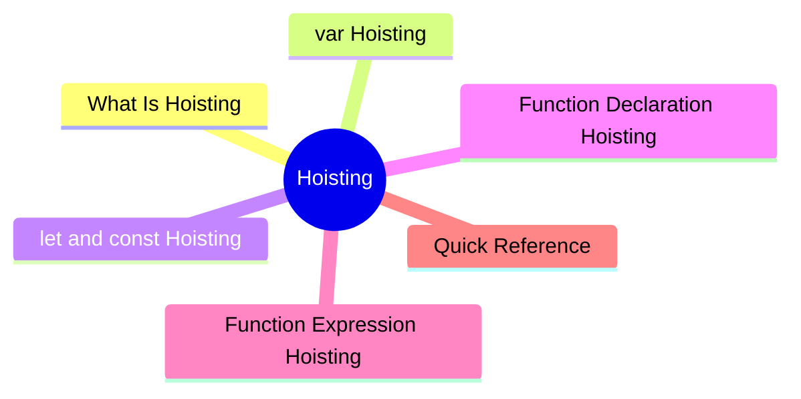

export const metadata = {
  title: 'JavaScript Hoisting',
  date: '2026-03-17',
  excerpt: 'A practical guide to JavaScript hoisting — covering var, let, and const behavior, the temporal dead zone, and the difference between function declarations and expressions.',
  tags: ['Front-end', 'JavaScript'],
};

# JavaScript Hoisting

Hoisting is one of those JavaScript behaviors that catches people off guard until they understand what's actually happening. Before any code runs, the engine processes all variable and function declarations — meaning some things are available earlier than you might expect.



- [What Is Hoisting](#what-is-hoisting)
- [`var` Hoisting](#var-hoisting)
- [`let` and `const` Hoisting](#let-and-const-hoisting)
- [Function Declaration Hoisting](#function-declaration-hoisting)
- [Function Expression Hoisting](#function-expression-hoisting)
- [Quick Reference](#quick-reference)

---

## What Is Hoisting

Before executing any code, JavaScript creates an execution environment. During this phase, it scans all variable and function declarations and registers them at the top of their scope.

This is hoisting.

It doesn't rearrange your code — it's just the engine registering declarations before anything else runs.

---

## `var` Hoisting

Variables declared with `var` are hoisted and automatically initialized to `undefined`.

```javascript
console.log(name); // undefined
var name = "Charmy";
```

JavaScript effectively treats this as:

```javascript
var name;
console.log(name); // undefined
name = "Charmy";
```

The declaration is hoisted, but the assignment is not. So accessing the variable before the assignment returns `undefined` instead of throwing an error.

---

## `let` and `const` Hoisting

`let` and `const` are also hoisted, but they are not initialized.

Accessing them before their declaration throws a `ReferenceError`:

```javascript
console.log(name); // ReferenceError: Cannot access 'name' before initialization
let name = "Charmy";
```

```javascript
console.log(count); // ReferenceError: Cannot access 'count' before initialization
const count = 0;
```

This is the Temporal Dead Zone (TDZ) — the period from the start of the scope to the point where the declaration is reached. The variable exists, but can't be accessed.

The TDZ is intentional. It makes bugs easier to catch by throwing an error immediately, rather than silently returning `undefined`.

---

## Function Declaration Hoisting

Function declarations are fully hoisted — the entire function body is available before the declaration appears in the code.

This means you can call a function before it's defined:

```javascript
greet(); // "Hello"

function greet() {
  console.log("Hello");
}
```

---

## Function Expression Hoisting

Function expressions follow the same hoisting rules as variables — depending on whether they use `var`, `let`, or `const`.

### With `var`

```javascript
greet(); // TypeError: greet is not a function

var greet = function () {
  console.log("Hello");
};
```

`var greet` is hoisted and initialized to `undefined`. Calling `undefined()` throws a `TypeError`.

### With `let` or `const`

```javascript
greet(); // ReferenceError: Cannot access 'greet' before initialization

const greet = function () {
  console.log("Hello");
};
```

`const greet` is hoisted but enters the TDZ. Accessing it before the declaration throws a `ReferenceError`.

### Arrow Functions

Arrow functions are function expressions and behave the same way:

```javascript
greet(); // ReferenceError: Cannot access 'greet' before initialization

const greet = () => {
  console.log("Hello");
};
```

---

## Quick Reference

| | Hoisted | Initialized | Before Declaration |
| - | - | - | - |
| `var` | Yes | `undefined` | Returns `undefined` |
| `let` | Yes | No (TDZ) | `ReferenceError` |
| `const` | Yes | No (TDZ) | `ReferenceError` |
| Function declaration | Yes (fully) | Complete function | Callable |
| Function expression | Same as variable | Same as variable | Same as variable |

---

## Conclusion

- `var` is hoisted and initialized to `undefined` — no error before the declaration, but can produce subtle bugs
- `let` and `const` are hoisted but enter the TDZ — accessing them early throws an error immediately, making issues easier to spot
- Function declarations are fully hoisted and can be called before they appear in the code
- Function expressions are not fully hoisted — they follow the same rules as their variable type

In practice, always declare variables and functions before using them. Relying on hoisting makes code harder to read and reason about.
