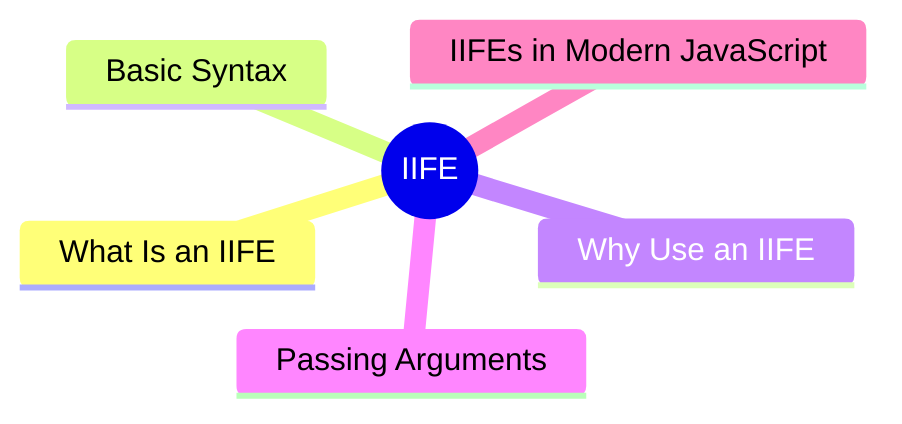

export const metadata = {
  title: 'JavaScript IIFE',
  date: '2026-03-18',
  excerpt: 'A practical guide to JavaScript IIFEs — covering the syntax, why they exist, passing arguments, and when they are still useful in modern JavaScript.',
  tags: ['Front-end', 'JavaScript'],
};

# JavaScript IIFE

An IIFE — Immediately Invoked Function Expression — is a function that defines and calls itself in the same breath. Write it, run it, done. Nothing gets added to the outer scope, no name left behind.

The main reason to reach for one is scope isolation: keeping variables contained and out of the global environment.



- [What Is an IIFE](#what-is-an-iife)
- [Basic Syntax](#basic-syntax)
- [Why Use an IIFE](#why-use-an-iife)
- [Passing Arguments](#passing-arguments)
- [IIFEs in Modern JavaScript](#iifes-in-modern-javascript)

---

## What Is an IIFE

```javascript
(function () {
  console.log("Hello");
})();
```

This defines a function and immediately calls it, logging `"Hello"`.

---

## Basic Syntax

There are two common ways to write an IIFE:

```javascript
// Style 1
(function () {
  // code
})();

// Style 2
(function () {
  // code
}());
```

Both work the same way — the only difference is where the closing parentheses go.

Arrow functions work too:

```javascript
(() => {
  console.log("Hello");
})();
```

---

## Why Use an IIFE

### Keeping Variables Out of the Global Scope

Before ES6, JavaScript had no block scope. Variables declared with `var` leaked into the global environment:

```javascript
var count = 0;

// somewhere else, accidentally overwritten
var count = 100;

console.log(count); // 100
```

Wrapping code in an IIFE creates its own scope:

```javascript
(function () {
  var count = 0;
  // count stays inside the IIFE
})();

console.log(count); // ReferenceError: count is not defined
```

### Avoiding Naming Conflicts

When multiple JavaScript files share the same global environment, IIFEs prevent variables in different files from stepping on each other:

```javascript
// File A
(function () {
  var name = "File A";
  console.log(name);
})();

// File B
(function () {
  var name = "File B";
  console.log(name);
})();
```

Each `name` lives in its own isolated scope — no conflicts.

---

## Passing Arguments

IIFEs can accept arguments. A common pattern is passing in global objects to make sure they're accessed safely inside the IIFE:

```javascript
(function (global) {
  console.log(global === window); // true
})(window);
```

You can pass in any value:

```javascript
(function (name) {
  console.log("Hello, " + name);
})("Charmy");
```

---

## IIFEs in Modern JavaScript

With ES6 came `let`, `const`, and ES Modules — and most of what IIFEs were used for is now handled natively.

`let` and `const` are block-scoped, so you don't need an IIFE just to isolate variables:

```javascript
{
  let count = 0;
  // count only exists here
}

console.log(count); // ReferenceError
```

ES Modules give every file its own scope by default, so global pollution isn't a concern:

```javascript
// module.js
const name = "Charmy"; // doesn't leak to global
export { name };
```

That said, IIFEs still have their place. They're useful when you need to run initialization logic immediately and don't want to leave a named function around:

```javascript
const result = (function () {
  const x = 10;
  const y = 20;
  return x + y;
})();

console.log(result); // 30
```

And in non-module environments, IIFEs remain a common tool for avoiding global pollution.

---

## Conclusion

An IIFE is a function that runs immediately and creates its own isolated scope.

Main uses:

- Prevent variables from leaking into the global scope
- Avoid naming conflicts between files or libraries

In modern JavaScript, `let`, `const`, and ES Modules handle most of what IIFEs were built for. But you'll still see IIFEs in older codebases — and occasionally in new ones — so it's worth understanding how they work.
