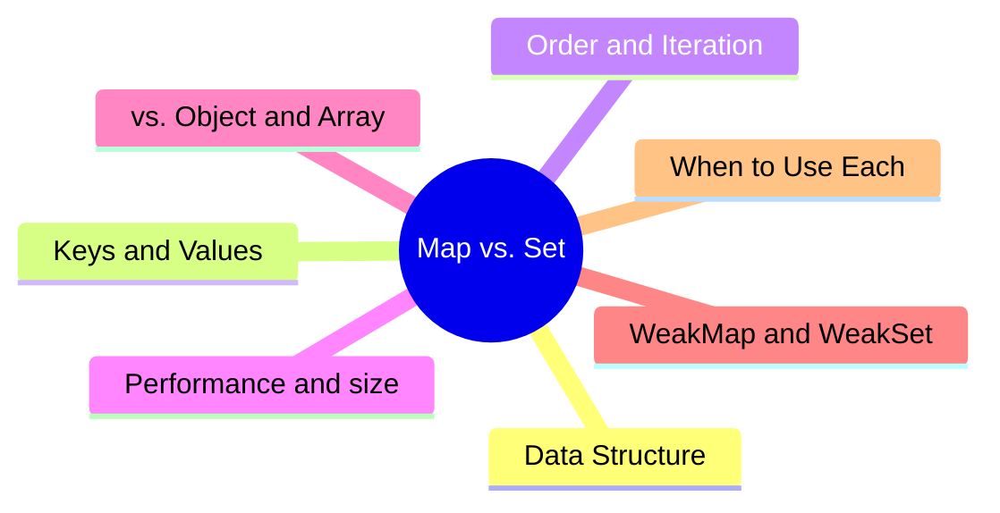

export const metadata = {
  title: 'JavaScript Map vs. Set: Key Differences and When to Use Each',
  date: '2026-06-28',
  excerpt: 'A practical comparison of JavaScript Map and Set — covering data structure, key and value semantics, ordering and iteration, performance, how they stack up against Object and Array, and when to reach for each.',
  tags: ['Front-end', 'JavaScript'],
};

# JavaScript Map vs. Set: Key Differences and When to Use Each

ES6 gave JavaScript two proper collection types: `Map` and `Set`.

Before they arrived, we reached for plain objects as dictionaries and arrays as lists. That works most of the time — until you need keys that aren't strings, values that can't repeat, or frequent inserts and deletes. Then it starts to feel like fighting the language.

`Map` and `Set` aren't just different syntax. They solve different problems: one manages a mapping from keys to values, the other manages a set of unique values.



- [What Map and Set Are](#what-map-and-set-are)
- [Creating and Basic Operations](#creating-and-basic-operations)
- [Keys, Values, and Uniqueness](#keys-values-and-uniqueness)
- [Order and Iteration](#order-and-iteration)
- [Performance and size](#performance-and-size)
- [Map or Object](#map-or-object)
- [Set or Array](#set-or-array)
- [WeakMap and WeakSet](#weakmap-and-weakset)
- [Quick Reference](#quick-reference)
- [When to Use Each](#when-to-use-each)

---

## What Map and Set Are

A `Map` is a collection of key–value pairs. Each entry maps one `key` to one `value`, and keys can't repeat.

A `Set` is a collection of values. It stores values, not mappings, and values can't repeat.

One line to tell them apart: Map cares about what a key maps to; Set cares about whether a value is present.

```javascript
// Map: map a key to a value
const scores = new Map();
scores.set('Charmy', 95);
scores.get('Charmy'); // 95

// Set: only the presence of a value matters
const tags = new Set();
tags.add('JavaScript');
tags.has('JavaScript'); // true
```

Both are iterable, both remember insertion order, and both expose `size` for the number of elements. What differs is what they hold.

---

## Creating and Basic Operations

### Map

The core `Map` methods are `set`, `get`, `has`, and `delete`:

```javascript
const map = new Map();

map.set('name', 'Charmy');
map.set('age', 28);

map.get('name');   // 'Charmy'
map.has('age');    // true
map.size;          // 2

map.delete('age'); // true
map.size;          // 1

map.clear();       // empties the map
```

`set` returns the map itself, so calls can be chained:

```javascript
const map = new Map()
  .set('a', 1)
  .set('b', 2)
  .set('c', 3);
```

You can also initialize a `Map` directly from an array of key–value pairs:

```javascript
const map = new Map([
  ['name', 'Charmy'],
  ['age', 28],
]);
```

### Set

The core `Set` methods are `add`, `has`, and `delete`:

```javascript
const set = new Set();

set.add('apple');
set.add('banana');
set.add('apple');     // duplicate, ignored

set.has('apple');     // true
set.size;             // 2

set.delete('banana'); // true
set.clear();          // empties the set
```

`add` also returns the set itself, so it chains too. The most common pattern is to pass an array straight into the constructor:

```javascript
const set = new Set([1, 2, 2, 3, 3, 3]);
set.size; // 3 — duplicates are dropped automatically
```

---

## Keys, Values, and Uniqueness

This is where `Map` and `Set` differ most from plain objects and arrays.

### Any type can be a key or value

A `Map` key can be any type: an object, a function, `NaN`, even `undefined`. An `Object` key, by contrast, can only be a string or a symbol — even numbers get quietly coerced to strings.

```javascript
const map = new Map();
const objKey = { id: 1 };

map.set(objKey, 'objects can be keys');
map.set(NaN, 'so can NaN');
map.set(true, 'and booleans');

map.get(objKey); // 'objects can be keys'
map.get(NaN);    // 'so can NaN'
```

`Set` is the same — it accepts values of any type.

### Object keys compare by reference

This is the easiest trap to fall into. Objects compare by reference, not by content:

```javascript
const map = new Map();
map.set({ id: 1 }, 'A');

map.get({ id: 1 }); // undefined — these are two different objects
```

The two `{ id: 1 }` literals look identical, but they're distinct objects with different references, so the lookup misses. To retrieve the value, you have to hold on to the same reference:

```javascript
const key = { id: 1 };
const map = new Map();

map.set(key, 'A');
map.get(key); // 'A'
```

### How uniqueness is decided: SameValueZero

To decide whether two keys are the same (in `Map`) or a value is a duplicate (in `Set`), both use an algorithm called SameValueZero. It behaves just like `===`, with two exceptions:

- `NaN` is considered equal to `NaN`
- `+0` and `-0` are treated as the same value

```javascript
const set = new Set([NaN, NaN, 0, -0]);
set.size; // 2 — the two NaNs collapse, and +0/-0 collapse
```

That `NaN` handling is genuinely useful: dedupe with a `Set` and `NaN` is handled correctly, whereas `[NaN].indexOf(NaN)` returns `-1` even though `[NaN].includes(NaN)` is `true`.

Objects still compare by reference:

```javascript
const a = { id: 1 };
const set = new Set([a, a, { id: 1 }]);
set.size; // 2 — the first two share a reference, the third is a new object
```

---

## Order and Iteration

Both `Map` and `Set` remember insertion order, and they iterate in that order. This is unlike plain objects, where integer-like keys get reordered by the engine.

### Iterating a Map

Iterating a `Map` with `for...of` yields a `[key, value]` pair each round:

```javascript
const map = new Map([
  ['name', 'Charmy'],
  ['age', 28],
]);

for (const [key, value] of map) {
  console.log(key, value);
}
// 'name' 'Charmy'
// 'age' 28
```

`Map` also provides three iterator methods:

```javascript
map.keys();    // 'name', 'age'
map.values();  // 'Charmy', 28
map.entries(); // ['name', 'Charmy'], ['age', 28]

map.forEach((value, key) => {
  console.log(key, value);
});
```

### Iterating a Set

Iterating a `Set` yields values directly:

```javascript
const set = new Set(['a', 'b', 'c']);

for (const value of set) {
  console.log(value); // 'a' 'b' 'c'
}

set.forEach((value) => {
  console.log(value);
});
```

To mirror the `Map` interface, `Set` also keeps `keys()`, `values()`, and `entries()` — where `entries()` returns `[value, value]` pairs.

### Converting to and from arrays

Both `Map` and `Set` convert to arrays with the spread operator or `Array.from`, and arrays convert back:

```javascript
// Deduplicating an array — the classic use case
const unique = [...new Set([1, 1, 2, 3, 3])]; // [1, 2, 3]

// Converting between Map and object
const map = new Map([['a', 1], ['b', 2]]);
Object.fromEntries(map);           // { a: 1, b: 2 }
new Map(Object.entries({ a: 1 })); // Map { 'a' => 1 }
```

---

## Performance and size

### size is a property, not a method

To get the element count, both `Map` and `Set` read `size` directly:

```javascript
map.size; // direct read, O(1)
set.size;
```

A plain object, by contrast, makes you compute `Object.keys(obj).length`, which builds an array first — an O(n) operation.

### Lookup speed

`Map.has`, `Map.get`, and `Set.has` are required by the spec to be, on average, sublinear — roughly O(1) — so they don't slow down as the collection grows. Array `includes` and `indexOf` are O(n): they scan from the front.

```javascript
// The gap shows up when you check membership repeatedly over a large set
const list = new Set(bigArray);

items.forEach((item) => {
  if (list.has(item)) {   // ~O(1) on average
    // ...
  }
});
```

Swap in `bigArray.includes(item)` and every check rescans the whole array, degrading the loop to O(n × m). Whenever you need frequent membership checks, `Set` is almost always the better choice.

---

## Map or Object

Both can model "keys to values," but the trade-offs differ.

Reach for `Map` when:

- Keys aren't strings (objects, numbers, and functions all need to work as keys)
- You add and remove entries frequently
- You need reliable insertion order and a cheap `size`
- You don't want inherited prototype properties getting in the way

Objects carry one easy-to-forget gotcha: they come with a prototype chain by default, so some keys *appear* to exist:

```javascript
const obj = {};
obj['toString'];   // a function, inherited from the prototype — not something you set
'toString' in obj; // true

const map = new Map();
map.has('toString'); // false — much cleaner
```

Numeric keys also get reordered in an object, whereas `Map` preserves insertion order faithfully:

```javascript
const obj = {};
obj[2] = 'two';
obj[1] = 'one';
Object.keys(obj); // ['1', '2'] — numeric keys are sorted

const map = new Map();
map.set(2, 'two');
map.set(1, 'one');
[...map.keys()]; // [2, 1] — insertion order preserved
```

Reach for `Object` when:

- You need `JSON.stringify` (a `Map` doesn't serialize directly)
- The shape is fixed and you're using it as a record with fields
- You want literal syntax `{ }` and destructuring

---

## Set or Array

Both hold a list of values; the difference is duplicates and lookup.

Reach for `Set` when:

- Values must be unique (deduplication)
- You frequently check whether a value is present

```javascript
const arr = [1, 2, 3];
arr.includes(2); // O(n)

const set = new Set([1, 2, 3]);
set.has(2);      // ~O(1) on average
```

Reach for `Array` when:

- You need order and indexed access (`arr[0]`)
- Duplicate values are allowed
- You want the rich `map`, `filter`, and `reduce` methods
- You need `JSON` serialization

A common pattern in practice is to dedupe with a `Set` and then convert back to an array to process:

```javascript
const unique = [...new Set(rawList)].sort();
```

---

## WeakMap and WeakSet

`Map` and `Set` each have a "weak" counterpart: `WeakMap` and `WeakSet`. They exist for one reason — don't keep an object alive just because you're holding a reference to it.

What sets them apart:

- `WeakMap` keys and `WeakSet` values must be objects (no primitives)
- They hold weak references — when an object has no other references, it can be garbage collected
- They aren't iterable, have no `size`, and can't be cleared (since contents may vanish at any time, enumeration wouldn't be meaningful)

The classic use case is attaching extra data to an object without causing a memory leak — for example, a cache:

```javascript
const cache = new WeakMap();

function process(obj) {
  if (cache.has(obj)) return cache.get(obj);

  const result = heavyComputation(obj);
  cache.set(obj, result);
  return result;
}
// Once obj is no longer referenced elsewhere, its cache entry is collected automatically
```

With a regular `Map`, `obj` would stay alive purely because the `Map` holds it as a key — a leak.

---

## Quick Reference

| | Map | Set |
| - | - | - |
| Stores | Key–value pairs | Single values |
| Uniqueness | Keys are unique | Values are unique |
| Add | `set(key, value)` | `add(value)` |
| Read | `get(key)` | check with `has` |
| Size | `size` | `size` |
| Order | Insertion order | Insertion order |
| Iteration yields | `[key, value]` | `value` |
| Key/value types | Any type | Any type |
| Weak variant | `WeakMap` | `WeakSet` |
| Typical use | Lookups, associating data | Dedup, membership checks |

---

## When to Use Each

### Use Map

#### When keys aren't strings, or keys are objects:
```javascript
const elementState = new Map();
elementState.set(domNode, { active: true });
```

#### When you add and remove often and care about order and size:
```javascript
const cart = new Map();
cart.set(productId, quantity);
cart.delete(productId);
cart.size;
```

### Use Set

#### Deduplicating an array:
```javascript
const unique = [...new Set([1, 1, 2, 3])]; // [1, 2, 3]
```

#### Fast membership checks:
```javascript
const blocked = new Set(['spam', 'ads']);
if (blocked.has(category)) {
  // block it
}
```

---

## Conclusion

`Map` and `Set` fill the gaps that objects and arrays leave behind.

Need to map keys to values, with keys that aren't necessarily strings? Use a `Map`. Need a collection of unique values you'll check membership against often? Use a `Set`.

Objects and arrays are still great — especially when you need serialization, a fixed shape, or indexed access. The point isn't which one replaces the other; it's matching the shape of your data to the right tool.
