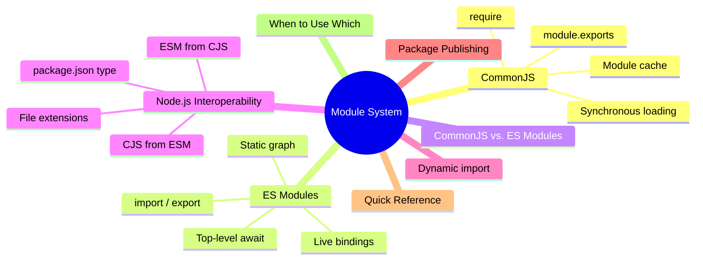
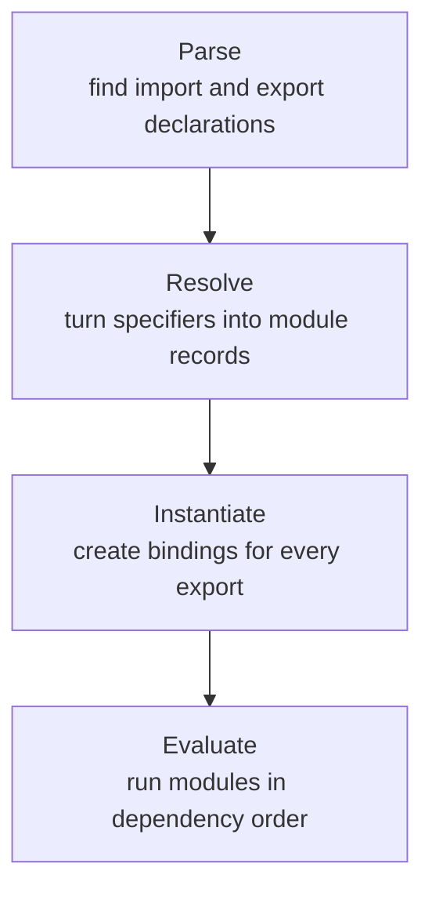
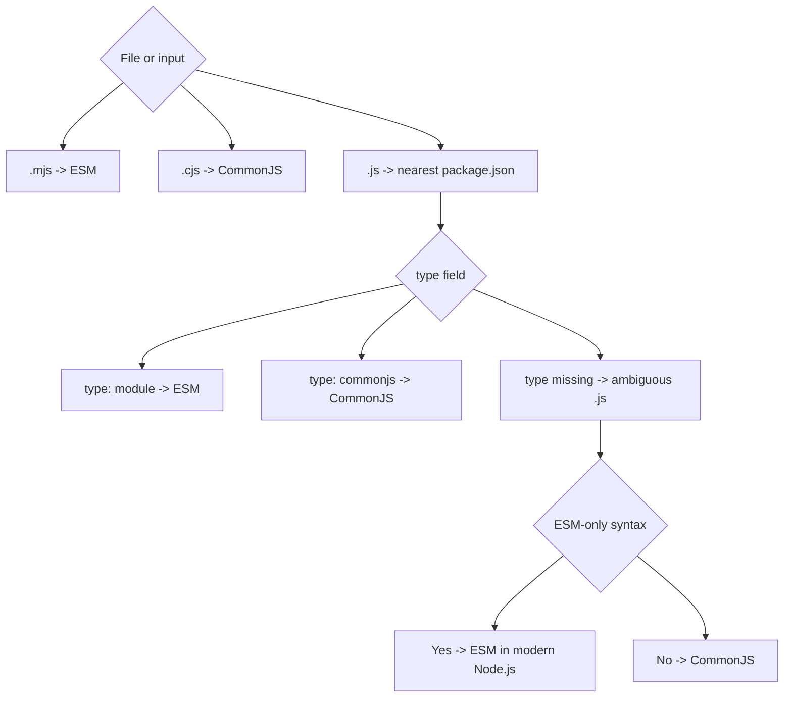

export const metadata = {
  title: 'JavaScript Module System: ESM vs. CommonJS',
  date: '2026-06-27',
  excerpt: 'A practical guide to CommonJS and ES Modules: how they load, cache, expose bindings, handle circular dependencies, interoperate in Node.js, and affect modern package design.',
  tags: ['Front-end', 'JavaScript'],
};

# JavaScript Module System: ESM vs. CommonJS

Before ES2015, JavaScript had no native module system. Browser scripts shared the global scope, load order mattered, and the usual escape hatch was an IIFE wrapped around otherwise global code.

CommonJS solved the problem for server-side JavaScript by giving each file its own module scope and a synchronous `require()` function. ES Modules later became the standard module system of the language itself. Both still matter: CommonJS is everywhere in older Node.js code, while ESM is the default shape of modern JavaScript.

The important part is not the syntax. It is the loading model: when code runs, what gets cached, whether imports are statically known, and how exported values stay connected.



- [CommonJS](#commonjs)
- [ES Modules](#es-modules)
- [CommonJS vs. ES Modules](#commonjs-vs-es-modules)
- [Node.js Interoperability](#nodejs-interoperability)
- [Dynamic import()](#dynamic-import)
- [Package Publishing](#package-publishing)
- [Quick Reference](#quick-reference)
- [When to Use Which](#when-to-use-which)

---

## CommonJS

CommonJS is built around local files and synchronous loading. That fits Node.js well: the module loader can resolve a path, read a file from disk, execute it immediately, and return its exports.

### How `require()` Works

```javascript
// math.cjs
function add(a, b) {
  return a + b;
}

module.exports = { add };
```

```javascript
// main.cjs
const math = require('./math.cjs');
console.log(math.add(2, 3)); // 5
```

When Node.js runs `require('./math.cjs')`, it roughly does this:

1. Resolve the specifier to a concrete file.
2. Return the cached `module.exports` if the module has already been loaded.
3. Create a `Module` object and place it in the cache.
4. Wrap the file in a function and execute it.
5. Return `module.exports`.

The wrapper explains why CommonJS has variables that look global but are actually local to the module:

```javascript
(function (exports, require, module, __filename, __dirname) {
  // Module code runs here.
});
```

Top-level `var`, `let`, and `const` stay inside that wrapper. `require`, `module`, `exports`, `__filename`, and `__dirname` are parameters passed by Node.js.

### `module.exports` and `exports`

`module.exports` is the value returned by `require()`. It can be an object, a function, a class, or any other JavaScript value:

```javascript
module.exports = { add, subtract };

module.exports = function greet(name) {
  return `Hello, ${name}`;
};

module.exports = class Calculator {
  add(a, b) {
    return a + b;
  }
};
```

`exports` starts as a shorter reference to the same object:

```javascript
exports.add = function (a, b) {
  return a + b;
};

exports.subtract = function (a, b) {
  return a - b;
};
```

The trap is reassignment:

```javascript
// Good: mutates the object referenced by module.exports
exports.add = add;

// Good: replaces the exported value entirely
module.exports = { add };

// Broken: only reassigns the local exports variable
exports = { add };
```

Use `module.exports = ...` when the module exports one main value. Use `exports.x = ...` when adding properties one by one.

### Cache and Shared State

CommonJS modules are cached by resolved filename. The module body runs once; later `require()` calls receive the same exported value.

```javascript
// counter.cjs
let count = 0;

module.exports = {
  increment() {
    count += 1;
    return count;
  },
  getCount() {
    return count;
  },
};
```

```javascript
// a.cjs
const counter = require('./counter.cjs');
counter.increment();

// b.cjs
const counter = require('./counter.cjs');
console.log(counter.getCount()); // 1
```

That shared instance is often useful for configuration, connection pools, and singletons. It also means top-level side effects run once per process, not once per import site.

### Dynamic Loading

`require()` is just a function call. It can run inside conditions, loops, or other functions:

```javascript
function loadPlugin(name) {
  return require(`./plugins/${name}.cjs`);
}

if (process.env.NODE_ENV !== 'production') {
  const devTools = require('./dev-tools.cjs');
  devTools.enable();
}
```

That flexibility is the reason CommonJS is hard to analyze statically. A bundler cannot always know which file a dynamic `require()` will load, so tree shaking and code splitting are limited compared with ESM.

---

## ES Modules

ES Modules (ESM) are JavaScript's standard module system. They are part of the language, supported by browsers, Node.js, Deno, Bun, and modern build tools.

### How ESM Loads

```javascript
// math.js
export function add(a, b) {
  return a + b;
}
```

```javascript
// main.js
import { add } from './math.js';

console.log(add(2, 3)); // 5
```

ESM does not start by executing files one by one. It first builds and links the whole static module graph:



Because imports and exports are known before evaluation, tools can reason about the graph. That enables reliable tree shaking and better editor tooling. The separate, async-capable evaluation phase is what makes top-level `await` workable.

### Named, Default, and Re-exports

A module can expose many named exports:

```javascript
// utils.js
export const PI = 3.14159;

export function square(x) {
  return x * x;
}

export function cube(x) {
  return x * x * x;
}
```

```javascript
import { PI, square } from './utils.js';
import * as utils from './utils.js';

console.log(PI);
console.log(utils.cube(3));
```

A module can also have one default export:

```javascript
// calculator.js
export default class Calculator {
  add(a, b) {
    return a + b;
  }
}
```

```javascript
import Calculator from './calculator.js';

const calc = new Calculator();
```

Named and default exports can be re-exported from a barrel file:

```javascript
// index.js
export { add, subtract } from './math.js';
export { formatDate, parseDate } from './date.js';
export { default as Calculator } from './calculator.js';
export * from './utils.js';
```

Barrel files are convenient, but keep them thin. Avoid hiding side effects in them; a barrel that imports half the project can make bundles larger and startup slower.

### Live Bindings

ESM imports are live bindings. An imported name is a read-only view of the binding in the exporting module, not a local copy.

```javascript
// counter.js
export let count = 0;

export function increment() {
  count += 1;
}
```

```javascript
// main.js
import { count, increment } from './counter.js';

increment();
increment();
console.log(count); // 2
```

The importer cannot reassign `count`, but it always sees the latest value assigned by `counter.js`.

CommonJS behaves differently. `require()` returns a value, usually the `module.exports` object. If you destructure from that object, the local variable is just a normal JavaScript variable:

```javascript
// counter.cjs
exports.count = 0;
exports.increment = function () {
  exports.count += 1;
};
```

```javascript
// main.cjs
const counter = require('./counter.cjs');
const { count, increment } = counter;

increment();

console.log(count); // 0
console.log(counter.count); // 1
```

CommonJS can still expose mutable objects. It just does not have ESM's language-level live binding semantics.

### Circular Dependencies

Circular dependencies are possible in both systems, but the failure modes are different.

In CommonJS, a module can receive a partially initialized `module.exports` object if it `require()`s a module that has not finished evaluating yet. That can produce `undefined` or missing properties depending on the order of assignments.

In ESM, all bindings are created before modules evaluate, so the shape of the graph is known earlier. This handles many cycles more predictably, but it does not remove every cycle problem: reading a `let` or `const` export before it has been initialized can still throw a temporal dead zone error.

The practical rule is simple: avoid cycles that need runtime values during module initialization. Move shared types, constants, or interfaces into a third module, or defer the work into a function call.

### Static Analysis and Tree Shaking

Static `import` declarations must be at the top level:

```javascript
import { something } from './module.js';

if (condition) {
  // SyntaxError: static import cannot be inside a block
  import { somethingElse } from './other-module.js';
}
```

That restriction is the point. Since the graph is known before code runs, bundlers can trace which exports are used:

```javascript
// utils.js
export function a() {}
export function b() {}
export function c() {}

// main.js
import { a } from './utils.js';

a();
```

A bundler can drop `b` and `c` if they are unused and safe to remove. Tree shaking still depends on the bundler and on side-effect information; ESM makes the analysis possible, but it does not override code that actually runs side effects.

### Top-Level `await`

ESM supports `await` at the top level of a module:

```javascript
// config.js
const response = await fetch('/api/config');
export const config = await response.json();
```

```javascript
// main.js
import { config } from './config.js';

console.log(config.apiKey);
```

A module that imports `config.js` waits for its evaluation to finish. That works because ESM has an async-capable evaluation model. CommonJS cannot pause `require()` in the same way.

### Browser Modules

In browsers, ESM runs through `<script type="module">`:

```html
<script type="module" src="/js/main.js"></script>
```

Module scripts are scoped to the module, use strict mode automatically, and are deferred by default. Relative imports need explicit file paths that the browser can fetch, such as `./utils.js`.

---

## CommonJS vs. ES Modules

| | CommonJS | ES Modules |
| - | - | - |
| Syntax | `require()` / `module.exports` | `import` / `export` |
| Loading model | Synchronous function call | Static graph, async-capable evaluation |
| Import location | Anywhere `require()` can run | Static imports only at top level |
| Export model | A returned value, usually an object | Live bindings |
| Cache model | Cached by resolved filename | Cached by resolved module URL/record |
| Top-level `await` | Not supported | Supported |
| Top-level `this` | `module.exports` | `undefined` |
| Strict mode | Opt-in with `'use strict'` | Always strict |
| Tree shaking | Limited and heuristic | Designed for static analysis |
| Browser support | Not native | Native with `<script type="module">` |
| Typical use | Legacy Node.js and CJS packages | Modern apps, browsers, and new packages |

---

## Node.js Interoperability

Node.js supports both module systems, but the rules matter.

### How Node.js Chooses a Module System

Node.js uses explicit markers first:



In practice:

- `.mjs` is always ESM.
- `.cjs` is always CommonJS.
- `.js` follows the nearest `package.json` `"type"` field.
- If `"type"` is missing, modern Node.js can inspect ambiguous `.js` files and treat them as ESM when it sees ESM-only syntax.

Even with syntax detection, package authors should set `"type"` explicitly. It avoids ambiguity, removes parser guesswork, and makes tooling behavior clearer.

### Resolution Differences

CommonJS and ESM do not resolve files the same way:

```javascript
// CommonJS can search extensions and folder indexes.
require('./startup');

// ESM needs the exact relative file path in Node.js and browsers.
import './startup/index.js';
```

For package imports such as `import react from 'react'`, Node.js uses package resolution and the package's `exports` field when present. Browsers do not understand bare package names by themselves; they need a bundler or an import map.

### Importing CommonJS from ESM

ESM can import CommonJS. The reliable form is a default import:

```javascript
// legacy.cjs
module.exports = {
  connect() {
    return 'connected';
  },
};
```

```javascript
// app.js
import legacy from './legacy.cjs';

console.log(legacy.connect());
```

Node.js may also expose named exports for CommonJS through static analysis:

```javascript
import legacy, { connect } from './legacy.cjs';
```

Treat that as a convenience, not a contract. The detection is heuristic, and named exports from CommonJS do not receive live updates when `module.exports` changes later. If the module is CJS, default import is the robust choice.

### Loading ESM from CommonJS

The portable answer is dynamic `import()`:

```javascript
// app.cjs
async function run() {
  const { default: start, loadConfig } = await import('./app.mjs');
  const config = await loadConfig();

  start(config);
}

run();
```

Current Node.js can also `require()` an ES module when that module and its dependencies are fully synchronous, meaning they do not use top-level `await`:

```javascript
// Works only for synchronous ESM in current Node.js
const mod = require('./sync-module.mjs');
```

By default, the return value is the module namespace object, so a default export is available as `mod.default`. Node.js also supports a specialized `"module.exports"` export for packages that need to customize what CommonJS receives.

If the ESM graph contains top-level `await`, `require()` cannot load it synchronously. Use `import()` for code that must work across older Node.js versions or async ESM modules.

### `__dirname`, `__filename`, and `require`

CommonJS provides these values automatically. ESM does not have `require`, `exports`, or `module.exports`, and older patterns need small replacements.

In current Node.js, local file modules can use:

```javascript
console.log(import.meta.dirname);
console.log(import.meta.filename);
```

For compatibility with older Node.js versions:

```javascript
import { dirname } from 'node:path';
import { fileURLToPath } from 'node:url';

const __filename = fileURLToPath(import.meta.url);
const __dirname = dirname(__filename);
```

If an ESM file must call `require()` for a specific CommonJS-only API, use `createRequire`:

```javascript
import { createRequire } from 'node:module';

const require = createRequire(import.meta.url);
const legacy = require('./legacy.cjs');
```

---

## Dynamic import()

`import()` is the runtime form of ESM loading. It works in both ESM and CommonJS and always returns a Promise for the module namespace object.

```javascript
const moduleName = userSettings.advanced ? './advanced.js' : './basic.js';
const { feature } = await import(moduleName);
```

It is also the standard way to load code on demand:

```javascript
button.addEventListener('click', async () => {
  const { default: Modal } = await import('./modal.js');
  new Modal().open();
});
```

If a module has a default export, it appears at `.default` on the namespace object:

```javascript
const { default: Calculator, LOG_LEVELS } = await import('./calculator.js');
```

Bundlers usually turn dynamic `import()` boundaries into separate chunks. That is how route-level and component-level code splitting work in frameworks such as Next.js, Nuxt, and SvelteKit.

Dynamic `require()` still exists in CommonJS, but it blocks the current thread while loading. For browser-facing code and code splitting, `import()` is the right model.

---

## Package Publishing

Applications can usually choose one module system and stay there. Libraries have a harder job because consumers may use either ESM or CommonJS.

A modern ESM package is simple:

```json
{
  "type": "module",
  "exports": {
    ".": "./dist/index.js"
  }
}
```

A dual package can provide different entry points for `import` and `require`:

```json
{
  "type": "module",
  "exports": {
    ".": {
      "import": "./dist/index.js",
      "require": "./dist/index.cjs"
    }
  }
}
```

Dual packages are useful during migration, but they add real maintenance cost. You must keep both builds behaviorally identical, test both entry points, and avoid the dual package hazard: if one part of an app imports the ESM build and another part requires the CJS build, the package may be loaded twice with separate module state.

For applications, pure ESM is usually the cleanest choice. For libraries, choose based on your consumers, support policy, and whether you can test both outputs properly.

---

## Quick Reference

| Task | CommonJS | ES Modules |
| - | - | - |
| Export one value | `module.exports = value` | `export default value` |
| Export many values | `exports.name = value` | `export const name = value` |
| Import one module | `const mod = require('./mod.cjs')` | `import mod from './mod.js'` |
| Import named values | `const { x } = require('./mod.cjs')` | `import { x } from './mod.js'` |
| Dynamic loading | `require(path)` | `await import(path)` |
| File extension in Node.js | `.cjs`, `.js` with `"type": "commonjs"`, or ambiguous `.js` without ESM syntax | `.mjs`, `.js` with `"type": "module"`, or ambiguous `.js` with ESM syntax |
| Relative specifier | Extension search is allowed | Exact file path is required |
| Shared state | Shared cached export object | Shared module instance with live bindings |
| Top-level `await` | No | Yes |
| Best new-project default | Rarely | Yes |

---

## When to Use Which

Use CommonJS when:

- You are maintaining an existing CommonJS Node.js codebase.
- A critical dependency or runtime path still expects synchronous `require()`.
- You are writing small Node.js scripts in an older environment.

Use ES Modules when:

- You are starting a new application or package.
- Your code runs in browsers, edge runtimes, Deno, Bun, or modern Node.js.
- You want better static analysis, tree shaking, and editor support.
- You need top-level `await`.
- You are publishing a package with a modern API surface.

For migration, do it at module boundaries instead of rewriting everything at once. Start with leaf modules, make file extensions explicit, add `"type"` to `package.json`, and replace `__dirname`, `require.resolve`, and JSON loading patterns deliberately.

---

## Conclusion

CommonJS and ES Modules solve the same problem from different eras.

CommonJS is practical and synchronous. It returns a value from `require()`, caches modules by resolved filename, and works naturally in older Node.js code.

ESM is the language standard. It builds a static graph before evaluation, exposes live bindings, supports top-level `await`, and gives tools enough structure to optimize modern applications.

The short version:

- CommonJS: `require()` / `module.exports`, synchronous, dynamic, cached export values.
- ES Modules: `import` / `export`, static graph, live bindings, async-capable evaluation.
- In Node.js, be explicit with `.mjs`, `.cjs`, or `"type"` in `package.json`.
- ESM can import CommonJS reliably through a default import.
- CommonJS should use `import()` for ESM unless it is intentionally relying on modern synchronous `require(esm)` support.
- For new code, start with ESM unless a concrete compatibility requirement says otherwise.

Once you're comfortable with module systems, the natural next topics are:

- Scope
- Execution Context
- Closures
