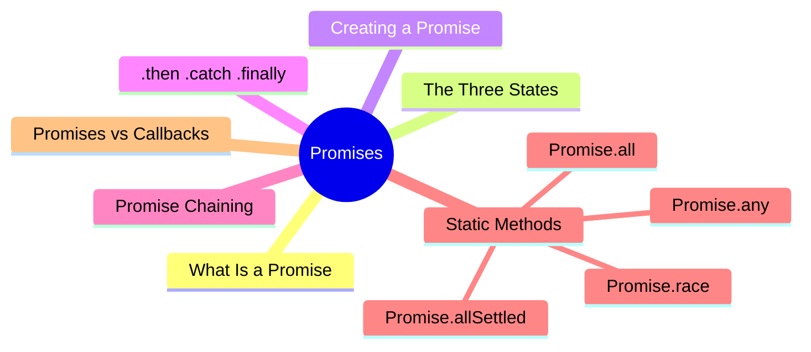
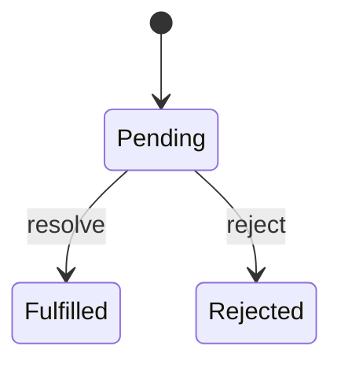

export const metadata = {
  title: 'JavaScript Promise',
  date: '2026-03-19',
  excerpt: 'A practical guide to JavaScript Promises — covering the three states, .then/.catch/.finally, Promise chaining, and the four static methods: all, allSettled, race, and any.',
  tags: ['Front-end', 'JavaScript'],
};

# JavaScript Promises

Promises were introduced in ES6 to solve the Callback Hell problem and give asynchronous code more structure.

The idea: a Promise represents an operation that hasn't completed yet, but will produce a result — either a success or a failure — in the future.



- [What Is a Promise](#what-is-a-promise)
- [The Three States](#the-three-states)
- [Creating a Promise](#creating-a-promise)
- [.then, .catch, .finally](#then-catch-finally)
- [Promise Chaining](#promise-chaining)
- [Static Methods](#static-methods)
- [Promises vs Callbacks](#promises-vs-callbacks)

---

## What Is a Promise

A Promise is an object that represents the eventual result of an asynchronous operation.

Think of it like a ticket: "I don't have your order ready yet, but I'll come find you when it's done — whether it worked out or not."

---

## The Three States

Every Promise is in exactly one of three states:

- Pending — the operation hasn't finished yet (initial state)
- Fulfilled — the operation completed successfully, with a result value
- Rejected — the operation failed, with a reason

Once a Promise moves from Pending to either Fulfilled or Rejected, it stays there. The state can't change again.



---

## Creating a Promise

Use `new Promise()` and pass it an executor function. The executor receives two arguments: `resolve` and `reject`.

- Call `resolve(value)` → the Promise becomes Fulfilled
- Call `reject(reason)` → the Promise becomes Rejected

```javascript
const promise = new Promise(function (resolve, reject) {
  const success = true;

  if (success) {
    resolve("it worked");
  } else {
    reject("something went wrong");
  }
});
```

A real async example:

```javascript
function delay(ms) {
  return new Promise(function (resolve) {
    setTimeout(function () {
      resolve("done");
    }, ms);
  });
}

delay(1000).then(function (result) {
  console.log(result); // "done" (after 1 second)
});
```

---

## .then, .catch, .finally

### .then

`.then` handles a fulfilled Promise:

```javascript
promise.then(function (result) {
  console.log(result); // "it worked"
});
```

`.then` can take two arguments — the first for success, the second for failure — but using `.catch` separately is more common and readable:

```javascript
promise.then(
  function (result) { console.log(result); },
  function (error) { console.error(error); }
);
```

### .catch

`.catch` handles a rejected Promise:

```javascript
const promise = new Promise(function (resolve, reject) {
  reject("something went wrong");
});

promise.catch(function (error) {
  console.error(error); // "something went wrong"
});
```

### .finally

`.finally` runs regardless of whether the Promise succeeded or failed — useful for cleanup:

```javascript
promise
  .then(function (result) {
    console.log(result);
  })
  .catch(function (error) {
    console.error(error);
  })
  .finally(function () {
    console.log("always runs");
  });
```

---

## Promise Chaining

`.then` always returns a new Promise, so you can chain multiple async operations in sequence:

```javascript
fetch("https://api.example.com/user")
  .then(function (response) {
    return response.json();
  })
  .then(function (user) {
    return fetch("https://api.example.com/posts/" + user.id);
  })
  .then(function (response) {
    return response.json();
  })
  .then(function (posts) {
    console.log(posts);
  })
  .catch(function (error) {
    console.error(error);
  });
```

If any `.then` throws an error or returns a rejected Promise, the chain skips all subsequent `.then` calls and jumps straight to `.catch`.

---

## Static Methods

### Promise.all

Runs multiple Promises in parallel. Resolves when all succeed, with an array of results. Rejects immediately if any one fails.

```javascript
const p1 = Promise.resolve(1);
const p2 = Promise.resolve(2);
const p3 = Promise.resolve(3);

Promise.all([p1, p2, p3]).then(function (results) {
  console.log(results); // [1, 2, 3]
});
```

```javascript
const p1 = Promise.resolve(1);
const p2 = Promise.reject("failed");
const p3 = Promise.resolve(3);

Promise.all([p1, p2, p3]).catch(function (error) {
  console.error(error); // "failed"
});
```

Use this when you need all requests to succeed before moving on.

### Promise.allSettled

Waits for all Promises to complete — regardless of whether they succeed or fail — and returns the outcome of each:

```javascript
const p1 = Promise.resolve(1);
const p2 = Promise.reject("failed");
const p3 = Promise.resolve(3);

Promise.allSettled([p1, p2, p3]).then(function (results) {
  console.log(results);
  // [
  //   { status: "fulfilled", value: 1 },
  //   { status: "rejected", reason: "failed" },
  //   { status: "fulfilled", value: 3 }
  // ]
});
```

Use this when you want every result, and one failure shouldn't stop the rest.

### Promise.race

Runs multiple Promises in parallel. The first one to settle — success or failure — determines the outcome:

```javascript
const p1 = new Promise(resolve => setTimeout(() => resolve("slow"), 1000));
const p2 = new Promise(resolve => setTimeout(() => resolve("fast"), 500));

Promise.race([p1, p2]).then(function (result) {
  console.log(result); // "fast"
});
```

Useful for setting a timeout on an operation.

### Promise.any

Runs multiple Promises in parallel. Resolves as soon as any one succeeds. Only rejects if all of them fail:

```javascript
const p1 = Promise.reject("fail 1");
const p2 = Promise.resolve("success");
const p3 = Promise.reject("fail 2");

Promise.any([p1, p2, p3]).then(function (result) {
  console.log(result); // "success"
});
```

---

## Promises vs Callbacks

| | Callbacks | Promises |
| - | - | - |
| Readability | Poor with deep nesting | Clean with chaining |
| Error handling | Each level handles its own errors | Single `.catch` handles everything |
| Multiple async ops | Callback Hell | Promise chaining or static methods |

Promises don't eliminate complexity, but they give it structure — making async code easier to read, reason about, and maintain.

---

## Conclusion

Promises give asynchronous operations a clear structure — and a consistent way to handle what happens when they succeed or fail.

- Three states: Pending, Fulfilled, Rejected
- `.then` handles success, `.catch` handles failure, `.finally` always runs
- Promise chaining keeps sequential async operations readable
- `Promise.all`, `Promise.allSettled`, `Promise.race`, and `Promise.any` handle parallel operations with different behaviors

Once you're comfortable with Promises, the natural next topics are:

- async / await
- Event Loop
- Error handling
