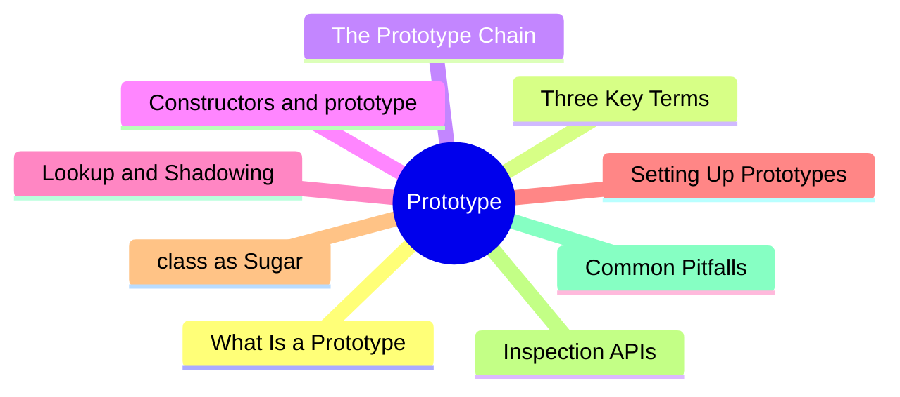
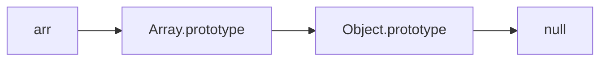

export const metadata = {
  title: 'JavaScript Prototypes and the Prototype Chain',
  date: '2026-06-26',
  excerpt: 'A practical guide to JavaScript prototypes and the prototype chain — covering the difference between prototype and __proto__, how property lookup and inheritance work, constructors, shadowing, class as syntactic sugar, and the common pitfalls.',
  tags: ['Front-end', 'JavaScript'],
};

# JavaScript Prototypes and the Prototype Chain

Most languages build inheritance on classes. JavaScript is one of the few that builds it on *prototypes*.

Every object carries a hidden link to another object. When you read a property the object doesn't have, JavaScript follows that link upward to look for it — and that path is the prototype chain.

Once this clicks, a lot of JavaScript stops feeling like magic: objects, inheritance, `class`, and `instanceof` all run on the same underlying mechanism.



- [What Is a Prototype](#what-is-a-prototype)
- [prototype vs. `__proto__`](#prototype-vs-__proto__)
- [The Prototype Chain](#the-prototype-chain)
- [Constructors and prototype](#constructors-and-prototype)
- [Property Lookup and Shadowing](#property-lookup-and-shadowing)
- [Why Methods Live on the Prototype](#why-methods-live-on-the-prototype)
- [Four Ways to Set Up a Prototype](#four-ways-to-set-up-a-prototype)
- [class Is Syntactic Sugar](#class-is-syntactic-sugar)
- [Inspecting the Prototype Chain](#inspecting-the-prototype-chain)
- [Common Pitfalls](#common-pitfalls)
- [Quick Reference](#quick-reference)

---

## What Is a Prototype

JavaScript is a prototype-based language. Every object holds a hidden link to another object, and that other object is its prototype.

When you read a property an object doesn't have, JavaScript doesn't give up right away; it follows that link to the prototype and keeps looking. This is how an object can "inherit" properties and methods without owning a copy of its own.

In the spec, this hidden link is called `[[Prototype]]`, an internal slot on every object.

```javascript
const animal = {
  eats: true,
};

const dog = {
  barks: true,
};

Object.setPrototypeOf(dog, animal); // make animal the prototype of dog

console.log(dog.barks); // true (dog's own property)
console.log(dog.eats);  // true (found on animal via the prototype)
```

`dog` has no `eats` of its own, but JavaScript followed `[[Prototype]]` and found `animal.eats`.

---

## prototype vs. `__proto__`

The thing that trips most people up early on is three terms that look alike but mean completely different things. Pin them down once and the rest falls into place.

- `[[Prototype]]` — the internal slot in the spec. Every object has one, pointing to its prototype. You can't touch it directly; you go through an API.
- `__proto__` — an accessor (a getter/setter) on `Object.prototype` that lets you read and write an object's `[[Prototype]]`. It's a legacy feature (Annex B in the spec); modern code should use `Object.getPrototypeOf` and `Object.setPrototypeOf` instead.
- `prototype` — an ordinary property that exists only on *functions*. It isn't the function's own prototype — it's the object that instances created with `new` will use as *their* prototype.

| Term | Lives on | Purpose |
| - | - | - |
| `[[Prototype]]` | Every object | Internal slot pointing to the object's prototype |
| `__proto__` | Via `Object.prototype` | Accessor for reading/writing `[[Prototype]]` (legacy) |
| `prototype` | Functions | The prototype that `new` instances will get |

```javascript
function Person() {}

const p = new Person();

// p's prototype is Person.prototype
console.log(Object.getPrototypeOf(p) === Person.prototype); // true
console.log(p.__proto__ === Person.prototype);              // true (equivalent, but avoid it)

// prototype lives only on functions; ordinary objects don't have one
console.log(p.prototype);             // undefined (p is an object, no prototype property)
console.log(typeof Person.prototype); // "object" (only functions have one, and it's an object)
```

One line to remember it by: `prototype` is the prototype a function hands to *future* instances; `__proto__` is the prototype an object has *right now*.

---

## The Prototype Chain

A prototype is itself an object, so it has a prototype too. Link those together, one after another, and you get the prototype chain.

Property lookup walks up that chain and stops at the first level where the property is found. If it reaches the end of the chain — `null` — without finding anything, the lookup returns `undefined`.

```javascript
const arr = [1, 2, 3];

console.log(arr.hasOwnProperty("length")); // true — length is arr's own property
console.log(typeof arr.map);               // "function" — inherited from Array.prototype
console.log(typeof arr.hasOwnProperty);    // "function" — inherited from Object.prototype
```

Here's `arr`'s prototype chain (each arrow is a `[[Prototype]]` link):



Tracing the lookups above:

- `length` is `arr`'s own property — found at the first level.
- `map` isn't on `arr`, so the lookup steps up and finds it on `Array.prototype`.
- `hasOwnProperty` isn't on `Array.prototype` either, so it steps up once more and finds it on `Object.prototype`.

`Object.prototype` sits at the top of nearly every chain, and its `[[Prototype]]` is `null` — that's where the chain ends.

---

## Constructors and prototype

Back to how `new` and `prototype` connect. When you define a function and call it with `new`, the prototype chain gets wired up automatically.

```javascript
function Animal(name) {
  this.name = name;
}

Animal.prototype.speak = function () {
  console.log(this.name + " makes a sound");
};

const cat = new Animal("Cat");
cat.speak(); // "Cat makes a sound"
```

`new Animal("Cat")` does four things behind the scenes:

1. Creates a new empty object
2. Sets that object's `[[Prototype]]` to `Animal.prototype`
3. Runs `Animal` with `this` bound to the new object
4. Returns the new object (unless the constructor returns an object of its own)

So `cat` doesn't have `speak` directly, yet it finds it on `Animal.prototype` through `[[Prototype]]`.

Every function's `prototype` comes with a `constructor` property pointing back to the function itself:

```javascript
console.log(Animal.prototype.constructor === Animal); // true
console.log(cat.constructor === Animal);              // true (found via the chain)
```

---

## Property Lookup and Shadowing

Reading and writing properties don't behave symmetrically, and that asymmetry causes a lot of bugs.

- Reading a property walks up the prototype chain.
- Writing a property creates or overwrites it directly *on the object itself*, never on the prototype. This is called shadowing.

```javascript
const animal = { legs: 4 };
const dog = Object.create(animal);

console.log(dog.legs); // 4 (inherited from animal)

dog.legs = 2;          // creates legs on dog itself, shadowing the one on the prototype

console.log(dog.legs);    // 2 (dog's own)
console.log(animal.legs); // 4 (the prototype is untouched)
```

Because writes only ever touch the instance, putting a *mutable* object or array on a prototype is dangerous — every instance ends up sharing the same one:

```javascript
function Team() {}
Team.prototype.members = []; // on the prototype, shared by all instances

const a = new Team();
const b = new Team();

a.members.push("Alice"); // mutates the single array on the prototype

console.log(b.members); // ["Alice"] — b is affected too
```

The fix is to keep mutable state on the instance (created with `this` inside the constructor) so each instance stays independent.

---

## Why Methods Live on the Prototype

If you assign methods inside the constructor with `this`, every instance gets its own copy of the function — wasted memory for no benefit:

```javascript
function User(name) {
  this.name = name;
  this.greet = function () {        // each user carries its own greet
    console.log("Hi, " + this.name);
  };
}
```

Put the method on the `prototype` instead, and every instance shares a single copy:

```javascript
function User(name) {
  this.name = name;
}

User.prototype.greet = function () { // all users share this one
  console.log("Hi, " + this.name);
};

const u1 = new User("A");
const u2 = new User("B");

console.log(u1.greet === u2.greet); // true — it's the same function
```

The rule of thumb is simple: behavior (methods) is shared, so it goes on the prototype; state (data) is per-instance, so it goes on `this`.

---

## Four Ways to Set Up a Prototype

There are four common ways to set an object's prototype:

1. `Object.create(proto)` — create a new object with a given prototype
2. A constructor function with `new`
3. `class` — still prototypes underneath (next section)
4. `Object.setPrototypeOf(obj, proto)` — change an existing object's prototype (slow, best avoided)

```javascript
// 1. Object.create
const base = { hello() { return "hi"; } };
const obj = Object.create(base);
console.log(obj.hello()); // "hi"

// 2. Constructor + new
function Foo() {}
const f = new Foo(); // f's prototype is Foo.prototype

// 4. setPrototypeOf
const target = {};
Object.setPrototypeOf(target, base);
console.log(target.hello()); // "hi"
```

There's also `Object.create(null)`, which creates an object with *no* prototype at all. It's handy as a clean dictionary, since it doesn't inherit `toString`, `hasOwnProperty`, and friends, so keys can't collide with inherited names:

```javascript
const dict = Object.create(null);
console.log(dict.toString); // undefined — completely clean, nothing inherited
```

---

## class Is Syntactic Sugar

The ES6 `class` keyword looks like classes in other languages, but underneath it's still prototypes.

```javascript
class Animal {
  constructor(name) {
    this.name = name;
  }

  speak() {
    console.log(this.name + " makes a sound");
  }
}
```

It's roughly equivalent to:

```javascript
function Animal(name) {
  this.name = name;
}

Animal.prototype.speak = function () {
  console.log(this.name + " makes a sound");
};
```

`speak` ends up on `Animal.prototype` just the same:

```javascript
console.log(typeof Animal.prototype.speak); // "function"
```

`extends` wires up *two* chains at once — one for instances and one for static members:

```javascript
class Dog extends Animal {
  speak() {
    console.log(this.name + " barks");
  }
}

const d = new Dog("Rex");

// Instance chain: d → Dog.prototype → Animal.prototype → Object.prototype
console.log(Object.getPrototypeOf(Dog.prototype) === Animal.prototype); // true

// Static chain: Dog → Animal (so the subclass inherits the parent's static methods)
console.log(Object.getPrototypeOf(Dog) === Animal); // true
```

That said, `class` isn't *exactly* a constructor function. A few real differences:

- A `class` body always runs in strict mode.
- A `class` declaration is hoisted, but it sits in the temporal dead zone (TDZ) until its definition, so you can't use it early.
- A `class` must be called with `new`; calling it directly throws a `TypeError`.
- Methods defined on a `class` are non-enumerable, so `for...in` won't list them.

---

## Inspecting the Prototype Chain

```javascript
const arr = [1, 2, 3];

// Get an object's prototype
Object.getPrototypeOf(arr); // Array.prototype

// Is one object somewhere in another's prototype chain?
Array.prototype.isPrototypeOf(arr); // true

// instanceof: is the constructor's prototype anywhere in the chain?
console.log(arr instanceof Array);  // true
console.log(arr instanceof Object); // true (Object.prototype is on the chain too)

// Own vs. inherited properties
console.log(arr.hasOwnProperty("length")); // true (length is its own)
console.log("map" in arr);                  // true (in walks the whole chain)
console.log(arr.hasOwnProperty("map"));     // false (map is inherited)
```

`instanceof` is defined in terms of the prototype chain: `obj instanceof Constructor` checks whether `Constructor.prototype` appears anywhere in `obj`'s chain.

The difference between `in` and `hasOwnProperty` is worth keeping straight. The first walks the whole chain, the second only looks at the object itself:

| Operation | Includes inherited properties? |
| - | - |
| `obj.hasOwnProperty(key)` | No — own properties only |
| `key in obj` | Yes — walks up the prototype chain |

---

## Common Pitfalls

### Don't modify built-in prototypes

Adding methods to `Array.prototype` or `Object.prototype` looks convenient, but it pollutes every object of that type, risks clashing with future language features or third-party libraries, and makes `for...in` surface unexpected keys.

```javascript
Array.prototype.last = function () {
  return this[this.length - 1];
}; // tempting, but it touches every array in your program — avoid in practice
```

### `__proto__` in object literals is a special case

```javascript
const obj = {
  __proto__: someProto, // this *sets the prototype*, not a property named __proto__
};
```

Inside an object literal, `__proto__:` has special meaning — it sets that object's prototype. If you genuinely want an ordinary property called `__proto__`, use `Object.defineProperty` instead.

### Changing a prototype dynamically hurts performance

`Object.setPrototypeOf(obj, proto)` and `obj.__proto__ = proto` force the engine to throw away the optimized internal shape (hidden class) it built for that object, slowing down later property access. When you need a specific prototype, decide it *at creation time* with `Object.create` or `class`.

### Longer chains aren't better

Every extra level adds a step to lookups that miss. You won't notice it most of the time, but on a very deep chain or a hot path it can become a bottleneck.

---

## Quick Reference

| Concept | What it is |
| - | - |
| `[[Prototype]]` | The internal slot on every object, pointing to its prototype |
| `__proto__` | An accessor for `[[Prototype]]` (legacy syntax) |
| `prototype` | A function-only property; the prototype `new` instances get |
| Reading a property | Walks up the chain until `null` |
| Writing a property | Always lands on the instance itself (shadowing) |
| `constructor` | A property on `prototype` pointing back to the function |
| `instanceof` | Checks whether `Constructor.prototype` is on the chain |
| `class` | Sugar over prototypal inheritance |

---

## Conclusion

- JavaScript does inheritance through prototypes: every object links to another via `[[Prototype]]`.
- Reading a missing property walks up the prototype chain until it hits `null`.
- `prototype` is a property on functions that sets the prototype of `new` instances; `__proto__` is the legacy way to access an existing object's prototype.
- Methods go on the prototype (shared); state goes on the instance's `this` (independent).
- `class` is sugar over this whole mechanism — it's still the prototype chain underneath.
