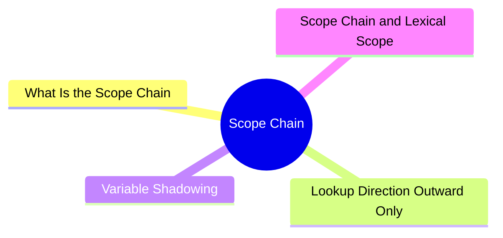
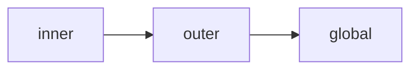
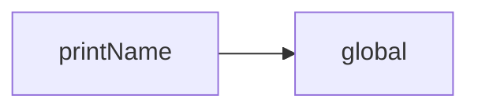

export const metadata = {
  title: 'JavaScript Scope Chain',
  date: '2026-03-16',
  excerpt: 'A practical guide to the JavaScript scope chain — covering how variable lookup works, variable shadowing, and the connection to lexical scope.',
  tags: ['Front-end', 'JavaScript'],
};

# JavaScript Scope Chain

When JavaScript looks up a variable, it doesn't just check the current scope. It searches outward, one scope at a time, until it either finds the variable or runs out of scopes to check.

That lookup process is called the scope chain.



- [What Is the Scope Chain](#what-is-the-scope-chain)
- [Lookup Direction: Outward Only](#lookup-direction-outward-only)
- [Variable Shadowing](#variable-shadowing)
- [Scope Chain and Lexical Scope](#scope-chain-and-lexical-scope)

---

## What Is the Scope Chain

Every scope has access to its own variables — and to the variables of any outer scope that contains it.

These nested scopes form a chain, from the innermost to the outermost (global) scope.

```javascript
const a = 1;

function outer() {
  const b = 2;

  function inner() {
    const c = 3;
    console.log(a); // 1 — found in global scope
    console.log(b); // 2 — found in outer's scope
    console.log(c); // 3 — found in inner's own scope
  }

  inner();
}

outer();
```

The lookup order is:



JavaScript walks up the chain from the inside out. As soon as it finds the variable, it stops. If it reaches the global scope without finding it, it throws a `ReferenceError`:

```javascript
function test() {
  console.log(x); // ReferenceError: x is not defined
}

test();
```

---

## Lookup Direction: Outward Only

The scope chain only goes one way — from inner to outer. Outer scopes cannot access variables declared inside inner scopes.

```javascript
function outer() {
  function inner() {
    const x = 10;
  }

  console.log(x); // ReferenceError: x is not defined
}

outer();
```

`outer` has no access to `x` — it's locked inside `inner`.

This holds true for any level of nesting:

```javascript
const level1 = "global";

function funcA() {
  const level2 = "funcA";

  function funcB() {
    const level3 = "funcB";

    function funcC() {
      console.log(level1); // "global"
      console.log(level2); // "funcA"
      console.log(level3); // "funcB"
    }

    funcC();
  }

  funcB();
}

funcA();
```

`funcC` can reach all the way up to the global scope. `funcA`, on the other hand, has no access to anything declared inside `funcB` or `funcC`.

---

## Variable Shadowing

When an inner scope declares a variable with the same name as one in an outer scope, the inner variable shadows the outer one.

```javascript
const name = "global";

function greet() {
  const name = "local";
  console.log(name); // "local"
}

greet();
console.log(name); // "global"
```

Inside `greet`, `name` resolves to `"local"`. The outer `"global"` is shadowed — hidden, but not changed.

Both variables coexist in their own scopes and don't affect each other.

Variable shadowing isn't an error, but using the same name at different levels can make code harder to follow. Use it with care.

---

## Scope Chain and Lexical Scope

The shape of the scope chain is determined by where the code is written, not where the function is called.

This is what lexical scope means.

```javascript
const name = "global";

function printName() {
  console.log(name);
}

function main() {
  const name = "local";
  printName(); // "global"
}

main();
```

`printName` is defined in the global scope, so its scope chain is:



Even though `printName` is called inside `main`, it doesn't have access to `main`'s `name`. `main` is simply not part of `printName`'s scope chain.

This behavior is also what makes closures possible.

---

## Conclusion

The scope chain is how JavaScript resolves variable references:

- Lookup starts in the current scope and moves outward toward global
- The chain only goes outward — outer scopes can't access inner variables
- Inner variables with the same name shadow outer ones
- The chain is determined by where the code is written, not where it's called

Once you're comfortable with the scope chain, the natural next topics are:

- Closures
- Hoisting
- Execution Context
